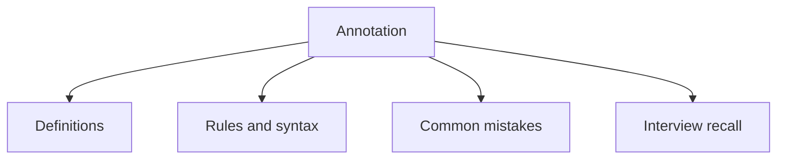

# 17 - Annotation

This topic follows the master outline in [outline.md](../outline.md). The goal is to understand each concept deeply enough to explain it, recognize it in code, and answer interview-style questions.

## Study Order

- [What Is An Annotation Concepts](theory/01-what-is-an-annotation-concepts.md)
- [Documented Concepts](theory/02-documented-concepts.md)
- [Key Terms](terms/01-key-terms.md)

## Outline Checklist

- What is an annotation?
- Built-in annotations:
- @Override
- @Deprecated
- @SuppressWarnings
- @FunctionalInterface
- @SafeVarargs
- Meta-annotations:
- @Target
- @Retention
- @Documented
- @Inherited
- @Repeatable
- Custom annotation
- Runtime annotation
- Basic annotation processing

## Self-Check

Before moving on, verify that you can answer these conceptual questions without searching:
1. Why do we need meta-annotations like `@Retention` and `@Target`?
2. What is the difference between `SOURCE`, `CLASS`, and `RUNTIME` retention policies at both the compiler and JVM level?
3. How does the JVM process annotations at runtime using reflection under the hood (e.g., dynamic proxy classes)?
4. Why is `@Override` processed at compile-time instead of runtime, and why does this design prevent silent bugs during refactoring?
5. Why can annotations only have elements of specific types (primitives, String, Class, enums, annotations, or 1D arrays of these) but not arbitrary objects or generics?
6. Why does `@Inherited` only apply to class declarations and not interfaces or methods, and what are the implications of this design constraint?

## Anki Cards

- [Basic](anki/basic.tsv)
- [Basic Extra](anki/basic-extra.tsv)
- [Cloze](anki/cloze.tsv)
- [Code Question](anki/code-question.tsv)

## Mermaid Overview

## Reference Links

- https://docs.oracle.com/javase/tutorial/java/annotations/
