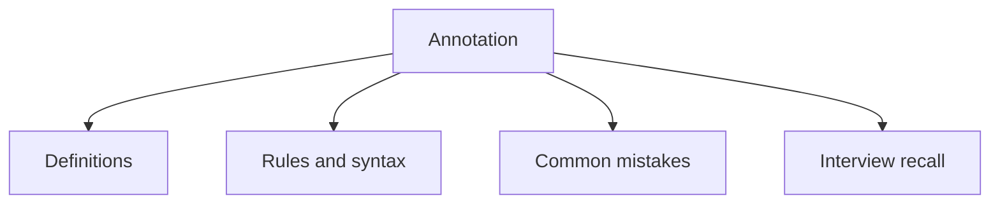

# 17 - Annotation

This topic follows the master outline in [outline.md](../outline.md). The goal is to understand each concept deeply enough to explain it, recognize it in code, and answer interview-style questions.

## Study Order

- [What Is An Annotation Concepts](theory/01-what-is-an-annotation-concepts.md)
- [Documented Concepts](theory/02-documented-concepts.md)
- [Key Terms](terms/01-key-terms.md)

## Outline Checklist

- What is an annotation?
- Built-in annotations:
- @Override
- @Deprecated
- @SuppressWarnings
- @FunctionalInterface
- @SafeVarargs
- Meta-annotations:
- @Target
- @Retention
- @Documented
- @Inherited
- @Repeatable
- Custom annotation
- Runtime annotation
- Basic annotation processing

## Anki Cards

- [Basic](anki/basic.tsv)
- [Basic Extra](anki/basic-extra.tsv)
- [Cloze](anki/cloze.tsv)
- [Code Question](anki/code-question.tsv)

## Mermaid Overview

## Reference Links

- https://docs.oracle.com/javase/tutorial/java/annotations/
