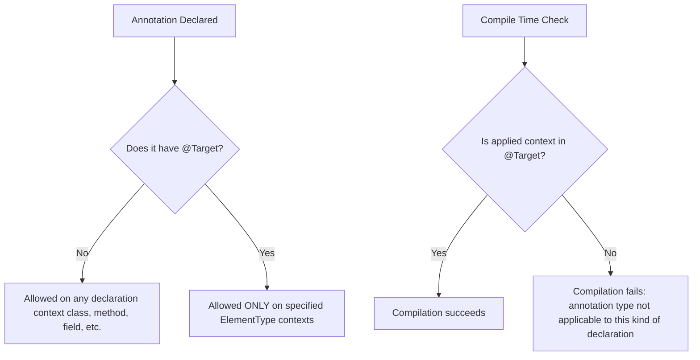

# Annotation - Part 1

## Learning Goal

This file covers a focused slice of **Annotation**. Study each concept as a practical Java rule, not as isolated vocabulary.

## Outline Coverage

| Concept | What to know |
| --- | --- |
| `What is an annotation?` | An annotation attaches metadata to program elements such as classes, methods, or fields. |
| `Built-in annotations:` | An annotation attaches metadata to program elements such as classes, methods, or fields. |
| `@Override` |@Override is a specific concept in Annotation; learn its Java rule, valid use cases, and failure mode rather than only its name. |
| `@Deprecated` |@Deprecated is a specific concept in Annotation; learn its Java rule, valid use cases, and failure mode rather than only its name. |
| `@SuppressWarnings` |@SuppressWarnings is a specific concept in Annotation; learn its Java rule, valid use cases, and failure mode rather than only its name. |
| `@FunctionalInterface` |@FunctionalInterface is a specific concept in Annotation; learn its Java rule, valid use cases, and failure mode rather than only its name. |
| `@SafeVarargs` |@SafeVarargs is a specific concept in Annotation; learn its Java rule, valid use cases, and failure mode rather than only its name. |
| `Meta-annotations:` | An annotation attaches metadata to program elements such as classes, methods, or fields. |
| `@Target` |@Target is a specific concept in Annotation; learn its Java rule, valid use cases, and failure mode rather than only its name. |
| `@Retention` |@Retention is a specific concept in Annotation; learn its Java rule, valid use cases, and failure mode rather than only its name. |

## Detailed Notes

### What is an annotation?

An annotation attaches metadata to program elements such as classes, methods, or fields.

Use it to predict the exact Java rule, the allowed form, and the failure mode. Review it with a tiny example instead of memorizing only the label.

Practical check:

- Define `What is an annotation?` in one sentence.
- Recognize `What is an annotation?` in code, commands, documentation, or interview prompts.
- Explain one bug, limitation, or tradeoff related to `What is an annotation?`.

Tiny example or mental model:

- When reading code, ask: what does `What is an annotation?` change, allow, reject, or clarify?

#### Concrete Explanation & Java Rules
Annotations are a form of syntactic metadata that can be added to Java source code. They declare a type of tag, using the `@interface` keyword, which does not directly affect program execution by itself. However, they can be processed:
1. At **compile time** by compiler plug-ins (Annotation Processors) to generate source code, XML descriptors, or perform extra validation.
2. At **class-load / runtime** via Java Reflection to dynamically configure behavior (e.g., Spring framework, Hibernate).

```java
// Declaring a simple custom annotation
@interface MyMetadata {
    String value() default "No Description";
}

// Applying it to class, field, and method
@MyMetadata("Applied at class level")
public class AnnotationDemo {
    
    @MyMetadata("Applied at field level")
    private String name;

    @MyMetadata("Applied at method level")
    public void performAction() {}
}
```

---

### Built-in annotations:

An annotation attaches metadata to program elements such as classes, methods, or fields.

Use it to predict the exact Java rule, the allowed form, and the failure mode. Review it with a tiny example instead of memorizing only the label.

Practical check:

- Define `Built-in annotations:` in one sentence.
- Recognize `Built-in annotations:` in code, commands, documentation, or interview prompts.
- Explain one bug, limitation, or tradeoff related to `Built-in annotations:`.

Tiny example or mental model:

- When reading code, ask: what does `Built-in annotations:` change, allow, reject, or clarify?

#### Concrete Explanation & Java Rules
Java provides standard built-in annotations. Those defined in `java.lang` (e.g., `@Override`, `@Deprecated`, `@SuppressWarnings`, `@SafeVarargs`, `@FunctionalInterface`) are used primarily by the compiler. Those defined in `java.lang.annotation` (e.g., `@Target`, `@Retention`, `@Documented`, `@Inherited`, `@Repeatable`) are meta-annotations applied to custom annotations to define their behavior.

```java
public class BuiltInDemo {
    @Override
    public String toString() {
        return "Built-in demo class";
    }
}
```

---

### @Override

@Override is a specific concept in Annotation; learn its Java rule, valid use cases, and failure mode rather than only its name.

Use it to predict the exact Java rule, the allowed form, and the failure mode. Review it with a tiny example instead of memorizing only the label.

Practical check:

- Define `@Override` in one sentence.
- Recognize `@Override` in code, commands, documentation, or interview prompts.
- Explain one bug, limitation, or tradeoff related to `@Override`.

Tiny example or mental model:

- When reading code, ask: what does `@Override` change, allow, reject, or clarify?

#### Concrete Explanation & Java Rules
The `@Override` annotation instructs the compiler to verify that the annotated method overrides or implements a method declared in a superclass or superinterface. If the signature does not match exactly (due to spelling mistakes, parameter type differences, or incorrect return types), the compiler throws a compilation error.

```java
class Base {
    public void execute(String value) {}
}

class Sub extends Base {
    // Correct usage
    @Override
    public void execute(String value) {
        System.out.println("Sub executed: " + value);
    }

    // Compilation error: Parent class does not have an "execut" method
    // @Override
    // public void execut(String value) {}

    // Compilation error: Parameter mismatch (int vs String)
    // @Override
    // public void execute(int value) {}
}
```

**Failure Mode & Gotcha:** 
Private methods cannot be overridden. If a subclass declares a method with the same name and parameter list as a private method in the parent class, and annotates it with `@Override`, it will cause a compilation error.

---

### @Deprecated

@Deprecated is a specific concept in Annotation; learn its Java rule, valid use cases, and failure mode rather than only its name.

Use it to predict the exact Java rule, the allowed form, and the failure mode. Review it with a tiny example instead of memorizing only the label.

Practical check:

- Define `@Deprecated` in one sentence.
- Recognize `@Deprecated` in code, commands, documentation, or interview prompts.
- Explain one bug, limitation, or tradeoff related to `@Deprecated`.

Tiny example or mental model:

- When reading code, ask: what does `@Deprecated` change, allow, reject, or clarify?

#### Concrete Explanation & Java Rules
`@Deprecated` marks a program element (class, method, field, constructor) as obsolete. If other code uses a deprecated element, the compiler generates a warning. Starting in Java 9, it includes elements:
- `since`: A `String` indicating the version in which the element was deprecated.
- `forRemoval`: A `boolean` indicating if the element is slated to be removed in a future release. If `true`, compiling against this method triggers a "terminal deprecation" warning.

```java
public class DeprecatedExample {
    @Deprecated(since = "2.0", forRemoval = true)
    public void oldAPIMethod() {
        System.out.println("This method is obsolete and will be removed.");
    }
}
```

---

### @SuppressWarnings

@SuppressWarnings is a specific concept in Annotation; learn its Java rule, valid use cases, and failure mode rather than only its name.

Use it to predict the exact Java rule, the allowed form, and the failure mode. Review it with a tiny example instead of memorizing only the label.

Practical check:

- Define `@SuppressWarnings` in one sentence.
- Recognize `@SuppressWarnings` in code, commands, documentation, or interview prompts.
- Explain one bug, limitation, or tradeoff related to `@SuppressWarnings`.

Tiny example or mental model:

- When reading code, ask: what does `@SuppressWarnings` change, allow, reject, or clarify?

#### Concrete Explanation & Java Rules
`@SuppressWarnings` suppresses specific compiler warnings in the annotated element and its descendants. It has a single element of type `String[]` (the array of warning names to suppress, such as `"unchecked"`, `"deprecation"`, `"rawtypes"`, or `"all"`).

```java
import java.util.ArrayList;
import java.util.List;

public class SuppressExample {
    
    @SuppressWarnings({"unchecked", "rawtypes"})
    public void processLegacyData() {
        List rawList = new ArrayList(); // rawtypes warning suppressed
        rawList.add("Hello");           // unchecked warning suppressed
    }
}
```

---

### @FunctionalInterface

@FunctionalInterface is a specific concept in Annotation; learn its Java rule, valid use cases, and failure mode rather than only its name.

It matters because modern Java APIs use function-style pipelines heavily. A common confusion is forgetting which operations are lazy and which operation actually triggers execution.

Practical check:

- Define `@FunctionalInterface` in one sentence.
- Recognize `@FunctionalInterface` in code, commands, documentation, or interview prompts.
- Explain one bug, limitation, or tradeoff related to `@FunctionalInterface`.

Tiny example or mental model:

- When reading code, ask: what does `@FunctionalInterface` change, allow, reject, or clarify?

#### Concrete Explanation & Java Rules
`@FunctionalInterface` is an informative annotation used to declare that an interface is intended to be a functional interface (having exactly one abstract method). If the interface contains zero or more than one abstract method, the compiler generates an error. Note that default methods, static methods, and public methods overriding `java.lang.Object` methods do not count against this single-method limit.

```java
@FunctionalInterface
public interface MathOperation {
    int operate(int a, int b); // The single abstract method
    
    // Allowed: Default methods
    default void printName() {
        System.out.println("Operation");
    }

    // Allowed: Static methods
    static void log() {
        System.out.println("Logging...");
    }

    // Allowed: Public method overriding Object class
    @Override
    boolean equals(Object obj);
}
```

---

### @SafeVarargs

@SafeVarargs is a specific concept in Annotation; learn its Java rule, valid use cases, and failure mode rather than only its name.

Use it to predict the exact Java rule, the allowed form, and the failure mode. Review it with a tiny example instead of memorizing only the label.

Practical check:

- Define `@SafeVarargs` in one sentence.
- Recognize `@SafeVarargs` in code, commands, documentation, or interview prompts.
- Explain one bug, limitation, or tradeoff related to `@SafeVarargs`.

Tiny example or mental model:

- When reading code, ask: what does `@SafeVarargs` change, allow, reject, or clarify?

#### Concrete Explanation & Java Rules
`@SafeVarargs` suppresses warnings about "potential heap pollution" when using generic varargs parameters. Java varargs are implemented using arrays, which do not preserve generic type information at runtime (reification). 
Because of this, writing `T...` exposes the method to class cast exceptions if an incompatible array type is passed. 

`@SafeVarargs` represents a promise by the programmer that the method body will only read from the varargs array and not write objects of an incompatible type into it (which is the source of heap pollution).

**Crucial Constraints:**
Can only be applied to:
1. Static methods
2. Final instance methods
3. Private instance methods (Java 9+)

It **cannot** be applied to non-final, non-private instance methods because subclass overrides could introduce unsafe writes.

```java
public class SafeVarargsDemo {
    @SafeVarargs
    public static <T> java.util.List<T> safeList(T... elements) {
        // Safe: we are only reading elements, not modifying the array
        java.util.List<T> list = new java.util.ArrayList<>();
        for (T element : elements) {
            list.add(element);
        }
        return list;
    }
}
```

---

### Meta-annotations:

An annotation attaches metadata to program elements such as classes, methods, or fields.

Use it to predict the exact Java rule, the allowed form, and the failure mode. Review it with a tiny example instead of memorizing only the label.

Practical check:

- Define `Meta-annotations:` in one sentence.
- Recognize `Meta-annotations:` in code, commands, documentation, or interview prompts.
- Explain one bug, limitation, or tradeoff related to `Meta-annotations:`.

Tiny example or mental model:

- When reading code, ask: what does `Meta-annotations:` change, allow, reject, or clarify?

#### Concrete Explanation & Java Rules
Meta-annotations are annotations applied to other annotation declarations. They specify how the custom annotation behaves (e.g., where it can be applied, how long it is kept in compiled code, whether it is inherited, etc.).

---

### @Target

@Target is a specific concept in Annotation; learn its Java rule, valid use cases, and failure mode rather than only its name.

Use it to predict the exact Java rule, the allowed form, and the failure mode. Review it with a tiny example instead of memorizing only the label.

Practical check:

- Define `@Target` in one sentence.
- Recognize `@Target` in code, commands, documentation, or interview prompts.
- Explain one bug, limitation, or tradeoff related to `@Target`.

Tiny example or mental model:

- When reading code, ask: what does `@Target` change, allow, reject, or clarify?

#### Concrete Explanation & Java Rules
`@Target` specifies the contexts (program elements) where the annotation can be applied. It takes an array of `ElementType` values, including:
- `TYPE`: Class, interface (including annotation type), record, or enum
- `FIELD`: Fields (including enum constants)
- `METHOD`: Methods
- `PARAMETER`: Formal parameters
- `CONSTRUCTOR`: Constructors
- `LOCAL_VARIABLE`: Local variables
- `ANNOTATION_TYPE`: Annotation types
- `TYPE_USE`: Any use of a type (Java 8+)

If `@Target` is absent, the annotation can be applied to any declaration context (but not type use contexts).

```java
import java.lang.annotation.ElementType;
import java.lang.annotation.Target;

// This custom annotation can ONLY be applied to methods and fields.
@Target({ElementType.METHOD, ElementType.FIELD})
public @interface MethodAndFieldOnly {
    String value() default "";
}
```

#### Why `@Target` Exists: Restricting Scope and Preventing Misuse

Annotations attach metadata to code elements. Without `@Target`, an annotation can be placed on any declaration context, including classes, methods, parameters, local variables, and constructors. This lack of restriction can lead to structural clutter, semantic confusion, and unsafe assumptions in code processing libraries. By defining `@Target`, language designers allow developers to restrict the applicability of an annotation to specific locations where it is valid and expected. For example, a validation annotation like `@NonNull` only makes sense on fields, method parameters, or return values, while a mapping annotation like `@RequestMapping` only makes sense on methods or classes. Restricting target scopes prevents developers from using annotations in contexts that the processing logic does not support, avoiding runtime errors or logical failures.

**Mental Model:**
*Analogy:* A "Do Not Disturb" sign is meant for doors. Putting it on a keyboard, a coffee mug, or a person's head makes no sense and causes confusion. `@Target` acts as the instructions that specify exactly where the sign can be hung.



**Code Example with Expected Output:**
```java
import java.lang.annotation.ElementType;
import java.lang.annotation.Target;

@Target(ElementType.METHOD)
@interface MethodOnly {}

public class TargetDemo {
    // Compilation Error: annotation type not applicable to this kind of declaration
    // @MethodOnly
    private String field;

    @MethodOnly
    public void execute() {
        // OK: applied to method
    }
}
```

**Cause-Effect Chain:**
`@Target(ElementType.METHOD)` defined on `@MethodOnly` &rarr; Developer attempts to write `@MethodOnly` on a field declaration &rarr; Java compiler checks `@MethodOnly` definition &rarr; Compiler detects that `ElementType.FIELD` is absent from allowed targets &rarr; Compiler aborts build and throws "annotation type not applicable to this kind of declaration".

---

### @Retention

@Retention is a specific concept in Annotation; learn its Java rule, valid use cases, and failure mode rather than only its name.

Use it to predict the exact Java rule, the allowed form, and the failure mode. Review it with a tiny example instead of memorizing only the label.

Practical check:

- Define `@Retention` in one sentence.
- Recognize `@Retention` in code, commands, documentation, or interview prompts.
- Explain one bug, limitation, or tradeoff related to `@Retention`.

Tiny example or mental model:

- When reading code, ask: what does `@Retention` change, allow, reject, or clarify?

#### Concrete Explanation & Java Rules
`@Retention` defines how long an annotation is preserved. It takes a `RetentionPolicy` enum value:
1. `RetentionPolicy.SOURCE`: Maintained only in the source file. Ignored by compiler and omitted from the compiled `.class` file. (Used for code analysis, like Lombok or `@Override`).
2. `RetentionPolicy.CLASS`: Recorded in the `.class` file by the compiler, but NOT loaded by the JVM at runtime. **This is the default retention policy if none is specified.**
3. `RetentionPolicy.RUNTIME`: Recorded in the `.class` file and loaded by the JVM. These annotations are visible at runtime using the Java Reflection API.

```java
import java.lang.annotation.Retention;
import java.lang.annotation.RetentionPolicy;

@Retention(RetentionPolicy.RUNTIME)
public @interface VisibleAtRuntime {
    String message();
}
```

#### Why `@Retention` Exists and How Retention Policies Differ

Annotations exist in different phases of a program's lifecycle: source code, class files, and execution memory. Without `@Retention`, Java defaults to `RetentionPolicy.CLASS`, which discards the annotation metadata when the classloader loads the class into the JVM heap. Declaring an explicit retention policy allows developers to balance information availability with memory and performance overhead. 

*   `RetentionPolicy.SOURCE` is ideal for tool-based compile checks (like `@Override`) or compile-time code generators (like Project Lombok), preventing compile-only metadata from adding overhead to the compiled `.class` files.
*   `RetentionPolicy.CLASS` is useful for bytecode analysis tools, linters, or compilers that process classes statically without loading them into the JVM heap. It is recorded in the `.class` file but discarded at runtime.
*   `RetentionPolicy.RUNTIME` keeps the metadata fully intact inside the JVM heap, allowing reflection-based frameworks (like Spring, Hibernate, or Jackson) to query annotations and adjust program behavior dynamically during execution.

**Mental Model:**
*Analogy:*
- `SOURCE`: A scaffolding blueprint used to construct a building but discarded once the building is complete.
- `CLASS`: A construction manual shipped with the building materials but left unopened once the building is inhabited.
- `RUNTIME`: A physical label on the building's utility box that remains visible and readable to maintenance crews at any time during the building's lifetime.

```
+------------------+                   +--------------------+                   +-------------------+
|   Source Code    | --[ Compiler ]--> |    .class File     | --[ Classloader ]-> |     JVM Heap      |
|  (MyClass.java)  |                   |   (MyClass.class)  |                   | (Runtime Memory)  |
+------------------+                   +--------------------+                   +-------------------+
      |                                          |                                        |
      | SOURCE annotations                       | CLASS annotations                      | RUNTIME annotations
      v (discarded by compiler)                  v (omitted by classloader)               v (accessible via reflection)
   [Compile-only Checks]                      [Static Bytecode Tools]                  [Dynamic Frameworks]
```

**Code Example with Expected Output:**
```java
import java.lang.annotation.Retention;
import java.lang.annotation.RetentionPolicy;

@Retention(RetentionPolicy.SOURCE)
@interface SourceAnno {}

@Retention(RetentionPolicy.CLASS)
@interface ClassAnno {}

@Retention(RetentionPolicy.RUNTIME)
@interface RuntimeAnno {}

@SourceAnno
@ClassAnno
@RuntimeAnno
class RetentionTest {}

public class RetentionDemo {
    public static void main(String[] args) {
        Class<?> clazz = RetentionTest.class;
        System.out.println(clazz.isAnnotationPresent(SourceAnno.class));  // false
        System.out.println(clazz.isAnnotationPresent(ClassAnno.class));   // false
        System.out.println(clazz.isAnnotationPresent(RuntimeAnno.class)); // true
    }
}
```

**Cause-Effect Chain:**
`@Retention(RetentionPolicy.SOURCE)` &rarr; Compiler processes the Java source code &rarr; Compiler discards annotations matching SOURCE policy &rarr; Bytecode is produced without these annotations &rarr; JVM classloader parses `.class` file &rarr; Reflection call `clazz.isAnnotationPresent()` returns `false`.

---

## Common Mistakes

### 1. Forgetting to set `@Retention(RetentionPolicy.RUNTIME)`
By default, custom annotations use `RetentionPolicy.CLASS`. Developers writing reflection-based frameworks (like custom validation, serialization, dependency injection) often forget to explicitly write `@Retention(RetentionPolicy.RUNTIME)`. As a result, calling `element.isAnnotationPresent(MyAnnotation.class)` returns `false` at runtime, causing silent configuration failures.

### 2. Overriding a private method with `@Override`
Developers sometimes declare a method in a subclass with the same signature as a private method in the parent class and tag it with `@Override`. Private methods are not visible to subclasses, so this is not overriding. It is method definition, and applying `@Override` will result in a compile error.

### 3. Misapplying `@SafeVarargs`
Putting `@SafeVarargs` on a method that modifies the varargs array contents (e.g., placing elements inside it) is a mistake. The annotation disables compiler warnings, but it does NOT prevent `ClassCastException` at runtime due to heap pollution if the caller passes an array of a different runtime class type.

---

## Common Review Prompts

- Which concepts here are compile-time rules?
- Which concepts here affect runtime behavior?
- Which concepts here are likely interview traps?

## Reference Links

- [Java Tutorials: Annotations](https://docs.oracle.com/javase/tutorial/java/annotations/)
- [Java Language Specification: Annotation Types](https://docs.oracle.com/javase/specs/jls/se21/html/jls-9.html#jls-9.6)
- [Java Language Specification: Retention Policy](https://docs.oracle.com/javase/specs/jls/se21/html/jls-9.html#jls-9.6.4.2)
- [Java Language Specification: Target](https://docs.oracle.com/javase/specs/jls/se21/html/jls-9.html#jls-9.6.4.1)
