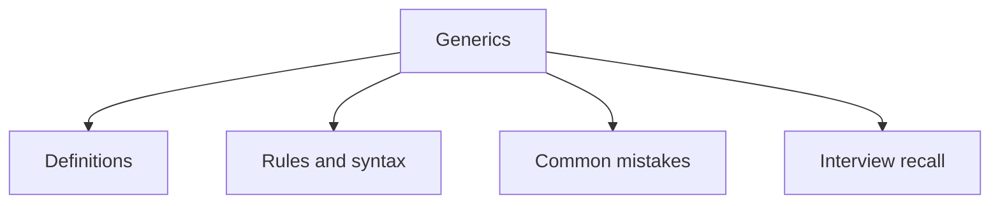

# 18 - Generics

This topic follows the master outline in [outline.md](../outline.md). The goal is to understand each concept deeply enough to explain it, recognize it in code, and answer interview-style questions.

## Study Order

- [Generic Class Concepts](theory/01-generic-class-concepts.md)
- [Topic Concepts](theory/02-topic-concepts.md)
- [Raw Type Concepts](theory/03-raw-type-concepts.md)
- [Key Terms](terms/01-key-terms.md)

## Outline Checklist

- Generic class
- Generic method
- Generic interface
- Type parameter
- Multiple type parameters
- Bounded type parameter:
- <T extends Number>
- Wildcard:
- <?>
- <? extends T>
- <? super T>
- PECS:
- Producer Extends
- Consumer Super
- Generic with Collection
- Type erasure
- Raw type
- Generic limitations

## Anki Cards

- [Basic](anki/basic.tsv)
- [Basic Extra](anki/basic-extra.tsv)
- [Cloze](anki/cloze.tsv)
- [Code Question](anki/code-question.tsv)

## Mermaid Overview

## Reference Links

- https://docs.oracle.com/javase/tutorial/java/generics/
