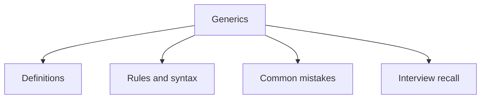

# 18 - Generics

This topic follows the master outline in [outline.md](../outline.md). The goal is to understand each concept deeply enough to explain it, recognize it in code, and answer interview-style questions.

## Study Order

- [Generic Class Concepts](theory/01-generic-class-concepts.md)
- [Topic Concepts](theory/02-topic-concepts.md)
- [Raw Type Concepts](theory/03-raw-type-concepts.md)
- [Key Terms](terms/01-key-terms.md)

## Outline Checklist

- Generic class
- Generic method
- Generic interface
- Type parameter
- Multiple type parameters
- Bounded type parameter:
- <T extends Number>
- Wildcard:
- <?>
- <? extends T>
- <? super T>
- PECS:
- Producer Extends
- Consumer Super
- Generic with Collection
- Type erasure
- Raw type
- Generic limitations

## Anki Cards

- [Basic](anki/basic.tsv)
- [Basic Extra](anki/basic-extra.tsv)
- [Cloze](anki/cloze.tsv)
- [Code Question](anki/code-question.tsv)

## Self-Check

Before moving to the next topic, verify that you can answer these questions:
1. Why does Java use Type Erasure for generics, and how does the JVM maintain backwards compatibility with pre-generic bytecode?
   &rarr; See [Why Java Uses Type Erasure](theory/02-topic-concepts.md#why-java-uses-type-erasure)
2. Why is a generic type invariant, and how do covariance (`? extends T`) and contravariance (`? super T`) extend API flexibility under the PECS rule?
   &rarr; See [Why Generics Are Invariant and How PECS Solves It](theory/02-topic-concepts.md#why-generics-are-invariant-and-how-pecs-solves-it)
3. Why are raw types permitted in Java, and what JVM runtime dangers or type safety compromises occur when raw types are used?
   &rarr; See [Why Raw Types Exist and Their Dangers](theory/03-raw-type-concepts.md#why-raw-types-exist-and-their-dangers)
4. Why cannot Java generics be instantiated with primitive types (like `List<int>`), and how does compile-time type erasure dictate this limitation?
   &rarr; See [Why Generics Do Not Support Primitives](theory/03-raw-type-concepts.md#why-generics-do-not-support-primitives)
5. Why are generic array creation and runtime type checks (like `instanceof List<String>`) forbidden in Java?
   &rarr; See [Why Generic Array Creation and Runtime Type Checks Are Forbidden](theory/03-raw-type-concepts.md#why-generic-array-creation-and-runtime-type-checks-are-forbidden)

## Mermaid Overview

## Reference Links

- https://docs.oracle.com/javase/tutorial/java/generics/
