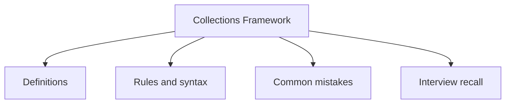

# 19 - Collections Framework

This topic follows the master outline in [outline.md](../outline.md). The goal is to understand each concept deeply enough to explain it, recognize it in code, and answer interview-style questions.

## Study Order

- [What Is The Collection Framework Concepts](theory/01-what-is-the-collection-framework-concepts.md)
- [Arraylist Concepts](theory/02-arraylist-concepts.md)
- [Treeset Concepts](theory/03-treeset-concepts.md)
- [Linkedlist As Queue Concepts](theory/04-linkedlist-as-queue-concepts.md)
- [Concurrenthashmap Concepts](theory/05-concurrenthashmap-concepts.md)
- [Fail Fast Iterator Concepts](theory/06-fail-fast-iterator-concepts.md)
- [Collections Unmodifiablelist Concepts](theory/07-collections-unmodifiablelist-concepts.md)
- [Key Terms](terms/01-key-terms.md)

## Outline Checklist

- What is the Collection Framework?
- Iterable
- Collection
- List
- Set
- Queue
- Deque
- Map
- ArrayList
- LinkedList
- Vector
- Stack
- Comparing ArrayList and LinkedList
- When to use List?
- HashSet
- LinkedHashSet
- TreeSet
- SortedSet
- NavigableSet
- When to use Set?
- Duplicate removal mechanism
- Role of equals() and hashCode()
- PriorityQueue
- ArrayDeque
- LinkedList as Queue
- FIFO
- LIFO
- Priority queue
- HashMap
- LinkedHashMap
- TreeMap
- Hashtable
- ConcurrentHashMap
- WeakHashMap
- IdentityHashMap
- SortedMap
- NavigableMap
- When to use Map?
- Iterator
- ListIterator
- Fail-fast iterator
- Fail-safe iterator
- ConcurrentModificationException
- Collections.sort
- Collections.reverse
- Collections.shuffle
- Collections.max
- Collections.min
- Collections.unmodifiableList
- Collections.synchronizedList
- Arrays.sort
- Arrays.binarySearch
- Arrays.asList
- Arrays.copyOf
- Arrays.equals
- Arrays.deepEquals

## Self-Check

Before moving to the next topic, verify that you can answer these questions:
1. Why does `ArrayList` resize by 1.5x (and how does `grow()` perform memory allocation/copying), and why is resizing expensive?
   &rarr; See [Why ArrayList Resizes by 1.5x](theory/02-arraylist-concepts.md#why-arraylist-resizes-by-15x)
2. Why must you override both `equals()` and `hashCode()` together when using custom objects as keys in `HashMap`, and what structural corruption occurs in the hash table if you fail to do so?
   &rarr; See [Why Equals and HashCode Must Be Overridden Together](theory/04-linkedlist-as-queue-concepts.md#why-equals-and-hashcode-must-be-overridden-together)
3. Why does `TreeSet`/`TreeMap` rely on `Comparable`/`Comparator` instead of `equals()` to determine duplicates and ordering, and what bug occurs if `compareTo()` is inconsistent with `equals()`?
   &rarr; See [Why TreeSet and TreeMap Rely on Comparable/Comparator](theory/03-treeset-concepts.md#why-treeset-and-treemap-rely-on-comparablecomparator)
4. Why does `ConcurrentHashMap` achieve high thread-safety without locking the entire map (and how do CAS and bucket-head `synchronized` blocks differ from `Hashtable`/`synchronizedMap`), and why does it reject null keys and values?
   &rarr; See [Why ConcurrentHashMap Avoids Global Locking](theory/05-concurrenthashmap-concepts.md#why-concurrenthashmap-avoids-global-locking)
5. Why do fail-fast iterators throw `ConcurrentModificationException` (and how does the `modCount` mechanism detect structural changes), and how do fail-safe/weakly-consistent iterators avoid this exception?
   &rarr; See [Why Fail-Fast Iterators Throw ConcurrentModificationException](theory/06-fail-fast-iterator-concepts.md#why-fail-fast-iterators-throw-concurrentmodificationexception)
6. Why is there a difference between `Collections.unmodifiableList()` (unmodifiable view) and `List.of()` / `List.copyOf()` (immutable collections), and how does the underlying memory structure differ?
   &rarr; See [Why Unmodifiable Views and Immutable Collections Differ](theory/07-collections-unmodifiablelist-concepts.md#why-unmodifiable-views-and-immutable-collections-differ)

## Anki Cards

- [Basic](anki/basic.tsv)
- [Basic Extra](anki/basic-extra.tsv)
- [Cloze](anki/cloze.tsv)
- [Code Question](anki/code-question.tsv)

## Mermaid Overview

## Reference Links

- https://docs.oracle.com/javase/tutorial/collections/
- https://docs.oracle.com/en/java/javase/21/docs/api/java.base/java/util/package-summary.html
