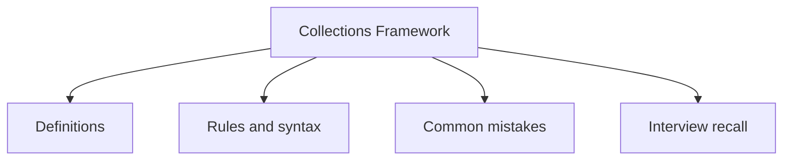

# 19 - Collections Framework

This topic follows the master outline in [outline.md](../outline.md). The goal is to understand each concept deeply enough to explain it, recognize it in code, and answer interview-style questions.

## Study Order

- [What Is The Collection Framework Concepts](theory/01-what-is-the-collection-framework-concepts.md)
- [Arraylist Concepts](theory/02-arraylist-concepts.md)
- [Treeset Concepts](theory/03-treeset-concepts.md)
- [Linkedlist As Queue Concepts](theory/04-linkedlist-as-queue-concepts.md)
- [Concurrenthashmap Concepts](theory/05-concurrenthashmap-concepts.md)
- [Fail Fast Iterator Concepts](theory/06-fail-fast-iterator-concepts.md)
- [Collections Unmodifiablelist Concepts](theory/07-collections-unmodifiablelist-concepts.md)
- [Key Terms](terms/01-key-terms.md)

## Outline Checklist

- What is the Collection Framework?
- Iterable
- Collection
- List
- Set
- Queue
- Deque
- Map
- ArrayList
- LinkedList
- Vector
- Stack
- Comparing ArrayList and LinkedList
- When to use List?
- HashSet
- LinkedHashSet
- TreeSet
- SortedSet
- NavigableSet
- When to use Set?
- Duplicate removal mechanism
- Role of equals() and hashCode()
- PriorityQueue
- ArrayDeque
- LinkedList as Queue
- FIFO
- LIFO
- Priority queue
- HashMap
- LinkedHashMap
- TreeMap
- Hashtable
- ConcurrentHashMap
- WeakHashMap
- IdentityHashMap
- SortedMap
- NavigableMap
- When to use Map?
- Iterator
- ListIterator
- Fail-fast iterator
- Fail-safe iterator
- ConcurrentModificationException
- Collections.sort
- Collections.reverse
- Collections.shuffle
- Collections.max
- Collections.min
- Collections.unmodifiableList
- Collections.synchronizedList
- Arrays.sort
- Arrays.binarySearch
- Arrays.asList
- Arrays.copyOf
- Arrays.equals
- Arrays.deepEquals

## Anki Cards

- [Basic](anki/basic.tsv)
- [Basic Extra](anki/basic-extra.tsv)
- [Cloze](anki/cloze.tsv)
- [Code Question](anki/code-question.tsv)

## Mermaid Overview

## Reference Links

- https://docs.oracle.com/javase/tutorial/collections/
- https://docs.oracle.com/en/java/javase/21/docs/api/java.base/java/util/package-summary.html
