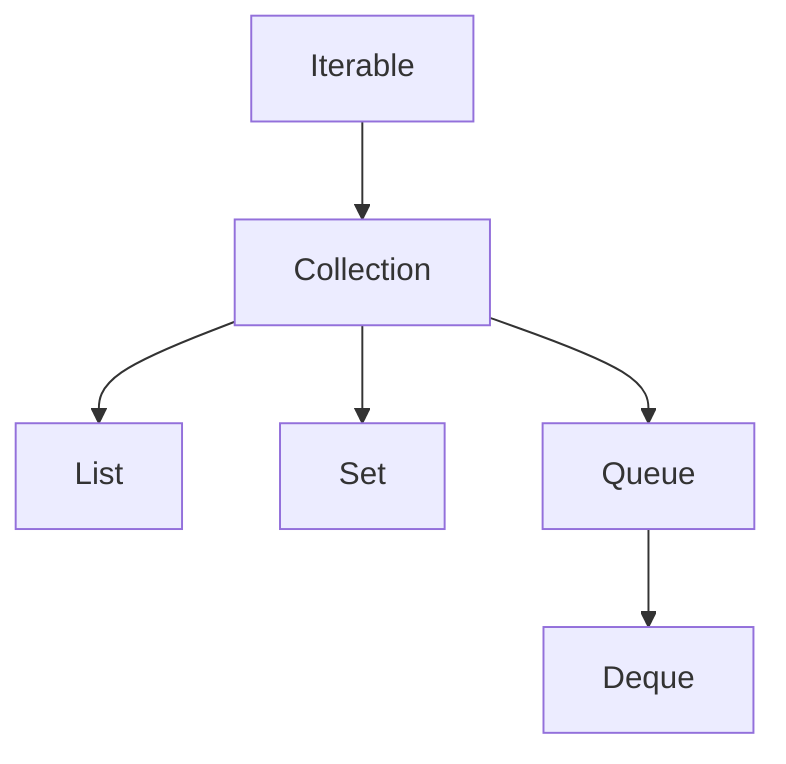

# Collections Framework - Part 1

## Learning Goal

This file covers a focused slice of **Collections Framework**. Study each concept as a practical Java rule, not as isolated vocabulary.

## Outline Coverage

| Concept | What to know |
| --- | --- |
| `What is the Collection Framework?` | A collection is an object that groups multiple elements under a common API. |
| `Iterable` | Iterable is the root traversal contract that allows an object to be used in enhanced for loops. |
| `Collection` | A collection is an object that groups multiple elements under a common API. |
| `List` | A List is an ordered collection that can contain duplicates and supports positional access. |
| `Set` | A Set is a collection that rejects duplicates according to equality rules. |
| `Queue` | Queue represents a collection designed for holding elements before processing, usually FIFO. |
| `Deque` | Deque is a double-ended queue that supports insertion and removal at both ends. |
| `Map` | A Map stores key-value pairs and retrieves values by key. |

## Detailed Notes

### The Collection Hierarchy

Below is the visual relationship between the core interfaces in the Java Collections Framework:


*Note: Map is a separate hierarchy and does not extend Collection, though it is a core part of the Collections Framework.*

### What is the Collection Framework?

A collection is an object that groups multiple elements under a common API. The Collections Framework provides:
1. **Interfaces**: Abstract representations of collections (e.g., `List`, `Set`, `Map`).
2. **Implementations**: Concrete implementations of these interfaces (e.g., `ArrayList`, `HashSet`, `HashMap`).
3. **Algorithms**: Static utility methods for searching, sorting, and manipulating collections (e.g., `Collections.sort()`).

### Iterable

`Iterable` is the root traversal contract that allows an object to be used in enhanced `for-each` loops.

**Runnable Code Example:**
```java
import java.util.Iterator;
import java.util.List;

public class IterableExample {
    public static void main(String[] args) {
        Iterable<String> iterable = List.of("Java", "Python", "Go");
        
        // 1. Using enhanced for-each loop (compiler translates this to Iterator)
        for (String lang : iterable) {
            System.out.println(lang);
        }
        
        // 2. Using explicit Iterator traversal
        Iterator<String> iterator = iterable.iterator();
        while (iterator.hasNext()) {
            System.out.println(iterator.next());
        }
    }
}
```

### Collection

The `Collection` interface represents the common behaviors shared by all collections (like adding, removing, and checking size).

**Runnable Code Example:**
```java
import java.util.ArrayList;
import java.util.Collection;

public class CollectionExample {
    public static void main(String[] args) {
        Collection<Integer> numbers = new ArrayList<>();
        numbers.add(10);
        numbers.add(20);
        numbers.add(30);
        
        System.out.println("Size: " + numbers.size()); // Size: 3
        System.out.println("Contains 20: " + numbers.contains(20)); // true
        
        // removeIf takes a Predicate (Java 8+)
        numbers.removeIf(n -> n > 15);
        System.out.println("Remaining: " + numbers); // [10]
    }
}
```

### List

A `List` is an ordered collection (also known as a sequence) that can contain duplicate elements. Users have precise control over where each element is inserted and can access elements by their integer index.

**Runnable Code Example:**
```java
import java.util.ArrayList;
import java.util.List;

public class ListExample {
    public static void main(String[] args) {
        List<String> list = new ArrayList<>();
        list.add("Apple");
        list.add("Banana");
        list.add("Apple"); // Duplicates are allowed
        
        // Positional access
        String first = list.get(0);
        System.out.println("First element: " + first); // Apple
        System.out.println("List elements: " + list);  // [Apple, Banana, Apple]
        
        list.set(1, "Cherry"); // Modify element at index 1
        System.out.println("Updated List: " + list);  // [Apple, Cherry, Apple]
    }
}
```

### Set

A `Set` is a collection that cannot contain duplicate elements. It models the mathematical set abstraction.

**Runnable Code Example:**
```java
import java.util.HashSet;
import java.util.Set;

public class SetExample {
    public static void main(String[] args) {
        Set<String> set = new HashSet<>();
        boolean addedFirst = set.add("Java");
        boolean addedSecond = set.add("Java"); // Duplicate entry
        
        System.out.println("Added first: " + addedFirst);   // true
        System.out.println("Added second: " + addedSecond); // false
        System.out.println("Set size: " + set.size());       // 1
    }
}
```

### Queue

`Queue` represents a collection designed for holding elements prior to processing. Typically (but not necessarily), queues order elements in a FIFO (first-in-first-out) manner.

**Runnable Code Example:**
```java
import java.util.LinkedList;
import java.util.Queue;

public class QueueExample {
    public static void main(String[] args) {
        Queue<String> queue = new LinkedList<>();
        
        // offer() inserts an element without throwing exceptions if capacity is restricted
        queue.offer("Task 1");
        queue.offer("Task 2");
        
        // peek() retrieves, but does not remove, the head
        System.out.println("Head: " + queue.peek()); // Task 1
        
        // poll() retrieves and removes the head, returning null if empty
        System.out.println("Polled: " + queue.poll()); // Task 1
        System.out.println("Next Head: " + queue.peek()); // Task 2
    }
}
```

### Deque

`Deque` (Double Ended Queue) is a linear collection that supports element insertion and removal at both ends. It can be used as a FIFO queue or a LIFO stack.

**Runnable Code Example:**
```java
import java.util.ArrayDeque;
import java.util.Deque;

public class DequeExample {
    public static void main(String[] args) {
        Deque<String> deque = new ArrayDeque<>();
        
        // Using as a Queue (FIFO)
        deque.addLast("A");
        deque.addLast("B");
        System.out.println(deque.removeFirst()); // A
        
        // Using as a Stack (LIFO)
        deque.push("First");
        deque.push("Second");
        System.out.println(deque.pop()); // Second
    }
}
```

### Map

A `Map` is an object that maps keys to values. A map cannot contain duplicate keys; each key can map to at most one value.

**Runnable Code Example:**
```java
import java.util.HashMap;
import java.util.Map;

public class MapExample {
    public static void main(String[] args) {
        Map<String, Integer> ageMap = new HashMap<>();
        ageMap.put("Alice", 25);
        ageMap.put("Bob", 30);
        ageMap.put("Alice", 26); // Overwrites the existing value for key "Alice"
        
        System.out.println("Alice's age: " + ageMap.get("Alice")); // 26
        
        // Iterating over Map entries
        for (Map.Entry<String, Integer> entry : ageMap.entrySet()) {
            System.out.println(entry.getKey() + " => " + entry.getValue());
        }
    }
}
```

---

## Common Mistakes

### 1. Treating Map as a Collection
A common interview trap is assuming `Map` extends the `Collection` interface. It does not. Methods like `map.add()` or `map.iterator()` do not exist. To iterate over a map's contents, you must call `map.keySet()`, `map.values()`, or `map.entrySet()`.

### 2. Confusing Queue/Deque Methods
Inserting into a Queue using `add()` or `remove()` throws exceptions (like `IllegalStateException` or `NoSuchElementException`) if the queue is full/empty. In contrast, `offer()`, `poll()`, and `peek()` return special values (`false` or `null`) instead of throwing exceptions. Mixing these leads to fragile error handling.

### 3. Modifying a List during a basic index-based loop
Using a standard `for` loop with index traversal while modifying the list size can lead to skipped elements or `IndexOutOfBoundsException`:
```java
// BUG: Modifies list while iterating forwards
for (int i = 0; i < list.size(); i++) {
    if (list.get(i).equals("remove-me")) {
        list.remove(i); // Shifts elements, causing the next element to be skipped!
    }
}
```
*Solution: Use an explicit iterator or `removeIf`.*

## Common Review Prompts

- Which concepts here are compile-time rules?
- Which concepts here affect runtime behavior?
- Which concepts here are likely interview traps?
