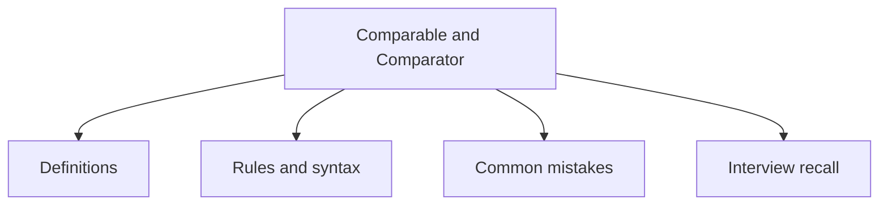

# 20 - Comparable and Comparator

This topic follows the master outline in [outline.md](../outline.md). The goal is to understand each concept deeply enough to explain it, recognize it in code, and answer interview-style questions.

## Study Order

- [Comparable Concepts](theory/01-comparable-concepts.md)
- [Reverse Order Concepts](theory/02-reverse-order-concepts.md)
- [Key Terms](terms/01-key-terms.md)

## Outline Checklist

- Comparable
- compareTo
- Comparator
- compare
- Natural ordering
- Custom ordering
- Sort List object
- Sort by multiple criteria
- Comparator.comparing
- thenComparing
- Reverse order
- Null handling:
- nullsFirst
- nullsLast

## Anki Cards

- [Basic](anki/basic.tsv)
- [Basic Extra](anki/basic-extra.tsv)
- [Cloze](anki/cloze.tsv)
- [Code Question](anki/code-question.tsv)

## Mermaid Overview

## Reference Links

- https://docs.oracle.com/en/java/javase/21/docs/api/java.base/java/lang/Comparable.html
- https://docs.oracle.com/en/java/javase/21/docs/api/java.base/java/util/Comparator.html
