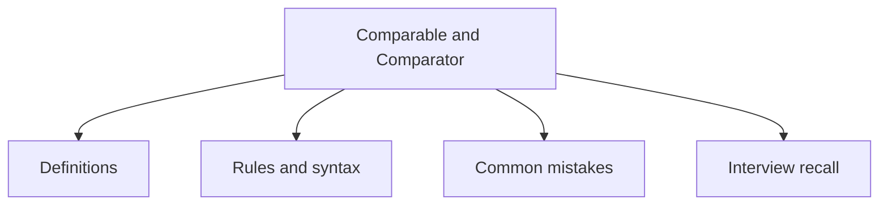

# 20 - Comparable and Comparator

This topic follows the master outline in [outline.md](../outline.md). The goal is to understand each concept deeply enough to explain it, recognize it in code, and answer interview-style questions.

## Study Order

- [Comparable Concepts](theory/01-comparable-concepts.md)
- [Reverse Order Concepts](theory/02-reverse-order-concepts.md)
- [Key Terms](terms/01-key-terms.md)

## Outline Checklist

- Comparable
- compareTo
- Comparator
- compare
- Natural ordering
- Custom ordering
- Sort List object
- Sort by multiple criteria
- Comparator.comparing
- thenComparing
- Reverse order
- Null handling:
- nullsFirst
- nullsLast

## Self-Check

1. Why does Java separate natural ordering (`Comparable`) from custom external ordering (`Comparator`), and when should you choose one over the other?
2. Why is the transitivity contract in `Comparable.compareTo` and `Comparator.compare` critical, and what runtime behavior or exceptions result if transitivity is violated?
3. Why do `TreeSet` and `TreeMap` require the comparison method (`compareTo` / `compare`) to be consistent with `equals()`, and what functional anomalies occur if `(x.compareTo(y) == 0) == (x.equals(y))` is false?
4. Why is implementing `compareTo` or `compare` using integer/floating-point subtraction (e.g., `this.id - other.id`) a dangerous bug, and how does integer overflow/underflow break sorting contracts?
5. Why does Java use Dual-Pivot Quicksort for sorting primitives (e.g., `Arrays.sort(int[])`) but TimSort for sorting objects (e.g., `Arrays.sort(Object[])`), and how do they differ in terms of time complexity, space complexity, and stability?

## Anki Cards

- [Basic](anki/basic.tsv)
- [Basic Extra](anki/basic-extra.tsv)
- [Cloze](anki/cloze.tsv)
- [Code Question](anki/code-question.tsv)

## Mermaid Overview

## Reference Links

- https://docs.oracle.com/en/java/javase/21/docs/api/java.base/java/lang/Comparable.html
- https://docs.oracle.com/en/java/javase/21/docs/api/java.base/java/util/Comparator.html
