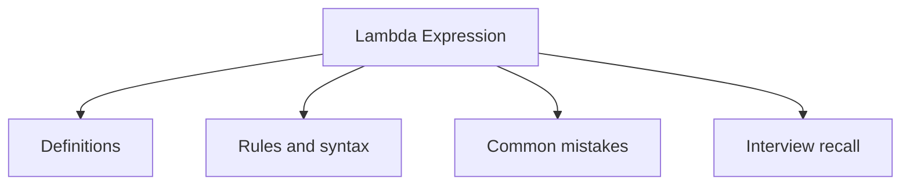

# 21 - Lambda Expression

This topic follows the master outline in [outline.md](../outline.md). The goal is to understand each concept deeply enough to explain it, recognize it in code, and answer interview-style questions.

## Study Order

- [What Is A Lambda Concepts](theory/01-what-is-a-lambda-concepts.md)
- [Lambda With Collection Concepts](theory/02-lambda-with-collection-concepts.md)
- [Key Terms](terms/01-key-terms.md)

## Outline Checklist

- What is a lambda?
- Lambda syntax
- Functional interface
- @FunctionalInterface
- Method reference:
- static method reference
- instance method reference
- constructor reference
- Variable capture
- Effectively final
- Lambda with Collection
- Lambda with Thread
- Lambda with Comparator

## Self-Check

1. Why does the Java compiler compile lambda expressions into `invokedynamic` instructions and dynamic bootstrap methods rather than traditional anonymous inner classes? (What are the class loading and runtime footprint benefits?)
2. Why must local variables captured by lambda closures be final or effectively final, while instance and static variables are exempted from this rule?
3. How do the different method reference types (static, bound instance, unbound instance, constructor reference) differ in how they determine the receiver object and map parameter lists to their target method signatures under the hood?
4. Why cannot a lambda expression throw checked exceptions unless they are explicitly declared by the abstract method of the target functional interface, and what mechanism enforces or bypasses this constraint?
5. Why does refactoring anonymous classes to lambdas change the semantics of the `this` keyword and variable shadowing, and what is the underlying scoping mechanism for both?

## Anki Cards

- [Basic](anki/basic.tsv)
- [Basic Extra](anki/basic-extra.tsv)
- [Cloze](anki/cloze.tsv)
- [Code Question](anki/code-question.tsv)

## Mermaid Overview

## Reference Links

- https://docs.oracle.com/javase/tutorial/java/javaOO/lambdaexpressions.html
