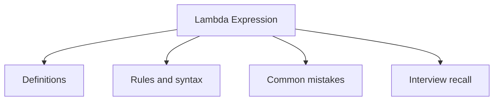

# 21 - Lambda Expression

This topic follows the master outline in [outline.md](../outline.md). The goal is to understand each concept deeply enough to explain it, recognize it in code, and answer interview-style questions.

## Study Order

- [What Is A Lambda Concepts](theory/01-what-is-a-lambda-concepts.md)
- [Lambda With Collection Concepts](theory/02-lambda-with-collection-concepts.md)
- [Key Terms](terms/01-key-terms.md)

## Outline Checklist

- What is a lambda?
- Lambda syntax
- Functional interface
- @FunctionalInterface
- Method reference:
- static method reference
- instance method reference
- constructor reference
- Variable capture
- Effectively final
- Lambda with Collection
- Lambda with Thread
- Lambda with Comparator

## Anki Cards

- [Basic](anki/basic.tsv)
- [Basic Extra](anki/basic-extra.tsv)
- [Cloze](anki/cloze.tsv)
- [Code Question](anki/code-question.tsv)

## Mermaid Overview

## Reference Links

- https://docs.oracle.com/javase/tutorial/java/javaOO/lambdaexpressions.html
