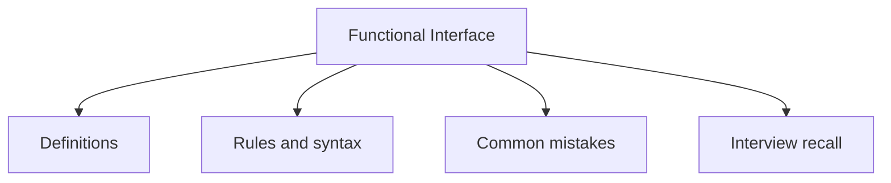

# 22 - Functional Interface

This topic follows the master outline in [outline.md](../outline.md). The goal is to understand each concept deeply enough to explain it, recognize it in code, and answer interview-style questions.

## Study Order

- [Predicate T Concepts](theory/01-predicate-t-concepts.md)
- [What Is The Output Concepts](theory/02-what-is-the-output-concepts.md)
- [Key Terms](terms/01-key-terms.md)

## Outline Checklist

- Predicate<T>
- Function<T, R>
- Consumer<T>
- Supplier<T>
- UnaryOperator<T>
- BinaryOperator<T>
- BiPredicate<T, U>
- BiFunction<T, U, R>
- BiConsumer<T, U>
- What is the input?
- What is the output?
- When to use which interface?

## Anki Cards

- [Basic](anki/basic.tsv)
- [Basic Extra](anki/basic-extra.tsv)
- [Cloze](anki/cloze.tsv)
- [Code Question](anki/code-question.tsv)

## Mermaid Overview

## Reference Links

- https://docs.oracle.com/en/java/javase/21/docs/api/java.base/java/util/function/package-summary.html
- https://docs.oracle.com/en/java/javase/21/docs/api/java.base/java/lang/FunctionalInterface.html
