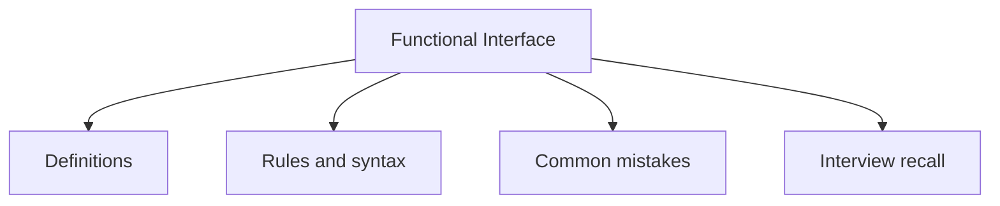

# 22 - Functional Interface

This topic follows the master outline in [outline.md](../outline.md). The goal is to understand each concept deeply enough to explain it, recognize it in code, and answer interview-style questions.

## Study Order

- [Predicate T Concepts](theory/01-predicate-t-concepts.md)
- [What Is The Output Concepts](theory/02-what-is-the-output-concepts.md)
- [Key Terms](terms/01-key-terms.md)

## Outline Checklist

- Predicate<T>
- Function<T, R>
- Consumer<T>
- Supplier<T>
- UnaryOperator<T>
- BinaryOperator<T>
- BiPredicate<T, U>
- BiFunction<T, U, R>
- BiConsumer<T, U>
- What is the input?
- What is the output?
- When to use which interface?

## Anki Cards

- [Basic](anki/basic.tsv)
- [Basic Extra](anki/basic-extra.tsv)
- [Cloze](anki/cloze.tsv)
- [Code Question](anki/code-question.tsv)

## Mermaid Overview

## Self-Check

Here are 5 deep conceptual questions to verify your understanding of functional interfaces. The answers can be found in the theory files:

1. Why is the `@FunctionalInterface` annotation optional, and what compile-time benefits does it provide?
2. How do the functional contract styles of `Predicate`, `Function`, `Consumer`, and `Supplier` differ in their input/output shapes and purposes?
3. Why do we need primitive specializations (like `IntPredicate`, `LongFunction`, `DoubleConsumer`) instead of just using generic wrappers, and how do they prevent boxing overhead?
4. How do functional interfaces leverage default methods for functional composition and chaining?
5. How does the Java Language Specification (JLS) count abstract methods for a functional interface, and what are the exact rules regarding overridden methods from `java.lang.Object`?

## Reference Links

- https://docs.oracle.com/en/java/javase/21/docs/api/java.base/java/util/function/package-summary.html
- https://docs.oracle.com/en/java/javase/21/docs/api/java.base/java/lang/FunctionalInterface.html
