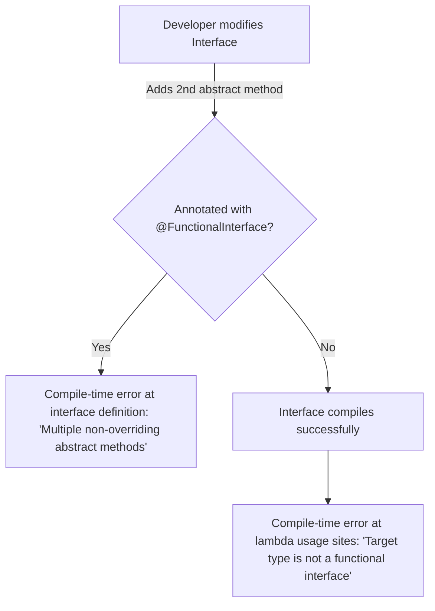
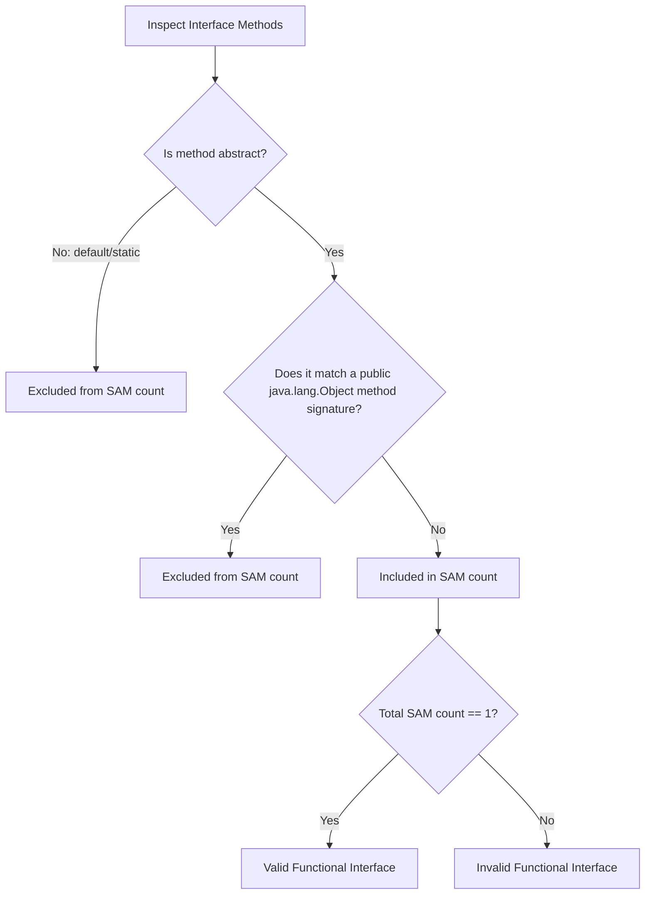

# Functional Interface - Part 1

## Learning Goal

This file covers a focused slice of **Functional Interface**. Study each concept as a practical Java rule, not as isolated vocabulary.

## Outline Coverage

| Concept | What to know |
| --- | --- |
| `Predicate<T>` |Predicate<T> is a specific concept in Functional Interface; learn its Java rule, valid use cases, and failure mode rather than only its name. |
| `Function<T, R>` |Function<T, R> is a specific concept in Functional Interface; learn its Java rule, valid use cases, and failure mode rather than only its name. |
| `Consumer<T>` |Consumer<T> is a specific concept in Functional Interface; learn its Java rule, valid use cases, and failure mode rather than only its name. |
| `Supplier<T>` |Supplier<T> is a specific concept in Functional Interface; learn its Java rule, valid use cases, and failure mode rather than only its name. |
| `UnaryOperator<T>` |UnaryOperator<T> is a specific concept in Functional Interface; learn its Java rule, valid use cases, and failure mode rather than only its name. |
| `BinaryOperator<T>` |BinaryOperator<T> is a specific concept in Functional Interface; learn its Java rule, valid use cases, and failure mode rather than only its name. |
| `BiPredicate<T, U>` |BiPredicate<T, U> is a specific concept in Functional Interface; learn its Java rule, valid use cases, and failure mode rather than only its name. |
| `BiFunction<T, U, R>` |BiFunction<T, U, R> is a specific concept in Functional Interface; learn its Java rule, valid use cases, and failure mode rather than only its name. |
| `BiConsumer<T, U>` |BiConsumer<T, U> is a specific concept in Functional Interface; learn its Java rule, valid use cases, and failure mode rather than only its name. |
| `What is the input?` | What is the input is a key question for understanding Functional Interface. |

## Detailed Notes

### The @FunctionalInterface Annotation

A functional interface in Java is an interface that contains **exactly one abstract method**. It may contain any number of `default` or `static` methods.

The `@FunctionalInterface` annotation is optional but highly recommended. It informs the compiler to validate that the annotated interface has exactly one abstract method. If it does not, a compilation error occurs.

#### Overriding Object Methods
An interface can declare abstract methods that override public methods of `java.lang.Object` (such as `equals`, `hashCode`, or `toString`). These declarations do **not** count toward the single abstract method count.

```java
@FunctionalInterface
public interface SimpleCalculator {
    int calculate(int a, int b); // Single Abstract Method (SAM)

    // Default methods are allowed
    default int add(int a, int b) {
        return a + b;
    }

    // Static methods are allowed
    static boolean isPositive(int val) {
        return val > 0;
    }

    // Overriding Object methods is allowed and does NOT count as abstract
    @Override
    boolean equals(Object obj);
}
```

## Why Use the @FunctionalInterface Annotation

The `@FunctionalInterface` annotation is a compiler-directing annotation that explicitly documents the design intent of an interface. While Java allows any interface containing exactly one abstract method to serve as the target for lambda expressions or method references, omitting this annotation exposes the code to future regressions. If a developer unknowingly adds a second abstract method to a functional interface without this annotation, the compilation failure will manifest at the usage sites (where lambda expressions are written) rather than at the interface declaration itself, making debugging more difficult. Including `@FunctionalInterface` ensures the compiler verifies the single-abstract-method (SAM) contract immediately at the declaration site, preventing accidental additions of other abstract methods.



### Code Example: Annotation Enforcement

```java
// Correct usage: compiler checks declaration
@FunctionalInterface
interface StringTransformer {
    String transform(String input);
    
    // If we uncomment the line below, compiler complains immediately:
    // "StringTransformer is not a functional interface"
    // void anotherMethod(); 
}

public class AnnotationDemo {
    public static void main(String[] args) {
        StringTransformer upper = String::toUpperCase;
        System.out.println(upper.transform("hello")); // Output: HELLO
    }
}
```

### Cause-Effect Chain
- **Annotated with `@FunctionalInterface`** $\rightarrow$ Compiler enforces single abstract method constraint at declaration $\rightarrow$ Prevents accidental addition of new abstract methods $\rightarrow$ Avoids compile-time breakage at downstream lambda usage sites.

---

## How the JLS Counts Abstract Methods and Treats java.lang.Object Overrides

The Java Language Specification (JLS §9.8) defines a functional interface as an interface with exactly one functional method, which is a single abstract method that is not overridden. When determining the abstract method count, any abstract method declared in the interface that overrides a public method of the `java.lang.Object` class (such as `equals(Object)`, `hashCode()`, or `toString()`) is excluded from the count. This exclusion exists because any class implementing this interface will automatically inherit implementations of these methods from `java.lang.Object` (either directly or via the parent class hierarchy), meaning the implementing class does not need to provide a new implementation for them. If a method in the interface overrides a non-public `Object` method (such as `clone()`), or if it declares an abstract method not present in `Object`, it is counted towards the single abstract method constraint.



### Code Example: Object Overrides

```java
@FunctionalInterface
interface CustomComparator<T> {
    // 1. Counts as the single abstract method (SAM)
    int compare(T o1, T o2);

    // 2. Overrides public java.lang.Object method: NOT counted
    @Override
    boolean equals(Object obj);

    // 3. Overrides public java.lang.Object method: NOT counted
    @Override
    String toString();
    
    // 4. Overriding protected/non-public Object method is NOT allowed as a non-counted method.
    // Object clone(); // If uncommented, counts as second abstract method and fails compilation!
}

public class JlsChecksDemo {
    public static void main(String[] args) {
        CustomComparator<String> lengthComp = (s1, s2) -> Integer.compare(s1.length(), s2.length());
        System.out.println(lengthComp.compare("apple", "banana")); // Output: -1
        System.out.println(lengthComp.equals(lengthComp));         // Output: true
    }
}
```

### Cause-Effect Chain
- **Declares public `Object` method as abstract** $\rightarrow$ Compiler recognizes signature matches public `Object` method $\rightarrow$ Method is excluded from the functional interface's abstract method count $\rightarrow$ Interface successfully compiles as a valid `@FunctionalInterface`.

---

### Predicate<T>

Predicate<T> is a specific concept in Functional Interface; learn its Java rule, valid use cases, and failure mode rather than only its name.

It matters because modern Java APIs use function-style pipelines heavily. A common confusion is forgetting which operations are lazy and which operation actually triggers execution.

Practical check:

- Define `Predicate<T>` in one sentence.
- Recognize `Predicate<T>` in code, commands, documentation, or interview prompts.
- Explain one bug, limitation, or tradeoff related to `Predicate<T>`.

Tiny example or mental model:

- When reading code, ask: what does `Predicate<T>` change, allow, reject, or clarify?

#### Detailed Explanation and Code Examples
`Predicate<T>` represents a single-argument function that returns a `boolean`.
- **Functional Method**: `boolean test(T t)`
- **Common Use Case**: Filtering elements from a Stream or Collection.

```java
import java.util.function.Predicate;
import java.util.List;
import java.util.stream.Collectors;

public class PredicateExample {
    public static void main(String[] args) {
        Predicate<String> isLong = s -> s.length() > 3;
        
        List<String> names = List.of("Al", "Bob", "Charlie");
        List<String> filtered = names.stream()
                                     .filter(isLong)
                                     .collect(Collectors.toList());
        System.out.println(filtered); // [Charlie]
        
        // Chaining: and(), or(), negate()
        Predicate<String> startsWithC = s -> s.startsWith("C");
        Predicate<String> combined = isLong.and(startsWithC);
        System.out.println(combined.test("Charlie")); // true
        System.out.println(combined.test("Bob"));     // false
    }
}
```

#### Primitive Variants
To avoid the cost of boxing and unboxing primitives (e.g. `int` to `Integer`), Java provides specialized primitive predicates:
- `IntPredicate`: `boolean test(int value)`
- `LongPredicate`: `boolean test(long value)`
- `DoublePredicate`: `boolean test(double value)`

```java
import java.util.function.IntPredicate;

public class PrimitivePredicateExample {
    public static void main(String[] args) {
        IntPredicate isEven = value -> value % 2 == 0;
        System.out.println(isEven.test(42)); // true (no autoboxing)
    }
}
```

---

### Function<T, R>

Function<T, R> is a specific concept in Functional Interface; learn its Java rule, valid use cases, and failure mode rather than only its name.

It matters because modern Java APIs use function-style pipelines heavily. A common confusion is forgetting which operations are lazy and which operation actually triggers execution.

Practical check:

- Define `Function<T, R>` in one sentence.
- Recognize `Function<T, R>` in code, commands, documentation, or interview prompts.
- Explain one bug, limitation, or tradeoff related to `Function<T, R>`.

Tiny example or mental model:

- When reading code, ask: what does `Function<T, R>` change, allow, reject, or clarify?

#### Detailed Explanation and Code Examples
`Function<T, R>` transforms an input of type `T` to a result of type `R`.
- **Functional Method**: `R apply(T t)`
- **Common Use Case**: Mapping objects from one form to another.

```java
import java.util.function.Function;

public class FunctionExample {
    public static void main(String[] args) {
        Function<String, Integer> stringLength = s -> s.length();
        System.out.println(stringLength.apply("Java")); // 4

        // Chaining: andThen(), compose()
        Function<Integer, Integer> multiplyBy2 = n -> n * 2;
        
        // andThen: apply stringLength first, then multiplyBy2
        Function<String, Integer> lengthDouble = stringLength.andThen(multiplyBy2);
        System.out.println(lengthDouble.apply("Java")); // 8

        // compose: apply multiplyBy2 first, then stringLength (needs to match input type of stringLength)
        Function<Integer, Integer> addThree = n -> n + 3;
        Function<Integer, Integer> pipeline = addThree.compose(multiplyBy2); // multiplyBy2 then addThree
        System.out.println(pipeline.apply(5)); // 5 * 2 + 3 = 13
    }
}
```

#### Primitive Variants
Using `Function<T, R>` with primitives requires boxing. Java provides primitive-specialized Functions to avoid this:
- **Primitive Input**: `IntFunction<R>` (`R apply(int)`), `LongFunction<R>`, `DoubleFunction<R>`.
- **Primitive Output**: `ToIntFunction<T>` (`int applyAsInt(T)`), `ToLongFunction<T>`, `ToDoubleFunction<T>`.
- **Primitive to Primitive**: `IntToDoubleFunction` (`double applyAsDouble(int)`), `IntToLongFunction`, `LongToIntFunction`, `LongToDoubleFunction`, `DoubleToIntFunction`, `DoubleToLongFunction`.

```java
import java.util.function.IntToDoubleFunction;

public class PrimitiveFunctionExample {
    public static void main(String[] args) {
        IntToDoubleFunction half = val -> val / 2.0;
        System.out.println(half.applyAsDouble(5)); // 2.5 (no boxing)
    }
}
```

---

### Consumer<T>

Consumer<T> is a specific concept in Functional Interface; learn its Java rule, valid use cases, and failure mode rather than only its name.

It matters because modern Java APIs use function-style pipelines heavily. A common confusion is forgetting which operations are lazy and which operation actually triggers execution.

Practical check:

- Define `Consumer<T>` in one sentence.
- Recognize `Consumer<T>` in code, commands, documentation, or interview prompts.
- Explain one bug, limitation, or tradeoff related to `Consumer<T>`.

Tiny example or mental model:

- When reading code, ask: what does `Consumer<T>` change, allow, reject, or clarify?

#### Detailed Explanation and Code Examples
`Consumer<T>` performs an operation on an input of type `T` and returns no result (returns `void`).
- **Functional Method**: `void accept(T t)`
- **Common Use Case**: Printing, writing to a database, or modifying the internal state of an object.

```java
import java.util.function.Consumer;

public class ConsumerExample {
    public static void main(String[] args) {
        Consumer<String> printUpper = s -> System.out.println(s.toUpperCase());
        printUpper.accept("hello"); // HELLO

        // Chaining: andThen()
        Consumer<String> printLength = s -> System.out.println(s.length());
        Consumer<String> combined = printUpper.andThen(printLength);
        combined.accept("java"); // JAVA then 4
    }
}
```

#### Primitive Variants
- `IntConsumer`: `void accept(int value)`
- `LongConsumer`: `void accept(long value)`
- `DoubleConsumer`: `void accept(double value)`

```java
import java.util.function.IntConsumer;

public class PrimitiveConsumerExample {
    public static void main(String[] args) {
        IntConsumer printInt = val -> System.out.println("Value: " + val);
        printInt.accept(100);
    }
}
```

---

### Supplier<T>

Supplier<T> is a specific concept in Functional Interface; learn its Java rule, valid use cases, and failure mode rather than only its name.

It matters because modern Java APIs use function-style pipelines heavily. A common confusion is forgetting which operations are lazy and which operation actually triggers execution.

Practical check:

- Define `Supplier<T>` in one sentence.
- Recognize `Supplier<T>` in code, commands, documentation, or interview prompts.
- Explain one bug, limitation, or tradeoff related to `Supplier<T>`.

Tiny example or mental model:

- When reading code, ask: what does `Supplier<T>` change, allow, reject, or clarify?

#### Detailed Explanation and Code Examples
`Supplier<T>` takes no arguments and returns a result of type `T`.
- **Functional Method**: `T get()`
- **Common Use Case**: Lazy generation of values, factories, or default values.

```java
import java.util.function.Supplier;
import java.time.LocalDateTime;

public class SupplierExample {
    public static void main(String[] args) {
        Supplier<LocalDateTime> currentTime = () -> LocalDateTime.now();
        System.out.println(currentTime.get());
    }
}
```

#### Primitive Variants
- `IntSupplier`: `int getAsInt()`
- `LongSupplier`: `long getAsLong()`
- `DoubleSupplier`: `double getAsDouble()`
- `BooleanSupplier`: `boolean getAsBoolean()`

```java
import java.util.function.IntSupplier;

public class PrimitiveSupplierExample {
    public static void main(String[] args) {
        IntSupplier diceRoller = () -> (int) (Math.random() * 6) + 1;
        System.out.println(diceRoller.getAsInt());
    }
}
```

---

### UnaryOperator<T>

UnaryOperator<T> is a specific concept in Functional Interface; learn its Java rule, valid use cases, and failure mode rather than only its name.

Use it to predict the exact Java rule, the allowed form, and the failure mode. Review it with a tiny example instead of memorizing only the label.

Practical check:

- Define `UnaryOperator<T>` in one sentence.
- Recognize `UnaryOperator<T>` in code, commands, documentation, or interview prompts.
- Explain one bug, limitation, or tradeoff related to `UnaryOperator<T>`.

Tiny example or mental model:

- When reading code, ask: what does `UnaryOperator<T>` change, allow, reject, or clarify?

#### Detailed Explanation and Code Examples
`UnaryOperator<T>` is a specialized `Function<T, T>` where the input and output are of the same type.
- **Functional Method**: `T apply(T t)`
- **Common Use Case**: Modifying a value in-place or replacing elements in a list.

```java
import java.util.function.UnaryOperator;
import java.util.ArrayList;
import java.util.List;

public class UnaryOperatorExample {
    public static void main(String[] args) {
        UnaryOperator<String> sanitize = s -> s.trim().toLowerCase();
        System.out.println(sanitize.apply("  Java21  ")); // "java21"

        List<String> list = new ArrayList<>(List.of("  A ", " B  "));
        list.replaceAll(sanitize);
        System.out.println(list); // [a, b]
    }
}
```

#### Primitive Variants
- `IntUnaryOperator`: `int applyAsInt(int)`
- `LongUnaryOperator`: `long applyAsLong(long)`
- `DoubleUnaryOperator`: `double applyAsDouble(double)`

```java
import java.util.function.IntUnaryOperator;

public class PrimitiveUnaryOperatorExample {
    public static void main(String[] args) {
        IntUnaryOperator square = val -> val * val;
        System.out.println(square.applyAsInt(5)); // 25
    }
}
```

---

### BinaryOperator<T>

BinaryOperator<T> is a specific concept in Functional Interface; learn its Java rule, valid use cases, and failure mode rather than only its name.

Use it to predict the exact Java rule, the allowed form, and the failure mode. Review it with a tiny example instead of memorizing only the label.

Practical check:

- Define `BinaryOperator<T>` in one sentence.
- Recognize `BinaryOperator<T>` in code, commands, documentation, or interview prompts.
- Explain one bug, limitation, or tradeoff related to `BinaryOperator<T>`.

Tiny example or mental model:

- When reading code, ask: what does `BinaryOperator<T>` change, allow, reject, or clarify?

#### Detailed Explanation and Code Examples
`BinaryOperator<T>` is a specialized `BiFunction<T, T, T>` where two inputs and the output all share the same type `T`.
- **Functional Method**: `T apply(T t1, T t2)`
- **Common Use Case**: Reducing collections or aggregating two values.

```java
import java.util.function.BinaryOperator;

public class BinaryOperatorExample {
    public static void main(String[] args) {
        BinaryOperator<Integer> sum = (a, b) -> a + b;
        System.out.println(sum.apply(10, 20)); // 30

        // Static helper methods: minBy, maxBy
        BinaryOperator<Integer> min = BinaryOperator.minBy(Integer::compareTo);
        System.out.println(min.apply(15, 8)); // 8
    }
}
```

#### Primitive Variants
- `IntBinaryOperator`: `int applyAsInt(int, int)`
- `LongBinaryOperator`: `long applyAsLong(long, long)`
- `DoubleBinaryOperator`: `double applyAsDouble(double, double)`

```java
import java.util.function.IntBinaryOperator;

public class PrimitiveBinaryOperatorExample {
    public static void main(String[] args) {
        IntBinaryOperator product = (a, b) -> a * b;
        System.out.println(product.applyAsInt(6, 7)); // 42
    }
}
```

---

### BiPredicate<T, U>

BiPredicate<T, U> is a specific concept in Functional Interface; learn its Java rule, valid use cases, and failure mode rather than only its name.

It matters because modern Java APIs use function-style pipelines heavily. A common confusion is forgetting which operations are lazy and which operation actually triggers execution.

Practical check:

- Define `BiPredicate<T, U>` in one sentence.
- Recognize `BiPredicate<T, U>` in code, commands, documentation, or interview prompts.
- Explain one bug, limitation, or tradeoff related to `BiPredicate<T, U>`.

Tiny example or mental model:

- When reading code, ask: what does `BiPredicate<T, U>` change, allow, reject, or clarify?

#### Detailed Explanation and Code Examples
`BiPredicate<T, U>` accepts two arguments of types `T` and `U` and returns a boolean.
- **Functional Method**: `boolean test(T t, U u)`
- **Common Use Case**: Checking relationships between two different objects.

```java
import java.util.function.BiPredicate;

public class BiPredicateExample {
    public static void main(String[] args) {
        BiPredicate<String, String> containsWord = (text, word) -> text.contains(word);
        System.out.println(containsWord.test("Java Programming", "Prog")); // true
    }
}
```

---

### BiFunction<T, U, R>

BiFunction<T, U, R> is a specific concept in Functional Interface; learn its Java rule, valid use cases, and failure mode rather than only its name.

It matters because modern Java APIs use function-style pipelines heavily. A common confusion is forgetting which operations are lazy and which operation actually triggers execution.

Practical check:

- Define `BiFunction<T, U, R>` in one sentence.
- Recognize `BiFunction<T, U, R>` in code, commands, documentation, or interview prompts.
- Explain one bug, limitation, or tradeoff related to `BiFunction<T, U, R>`.

Tiny example or mental model:

- When reading code, ask: what does `BiFunction<T, U, R>` change, allow, reject, or clarify?

#### Detailed Explanation and Code Examples
`BiFunction<T, U, R>` accepts two arguments of types `T` and `U` and produces a result of type `R`.
- **Functional Method**: `R apply(T t, U u)`
- **Common Use Case**: Combining two distinct inputs into a third representation.

```java
import java.util.function.BiFunction;

public class BiFunctionExample {
    public static void main(String[] args) {
        BiFunction<String, Integer, String> repeatString = (s, count) -> s.repeat(count);
        System.out.println(repeatString.apply("Hi", 3)); // "HiHiHi"
    }
}
```

---

### BiConsumer<T, U>

BiConsumer<T, U> is a specific concept in Functional Interface; learn its Java rule, valid use cases, and failure mode rather than only its name.

It matters because modern Java APIs use function-style pipelines heavily. A common confusion is forgetting which operations are lazy and which operation actually triggers execution.

Practical check:

- Define `BiConsumer<T, U>` in one sentence.
- Recognize `BiConsumer<T, U>` in code, commands, documentation, or interview prompts.
- Explain one bug, limitation, or tradeoff related to `BiConsumer<T, U>`.

Tiny example or mental model:

- When reading code, ask: what does `BiConsumer<T, U>` change, allow, reject, or clarify?

#### Detailed Explanation and Code Examples
`BiConsumer<T, U>` accepts two arguments of types `T` and `U` and returns no result (`void`).
- **Functional Method**: `void accept(T t, U u)`
- **Common Use Case**: Iterating over elements of a Map using `Map.forEach`.

```java
import java.util.function.BiConsumer;
import java.util.HashMap;
import java.util.Map;

public class BiConsumerExample {
    public static void main(String[] args) {
        Map<String, Integer> map = new HashMap<>();
        map.put("Apple", 10);
        map.put("Banana", 20);

        BiConsumer<String, Integer> printer = (key, value) -> System.out.println(key + " has quantity " + value);
        map.forEach(printer);
    }
}
```

---

### What is the input?

What is the input is a key question for understanding Functional Interface.

Use it to predict the exact Java rule, the allowed form, and the failure mode. Review it with a tiny example instead of memorizing only the label.

Practical check:

- Define `What is the input?` in one sentence.
- Recognize `What is the input?` in code, commands, documentation, or interview prompts.
- Explain one bug, limitation, or tradeoff related to `What is the input?`.

Tiny example or mental model:

- When reading code, ask: what does `What is the input?` change, allow, reject, or clarify?

#### Detailed Explanation and Code Examples
When designing or choosing a functional interface, always analyze:
1. **How many inputs?** (None, One, or Two)
2. **What are the input types?** (Generic objects `T`, `U`, or primitive types like `int`, `double`, `long`).

For example:
- `Supplier<T>` has **zero** inputs.
- `Function<T, R>` has **one** input.
- `BiFunction<T, U, R>` has **two** inputs.
- `IntConsumer` has **one primitive `int`** input.

---

## Why Primitive Specializations Prevent Boxing Overhead

Generic types in Java are subject to type erasure, meaning the JVM operates only on references of type `java.lang.Object` at runtime, which prevents primitives like `int` or `double` from being used directly as type arguments. When using standard functional interfaces like `Predicate<Integer>`, any primitive `int` passed as an argument must be wrapped in a heap-allocated `Integer` object through autoboxing. This boxing process allocates memory on the heap, increases garbage collection (GC) pressure, and requires dereferencing to retrieve the primitive value during method execution. To solve this efficiency problem, Java provides primitive specializations like `IntPredicate` or `DoubleConsumer` which define abstract methods taking primitive arguments directly (e.g., `test(int value)`). Using these specializations eliminates heap allocation, avoids memory overhead, and allows the JVM to execute operations with minimal overhead inside high-throughput loops.

```mermaid
sequenceDiagram
    autonumber
    participant Loop as Loop / Code
    participant Generic as Predicate<Integer>
    participant Heap as JVM Heap Memory
    participant Primitive as IntPredicate
    
    Note over Loop, Heap: Using Generic Predicate (Autoboxing)
    Loop->>Generic: test(42)
    Generic->>Heap: Allocate Integer(42) [Heap Overhead!]
    Heap-->>Generic: Return Integer Reference
    Generic->>Generic: Unbox Integer to int
    Generic-->>Loop: Return boolean
    
    Note over Loop, Primitive: Using Primitive Specialization
    Loop->>Primitive: test(42)
    Primitive->>Primitive: Execute logic directly on primitive 42
    Primitive-->>Loop: Return boolean [Zero Heap Allocation]
```

### Code Example: Boxing Overhead vs Primitive Specializations

```java
import java.util.function.Predicate;
import java.util.function.IntPredicate;

public class BoxingOverheadDemo {
    public static void main(String[] args) {
        int iterations = 10_000_000;
        
        // 1. Generic Predicate (autoboxing overhead)
        Predicate<Integer> isEvenGeneric = x -> x % 2 == 0;
        long startGeneric = System.nanoTime();
        for (int i = 0; i < iterations; i++) {
            isEvenGeneric.test(i); // boxes 'i' into Integer
        }
        long endGeneric = System.nanoTime();
        
        // 2. Primitive Specialization (no autoboxing)
        IntPredicate isEvenPrimitive = x -> x % 2 == 0;
        long startPrimitive = System.nanoTime();
        for (int i = 0; i < iterations; i++) {
            isEvenPrimitive.test(i); // passes primitive int
        }
        long endPrimitive = System.nanoTime();
        
        System.out.println("Generic took: " + (endGeneric - startGeneric) / 1_000_000 + " ms");
        System.out.println("Primitive took: " + (endPrimitive - startPrimitive) / 1_000_000 + " ms");
    }
}
```

### Cause-Effect Chain
- **Generic type parameter used** $\rightarrow$ Compiler enforces reference type argument $\rightarrow$ Primitive values must be boxed into wrapper objects $\rightarrow$ Heap allocation and GC pressure increase $\rightarrow$ Performance degrades compared to direct primitive specializations.

---

## Common Mistakes

### 1. Autoboxing/Unboxing Overhead
Using wrapper-based functional interfaces like `Function<Integer, Integer>` in high-throughput loops instead of primitive variants like `IntUnaryOperator` leads to garbage collection pressure and performance degradation.
```java
// Bad: autoboxing happens 1,000,000 times
Function<Integer, Integer> badSquare = x -> x * x; 
for (int i = 0; i < 1_000_000; i++) {
    badSquare.apply(i); 
}

// Good: no autoboxing
IntUnaryOperator goodSquare = x -> x * x;
for (int i = 0; i < 1_000_000; i++) {
    goodSquare.applyAsInt(i);
}
```

### 2. NullPointerException with Primitive Variants
If a lambda returns `null` or a wrapper referencing `null` to a primitive functional interface, a `NullPointerException` will be thrown at runtime due to implicit unboxing.
```java
Integer value = null;
IntSupplier supplier = () -> value; // Compiles fine!
int x = supplier.getAsInt(); // Throws NullPointerException at runtime!
```

### 3. Multiple Abstract Methods
Declaring multiple abstract methods in an interface annotated with `@FunctionalInterface` causes a compile error.
```java
@FunctionalInterface
public interface InvalidInterface {
    void doSomething();
    void doSomethingElse(); // Compile error: Multiple non-overriding abstract methods found
}
```

### 4. Confusing default/static methods with abstract methods
Default and static methods are not abstract. An interface can have multiple default and static methods and still be a functional interface, as long as it has exactly one abstract method.

---

## Common Review Prompts

- Which concepts here are compile-time rules?
- Which concepts here affect runtime behavior?
- Which concepts here are likely interview traps?

