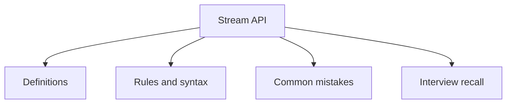

# 23 - Stream API

This topic follows the master outline in [outline.md](../outline.md). The goal is to understand each concept deeply enough to explain it, recognize it in code, and answer interview-style questions.

## Study Order

- [What Is Stream Concepts](theory/01-what-is-stream-concepts.md)
- [Longstream Concepts](theory/02-longstream-concepts.md)
- [Peek Concepts](theory/03-peek-concepts.md)
- [Min Concepts](theory/04-min-concepts.md)
- [Lazy Evaluation Concepts](theory/05-lazy-evaluation-concepts.md)
- [Partitioningby Concepts](theory/06-partitioningby-concepts.md)
- [Key Terms](terms/01-key-terms.md)

## Outline Checklist

- What is Stream?
- Stream vs Collection
- Create Stream:
- from List
- from Array
- from Map
- Stream.of
- IntStream
- LongStream
- DoubleStream
- Intermediate operations:
- filter
- map
- flatMap
- distinct
- sorted
- peek
- limit
- skip
- Terminal operations:
- forEach
- collect
- toList
- count
- min
- max
- reduce
- anyMatch
- allMatch
- noneMatch
- findFirst
- findAny
- Lazy evaluation
- Short-circuiting
- Parallel stream
- Collectors:
- toSet
- toMap
- joining
- groupingBy
- partitioningBy
- counting
- summarizingInt
- mapping
- reducing

## Self-Check

Before moving to the next topic, verify that you can answer these questions:
1. Why are Java Streams lazily evaluated, and how does the pipeline separate intermediate operations (like `filter`, `map`) from terminal operations (like `collect`, `forEach`) at the JVM level?
   &rarr; See [Why Streams Are Lazily Evaluated](theory/05-lazy-evaluation-concepts.md#why-streams-are-lazily-evaluated)
2. Why should you avoid using `peek()` for production-level state mutation, and what is the difference between `peek()` execution in intermediate vs terminal contexts?
   &rarr; See [Why peek() Should Not Be Used for State Mutation](theory/03-peek-concepts.md#why-peek-should-not-be-used-for-state-mutation)
3. Why does `flatMap()` differ from `map()`, and how does it flatten nested collections into a single stream of elements?
   &rarr; See [Why flatMap() Differs from map()](theory/02-longstream-concepts.md#why-flatmap-differs-from-map)
4. Why do primitive streams (like `IntStream`, `LongStream`, `DoubleStream`) exist, and how do they avoid the performance cost of auto-boxing and unboxing?
   &rarr; See [Why Primitive Streams Exist and Avoid Autoboxing](theory/01-what-is-stream-concepts.md#why-primitive-streams-exist-and-avoid-autoboxing)
5. Why are parallel streams not a default solution for performance scaling, and what thread pool (ForkJoinPool) and data splitting characteristics determine parallel stream performance?
   &rarr; See [Why Parallel Streams Are Not a Default Solution](theory/05-lazy-evaluation-concepts.md#why-parallel-streams-are-not-a-default-solution)
6. Why do collectors like `groupingBy` and `partitioningBy` serve different aggregation purposes, and how do they internally bucket values into Map structures?
   &rarr; See [Why groupingBy and partitioningBy Serve Different Purposes](theory/06-partitioningby-concepts.md#why-groupingby-and-partitioningby-serve-different-purposes)

## Anki Cards

- [Basic](anki/basic.tsv)
- [Basic Extra](anki/basic-extra.tsv)
- [Cloze](anki/cloze.tsv)
- [Code Question](anki/code-question.tsv)

## Mermaid Overview

## Reference Links

- https://docs.oracle.com/en/java/javase/21/docs/api/java.base/java/util/stream/package-summary.html
- https://docs.oracle.com/javase/tutorial/collections/streams/
