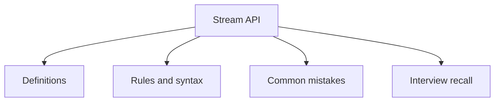

# 23 - Stream API

This topic follows the master outline in [outline.md](../outline.md). The goal is to understand each concept deeply enough to explain it, recognize it in code, and answer interview-style questions.

## Study Order

- [What Is Stream Concepts](theory/01-what-is-stream-concepts.md)
- [Longstream Concepts](theory/02-longstream-concepts.md)
- [Peek Concepts](theory/03-peek-concepts.md)
- [Min Concepts](theory/04-min-concepts.md)
- [Lazy Evaluation Concepts](theory/05-lazy-evaluation-concepts.md)
- [Partitioningby Concepts](theory/06-partitioningby-concepts.md)
- [Key Terms](terms/01-key-terms.md)

## Outline Checklist

- What is Stream?
- Stream vs Collection
- Create Stream:
- from List
- from Array
- from Map
- Stream.of
- IntStream
- LongStream
- DoubleStream
- Intermediate operations:
- filter
- map
- flatMap
- distinct
- sorted
- peek
- limit
- skip
- Terminal operations:
- forEach
- collect
- toList
- count
- min
- max
- reduce
- anyMatch
- allMatch
- noneMatch
- findFirst
- findAny
- Lazy evaluation
- Short-circuiting
- Parallel stream
- Collectors:
- toSet
- toMap
- joining
- groupingBy
- partitioningBy
- counting
- summarizingInt
- mapping
- reducing

## Anki Cards

- [Basic](anki/basic.tsv)
- [Basic Extra](anki/basic-extra.tsv)
- [Cloze](anki/cloze.tsv)
- [Code Question](anki/code-question.tsv)

## Mermaid Overview

## Reference Links

- https://docs.oracle.com/en/java/javase/21/docs/api/java.base/java/util/stream/package-summary.html
- https://docs.oracle.com/javase/tutorial/collections/streams/
