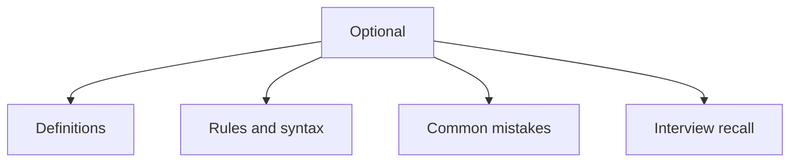

# 24 - Optional

This topic follows the master outline in [outline.md](../outline.md). The goal is to understand each concept deeply enough to explain it, recognize it in code, and answer interview-style questions.

## Study Order

- [What Is Optional T Concepts](theory/01-what-is-optional-t-concepts.md)
- [Map Concepts](theory/02-map-concepts.md)
- [Key Terms](terms/01-key-terms.md)

## Outline Checklist

- What is Optional<T>?
- Avoid NullPointerException
- Optional.of
- Optional.ofNullable
- Optional.empty
- isPresent
- ifPresent
- orElse
- orElseGet
- orElseThrow
- map
- flatMap
- filter
- Do not overuse Optional
- Optional in return type

## Self-Check

1. Why is Optional designed as a wrapper rather than a replacement for null in fields or parameters?
2. What is the performance overhead of using Optional in loops or fields?
3. What is the difference between orElse() and orElseGet() in terms of eager vs lazy evaluation?
4. Why does returning null from an Optional-returning method violate its design API contract?
5. What is the key difference between Optional's map() and flatMap() methods in terms of signature and wrapping behavior?
6. Why can flatMap() throw a NullPointerException when the mapping function returns null, while map() does not?
7. Why is Optional not Serializable, and what are the implications of this for Java class design?

## Anki Cards

- [Basic](anki/basic.tsv)
- [Basic Extra](anki/basic-extra.tsv)
- [Cloze](anki/cloze.tsv)
- [Code Question](anki/code-question.tsv)

## Mermaid Overview

## Reference Links

- https://docs.oracle.com/en/java/javase/21/docs/api/java.base/java/util/Optional.html
