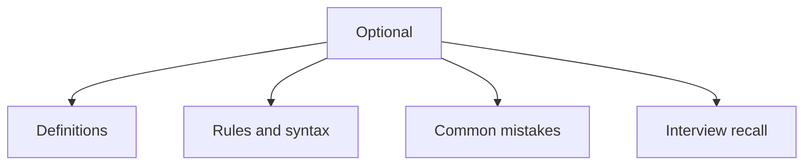

# 24 - Optional

This topic follows the master outline in [outline.md](../outline.md). The goal is to understand each concept deeply enough to explain it, recognize it in code, and answer interview-style questions.

## Study Order

- [What Is Optional T Concepts](theory/01-what-is-optional-t-concepts.md)
- [Map Concepts](theory/02-map-concepts.md)
- [Key Terms](terms/01-key-terms.md)

## Outline Checklist

- What is Optional<T>?
- Avoid NullPointerException
- Optional.of
- Optional.ofNullable
- Optional.empty
- isPresent
- ifPresent
- orElse
- orElseGet
- orElseThrow
- map
- flatMap
- filter
- Do not overuse Optional
- Optional in return type

## Anki Cards

- [Basic](anki/basic.tsv)
- [Basic Extra](anki/basic-extra.tsv)
- [Cloze](anki/cloze.tsv)
- [Code Question](anki/code-question.tsv)

## Mermaid Overview

## Reference Links

- https://docs.oracle.com/en/java/javase/21/docs/api/java.base/java/util/Optional.html
