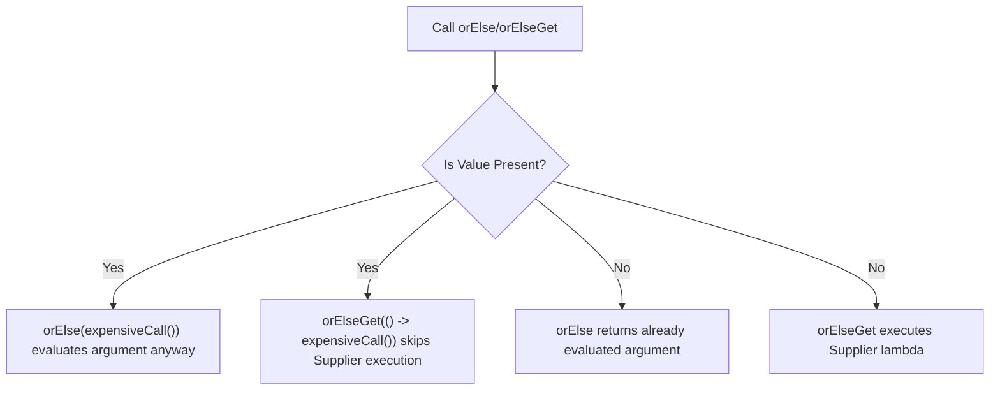

# Optional - Part 1

## Learning Goal

This file covers a focused slice of **Optional**. Study each concept as a practical Java rule, not as isolated vocabulary.

## Outline Coverage

| Concept | What to know |
| --- | --- |
| `What is Optional<T>?` | Optional is a container that may or may not hold a non-null value. |
| `Avoid NullPointerException` | An exception represents an abnormal condition that a program may catch or propagate. |
| `Optional.of` | Optional is a container that may or may not hold a non-null value. |
| `Optional.ofNullable` | Optional is a container that may or may not hold a non-null value. |
| `Optional.empty` | Optional is a container that may or may not hold a non-null value. |
| `isPresent` |isPresent is a specific concept in Optional; learn its Java rule, valid use cases, and failure mode rather than only its name. |
| `ifPresent` |ifPresent is a specific concept in Optional; learn its Java rule, valid use cases, and failure mode rather than only its name. |
| `orElse` |orElse is a specific concept in Optional; learn its Java rule, valid use cases, and failure mode rather than only its name. |
| `orElseGet` |orElseGet is a specific concept in Optional; learn its Java rule, valid use cases, and failure mode rather than only its name. |
| `orElseThrow` | orElseThrow returns the wrapped value or throws an exception if the value is absent. |

## Detailed Notes

### What is Optional<T>?

Optional is a container that may or may not hold a non-null value.

Use it to predict the exact Java rule, the allowed form, and the failure mode. Review it with a tiny example instead of memorizing only the label.

Practical check:

- Define `What is Optional<T>?` in one sentence.
- Recognize `What is Optional<T>?` in code, commands, documentation, or interview prompts.
- Explain one bug, limitation, or tradeoff related to `What is Optional<T>?`.

Tiny example or mental model:

- `Optional.ofNullable(value)` handles a possibly-null value.

#### Detailed Explanation
`Optional<T>` is a final value-based class in the `java.util` package. It wraps a reference of type `T` which can be either present (non-null) or empty. By returning `Optional<T>` from a method, you make the potential absence of a value part of the method signature, alerting caller APIs that they must explicitly handle the empty case.

#### Runnable Code Example
```java
import java.util.Optional;

public class OptionalIntroduction {
    public static void main(String[] args) {
        // Creating an Optional that contains a value
        Optional<String> optionalValue = Optional.of("Hello, Java!");
        
        // Checking and consuming the value
        if (optionalValue.isPresent()) {
            System.out.println("Value is: " + optionalValue.get()); // Prints: Value is: Hello, Java!
        }
    }
}
```

#### Common Mistake
Treating `Optional` as a direct replacement for all null references or using it to wrap local variables. This introduces unnecessary wrapper allocation overhead.

### Avoid NullPointerException

An exception represents an abnormal condition that a program may catch or propagate.

It matters because exception behavior decides whether failures are handled locally, propagated, or allowed to stop the program. A common confusion is treating every exception the same instead of separating recoverable conditions from programming bugs.

Practical check:

- Define `Avoid NullPointerException` in one sentence.
- Recognize `Avoid NullPointerException` in code, commands, documentation, or interview prompts.
- Explain one bug, limitation, or tradeoff related to `Avoid NullPointerException`.

Tiny example or mental model:

- When reading code, ask: what does `Avoid NullPointerException` change, allow, reject, or clarify?

#### Detailed Explanation
In traditional Java, `null` is often returned to represent the absence of a value. If callers forget to perform a null-check before dereferencing, a `NullPointerException` (NPE) is thrown at runtime. `Optional` helps avoid NPEs by shifting the presence check from runtime danger to a structured, compiler-encouraged check.

#### Runnable Code Example
```java
import java.util.Optional;

public class AvoidNPEExample {
    // Bad approach: returns null
    public static String getLegacyName(boolean exists) {
        return exists ? "Alice" : null;
    }

    // Good approach: returns Optional
    public static Optional<String> getOptionalName(boolean exists) {
        return exists ? Optional.of("Alice") : Optional.empty();
    }

    public static void main(String[] args) {
        // Bad: Can cause NullPointerException if not checked
        String name = getLegacyName(false);
        // System.out.println(name.toUpperCase()); // Throws NPE!

        // Good: Caller is forced to address the empty possibility
        Optional<String> optName = getOptionalName(false);
        String upperName = optName.map(String::toUpperCase).orElse("UNKNOWN");
        System.out.println(upperName); // Prints: UNKNOWN
    }
}
```

#### Common Mistake
Calling `.get()` immediately on an `Optional` without verifying presence. If the `Optional` is empty, it throws a `NoSuchElementException`, defeating the purpose of avoiding runtime failures.

### Optional.of

Optional is a container that may or may not hold a non-null value.

Use it to predict the exact Java rule, the allowed form, and the failure mode. Review it with a tiny example instead of memorizing only the label.

Practical check:

- Define `Optional.of` in one sentence.
- Recognize `Optional.of` in code, commands, documentation, or interview prompts.
- Explain one bug, limitation, or tradeoff related to `Optional.of`.

Tiny example or mental model:

- `Optional.ofNullable(value)` handles a possibly-null value.

#### Detailed Explanation
`Optional.of(T value)` is a static factory method used to create an `Optional` containing a non-null value. If the passed value is null, it immediately throws a `NullPointerException` at the point of creation, preventing the null reference from propagating further.

#### Runnable Code Example
```java
import java.util.Optional;

public class OptionalOfExample {
    public static void main(String[] args) {
        // Creating with a valid non-null value
        Optional<String> valid = Optional.of("Java");
        System.out.println(valid.isPresent()); // true

        // Throws NullPointerException immediately at the creation line
        try {
            Optional<String> invalid = Optional.of(null);
        } catch (NullPointerException e) {
            System.out.println("NPE caught: Value cannot be null!");
        }
    }
}
```

#### Common Mistake
Passing a reference that might be null into `Optional.of(value)`. If a reference can be null, always use `Optional.ofNullable(value)` instead.

### Optional.ofNullable

Optional is a container that may or may not hold a non-null value.

Use it to predict the exact Java rule, the allowed form, and the failure mode. Review it with a tiny example instead of memorizing only the label.

Practical check:

- Define `Optional.ofNullable` in one sentence.
- Recognize `Optional.ofNullable` in code, commands, documentation, or interview prompts.
- Explain one bug, limitation, or tradeoff related to `Optional.ofNullable`.

Tiny example or mental model:

- `Optional.ofNullable(value)` handles a possibly-null value.

#### Detailed Explanation
`Optional.ofNullable(T value)` is a static factory method that returns an `Optional` describing the value if non-null, otherwise returns an empty `Optional` (`Optional.empty()`). This is the safest way to wrap legacy APIs or external data that might return `null`.

#### Runnable Code Example
```java
import java.util.Optional;

public class OptionalOfNullableExample {
    public static void main(String[] args) {
        String name1 = "Bob";
        String name2 = null;

        // ofNullable with non-null wraps the value
        Optional<String> opt1 = Optional.ofNullable(name1);
        System.out.println(opt1.isPresent()); // true

        // ofNullable with null safely returns an empty Optional
        Optional<String> opt2 = Optional.ofNullable(name2);
        System.out.println(opt2.isPresent()); // false
        System.out.println(opt2 == Optional.empty()); // true
    }
}
```

#### Common Mistake
Overusing `ofNullable` on values that are guaranteed to be non-null. If a value is guaranteed to be non-null, using `Optional.of()` acts as a self-documenting validation check.

### Optional.empty

Optional is a container that may or may not hold a non-null value.

Use it to predict the exact Java rule, the allowed form, and the failure mode. Review it with a tiny example instead of memorizing only the label.

Practical check:

- Define `Optional.empty` in one sentence.
- Recognize `Optional.empty` in code, commands, documentation, or interview prompts.
- Explain one bug, limitation, or tradeoff related to `Optional.empty`.

Tiny example or mental model:

- `Optional.ofNullable(value)` handles a possibly-null value.

#### Detailed Explanation
`Optional.empty()` is a static factory method that returns an empty `Optional` instance. Java caches a single empty singleton instance under the hood, so multiple calls to `Optional.empty()` return the exact same reference.

#### Runnable Code Example
```java
import java.util.Optional;

public class OptionalEmptyExample {
    public static void main(String[] args) {
        Optional<Integer> empty1 = Optional.empty();
        Optional<String> empty2 = Optional.empty();

        // They are reference-equal because Optional.empty() is cached
        System.out.println(empty1 == empty2); // true
    }
}
```

#### Common Mistake
Returning `null` instead of `Optional.empty()` from a method designed to return an `Optional`. This forces the caller to check for null on the `Optional` container itself, causing nested null checks and bypassing the type-level safety.

### isPresent

isPresent is a specific concept in Optional; learn its Java rule, valid use cases, and failure mode rather than only its name.

Use it to predict the exact Java rule, the allowed form, and the failure mode. Review it with a tiny example instead of memorizing only the label.

Practical check:

- Define `isPresent` in one sentence.
- Recognize `isPresent` in code, commands, documentation, or interview prompts.
- Explain one bug, limitation, or tradeoff related to `isPresent`.

Tiny example or mental model:

- When reading code, ask: what does `isPresent` change, allow, reject, or clarify?

#### Detailed Explanation
`isPresent()` returns `true` if there is a value present, otherwise `false`. Java 11 also introduced `isEmpty()`, which returns `true` if empty. Both are state-querying methods.

#### Runnable Code Example
```java
import java.util.Optional;

public class IsPresentExample {
    public static void main(String[] args) {
        Optional<String> opt = Optional.of("Hello");

        if (opt.isPresent()) {
            System.out.println("Length: " + opt.get().length()); // Length: 5
        }

        Optional<String> emptyOpt = Optional.empty();
        if (emptyOpt.isEmpty()) {
            System.out.println("Optional is indeed empty");
        }
    }
}
```

#### Common Mistake
Falling back to imperative null-like checks by using `if (opt.isPresent()) { ... opt.get() ... }`. This is called the "isPresent/get anti-pattern." Whenever possible, replace it with functional methods like `ifPresent`, `orElse`, or `map`.

### ifPresent

ifPresent is a specific concept in Optional; learn its Java rule, valid use cases, and failure mode rather than only its name.

Use it to predict the exact Java rule, the allowed form, and the failure mode. Review it with a tiny example instead of memorizing only the label.

Practical check:

- Define `ifPresent` in one sentence.
- Recognize `ifPresent` in code, commands, documentation, or interview prompts.
- Explain one bug, limitation, or tradeoff related to `ifPresent`.

Tiny example or mental model:

- When reading code, ask: what does `ifPresent` change, allow, reject, or clarify?

#### Detailed Explanation
`ifPresent(Consumer<? super T> action)` takes a lambda consumer and executes it only if a value is present. If the Optional is empty, it does nothing. In Java 9, `ifPresentOrElse(Consumer<? super T> action, Runnable emptyAction)` was introduced to handle both presence and absence.

#### Runnable Code Example
```java
import java.util.Optional;

public class IfPresentExample {
    public static void main(String[] args) {
        Optional<String> opt = Optional.of("Alice");

        // safe consumption without calling get()
        opt.ifPresent(name -> System.out.println("Hello, " + name));

        // Handling both paths with ifPresentOrElse
        Optional<String> emptyOpt = Optional.empty();
        emptyOpt.ifPresentOrElse(
            name -> System.out.println("Hello, " + name),
            () -> System.out.println("No name provided")
        ); // Prints: No name provided
    }
}
```

#### Common Mistake
Executing blocks with side effects inside `ifPresent` when a return value is needed. If you want to transform the value and retrieve a result, use `map()` or `flatMap()` instead of performing side effects inside `ifPresent`.

### orElse

orElse is a specific concept in Optional; learn its Java rule, valid use cases, and failure mode rather than only its name.

Use it to predict the exact Java rule, the allowed form, and the failure mode. Review it with a tiny example instead of memorizing only the label.

Practical check:

- Define `orElse` in one sentence.
- Recognize `orElse` in code, commands, documentation, or interview prompts.
- Explain one bug, limitation, or tradeoff related to `orElse`.

Tiny example or mental model:

- When reading code, ask: what does `orElse` change, allow, reject, or clarify?

#### Detailed Explanation
`orElse(T other)` returns the wrapped value if present, otherwise returns the default value `other`.
**Crucial Performance Rule**: The expression passed to `orElse` is evaluated eagerly at the time of the method call, regardless of whether the `Optional` is empty or not.

#### Runnable Code Example
```java
import java.util.Optional;

public class OrElseExample {
    public static String getDefault() {
        System.out.println("getDefault() executed!");
        return "DefaultValue";
    }

    public static void main(String[] args) {
        Optional<String> presentOpt = Optional.of("Java");

        // Even though presentOpt is present, getDefault() IS still executed!
        String value = presentOpt.orElse(getDefault());
        System.out.println("Returned: " + value);
        // Output:
        // getDefault() executed!
        // Returned: Java
    }
}
```

#### Common Mistake
Using `orElse` to call constructors, methods with side effects, or database fetches. This leads to performance degradation and unintended side effects since the fallback is evaluated even when not needed. Use `orElseGet` to evaluate the fallback lazily.

### orElseGet

orElseGet is a specific concept in Optional; learn its Java rule, valid use cases, and failure mode rather than only its name.

Use it to predict the exact Java rule, the allowed form, and the failure mode. Review it with a tiny example instead of memorizing only the label.

Practical check:

- Define `orElseGet` in one sentence.
- Recognize `orElseGet` in code, commands, documentation, or interview prompts.
- Explain one bug, limitation, or tradeoff related to `orElseGet`.

Tiny example or mental model:

- When reading code, ask: what does `orElseGet` change, allow, reject, or clarify?

#### Detailed Explanation
`orElseGet(Supplier<? super T> supplier)` takes a `Supplier` lambda. If the value is present, it returns the value directly. If the value is empty, it evaluates the supplier and returns the result. This evaluates the fallback lazily, avoiding performance penalties when the default value is not needed.

#### Runnable Code Example
```java
import java.util.Optional;

public class OrElseGetExample {
    public static String getDefault() {
        System.out.println("getDefault() executed lazily!");
        return "DefaultValue";
    }

    public static void main(String[] args) {
        Optional<String> presentOpt = Optional.of("Java");

        // getDefault() is NOT executed because presentOpt is present
        String value = presentOpt.orElseGet(() -> getDefault());
        System.out.println("Returned: " + value);
        
        Optional<String> emptyOpt = Optional.empty();
        // getDefault() IS executed because emptyOpt is empty
        String value2 = emptyOpt.orElseGet(() -> getDefault());
        System.out.println("Returned: " + value2);
    }
}
```

#### Common Mistake
Using `orElse` when lazy evaluation is required, or using `orElseGet` with a lambda that returns a static, pre-allocated constant (which is unnecessary overhead for a lambda wrapper). For static constants, use `orElse`.

## Why orElse() and orElseGet() Differ in Evaluation Mechanics

The fundamental difference between `orElse()` and `orElseGet()` lies in their evaluation strategy: `orElse()` evaluates its argument eagerly (at method call time), whereas `orElseGet()` evaluates its Supplier lambda lazily (only when the `Optional` is empty). When a method call is passed directly into `orElse(expensiveCall())`, the Java compiler evaluates `expensiveCall()` first to obtain its return value, which is then passed as an argument to `orElse()`. This eager execution occurs even if the `Optional` is full and the fallback is completely discarded. In contrast, `orElseGet(() -> expensiveCall())` accepts a functional interface (`Supplier`), meaning Java only invokes the functional method `get()` inside `orElseGet()` if the wrapped value is absent, avoiding useless resource consumption.

### Mental Model: The Vending Machine Analogy

Imagine a vending machine that dispenses drinks:
- **Eager Evaluation (`orElse`)**: Every time you request a drink, the machine proactively opens and pours a backup cup of water, even if the primary drink is perfectly available. If the primary drink is dispensed, it throws the poured backup cup into the trash.
- **Lazy Evaluation (`orElseGet`)**: The machine only starts pouring the backup cup of water if and when the primary drink dispenser runs out completely.



### Runnable Code Example

```java
import java.util.Optional;

public class OrElseEvaluationDemo {
    public static String fetchBackupFromDatabase() {
        System.out.println("Database queried for fallback!"); // Side effect!
        return "DatabaseBackup";
    }

    public static void main(String[] args) {
        Optional<String> optionalValue = Optional.of("PrimaryValue");

        System.out.println("--- Testing orElse (Eager) ---");
        // Eager evaluation: method is called even though optionalValue is present!
        String res1 = optionalValue.orElse(fetchBackupFromDatabase());
        System.out.println("Result: " + res1);
        // Output:
        // Database queried for fallback!
        // Result: PrimaryValue

        System.out.println("\n--- Testing orElseGet (Lazy) ---");
        // Lazy evaluation: Supplier is not triggered because optionalValue is present!
        String res2 = optionalValue.orElseGet(() -> fetchBackupFromDatabase());
        System.out.println("Result: " + res2);
        // Output:
        // Result: PrimaryValue
    }
}
```

### Cause-Effect Chain
Method argument passed to `orElse()` → Java Runtime evaluates argument expression eagerly before entering `orElse()` execution scope → Secondary method executes and incurs CPU/IO/Memory overhead → Primary value is present → Evaluated argument is discarded → Performance waste and unintended side-effects occur.

### orElseThrow

orElseThrow returns the contained value if present, or throws an exception if empty.

It matters because it allows developers to safely unwrap Optionals in contexts where an absent value is an exceptional condition. A common confusion is using `.get()` which does the same but lacks self-documenting intent and has been deprecated/marked as less preferred.

Practical check:

- Define `orElseThrow` in one sentence.
- Recognize `orElseThrow` in code, commands, documentation, or interview prompts.
- Explain one bug, limitation, or tradeoff related to `orElseThrow`.

Tiny example or mental model:

- `opt.orElseThrow(() -> new IllegalArgumentException("Required value missing"))`


#### Detailed Explanation
`orElseThrow()` returns the contained value if present. If empty, it throws a `NoSuchElementException`. In Java 10, the no-argument `orElseThrow()` was added as the preferred alternative to `.get()`.
You can also use `orElseThrow(Supplier<? extends X> exceptionSupplier)` to throw custom checked or unchecked exceptions.

#### Runnable Code Example
```java
import java.util.Optional;

public class OrElseThrowExample {
    public static void main(String[] args) {
        Optional<String> opt = Optional.empty();

        // Custom exception
        try {
            opt.orElseThrow(() -> new IllegalArgumentException("Missing parameter"));
        } catch (IllegalArgumentException e) {
            System.out.println("Caught: " + e.getMessage()); // Caught: Missing parameter
        }

        // Default NoSuchElementException (preferred over get())
        try {
            opt.orElseThrow();
        } catch (java.util.NoSuchElementException e) {
            System.out.println("Caught default NoSuchElementException");
        }
    }
}
```

#### Common Mistake
Using `.get()` instead of `.orElseThrow()`. While they behave identically in throwing `NoSuchElementException` on empty optionals, `orElseThrow()` is self-documenting and signals explicitly that exception throwing is expected and handled behavior.

## Reference Links

- https://docs.oracle.com/en/java/javase/21/docs/api/java.base/java/util/Optional.html#orElse(T) (Optional.orElse API Documentation)
- https://docs.oracle.com/en/java/javase/21/docs/api/java.base/java/util/Optional.html#orElseGet(java.util.function.Supplier) (Optional.orElseGet API Documentation)

## Common Review Prompts

- Which concepts here are compile-time rules?
- Which concepts here affect runtime behavior?
- Which concepts here are likely interview traps?
