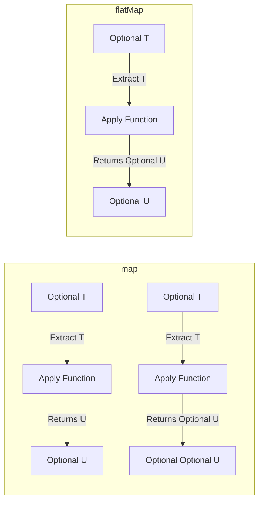
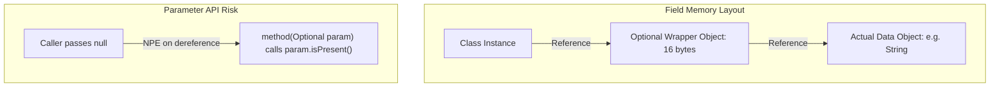

# Optional - Part 2

## Learning Goal

This file covers a focused slice of **Optional**. Study each concept as a practical Java rule, not as isolated vocabulary.

## Outline Coverage

| Concept | What to know |
| --- | --- |
| `map` | map transforms the wrapped value if present and wraps the result back into an Optional. |
| `flatMap` | flatMap transforms the wrapped value using a mapper that returns an Optional, avoiding nesting. |
| `filter` |filter is a specific concept in Optional; learn its Java rule, valid use cases, and failure mode rather than only its name. |
| `Do not overuse Optional` | Optional is a container that may or may not hold a non-null value. |
| `Optional in return type` | Optional is a container that may or may not hold a non-null value. |

## Detailed Notes

### map

map transforms the value inside the Optional if present, wrapping the returned raw type back into an Optional.

It matters because it allows developers to build clean functional pipelines without manually checking for null at each step. A common confusion is using map when the mapper function itself returns an Optional, which results in a nested Optional<Optional<T>>.

Practical check:

- Define `map` in one sentence.
- Recognize `map` in code, commands, documentation, or interview prompts.
- Explain one bug, limitation, or tradeoff related to `map`.

Tiny example or mental model:

- `opt.map(String::toUpperCase)`


#### Detailed Explanation
`map(Function<? super T, ? extends U> mapper)` is used to transform the value inside the `Optional`. If a value is present, it applies the mapping function to the value. If the mapping function returns a non-null value, it returns an `Optional` containing that result. If the `Optional` is empty or if the mapper returns `null`, it returns an empty `Optional`.
Crucially, the mapping function returns a raw type `U`, and `map` automatically wraps it into `Optional<U>`.

#### Runnable Code Example
```java
import java.util.Optional;

public class OptionalMapExample {
    public static void main(String[] args) {
        Optional<String> opt = Optional.of("Hello");

        // Transform string to its length
        Optional<Integer> length = opt.map(String::length);
        System.out.println(length.orElse(0)); // Prints: 5

        // If mapper returns null, map() returns empty Optional
        Optional<String> nullResult = opt.map(val -> (String) null);
        System.out.println(nullResult.isPresent()); // Prints: false
    }
}
```

#### Common Mistake
Using `map` when the mapping function itself returns an `Optional`. This results in a nested `Optional<Optional<U>>`. In such cases, use `flatMap` instead.

### flatMap

flatMap transforms the value inside the Optional if present, where the mapper function returns an Optional directly.

It matters because it avoids wrapping the result of the mapping function in a nested Optional (e.g. Optional<Optional<T>>), returning the single flattened Optional instead. A common confusion is that flatMap will throw a NullPointerException if the mapping function returns null, whereas map would safely return an empty Optional.

Practical check:

- Define `flatMap` in one sentence.
- Recognize `flatMap` in code, commands, documentation, or interview prompts.
- Explain one bug, limitation, or tradeoff related to `flatMap`.

Tiny example or mental model:

- `optUser.flatMap(User::getEmail)`


#### Detailed Explanation
`flatMap(Function<? super T, ? extends Optional<? extends U>> mapper)` is similar to `map`, but is used when the mapping function returns an `Optional`. Instead of wrapping the returned `Optional` into another `Optional`, `flatMap` flattens the result by returning the mapper's `Optional` directly.
**Gotcha**: If the mapping function returns `null`, `flatMap` throws `NullPointerException` (unlike `map`, which would return an empty `Optional`).

#### Runnable Code Example
```java
import java.util.Optional;

class User {
    private final String name;
    private final Optional<String> email;

    public User(String name, String email) {
        this.name = name;
        this.email = Optional.ofNullable(email);
    }

    public Optional<String> getEmail() {
        return email;
    }
}

public class OptionalFlatMapExample {
    public static void main(String[] args) {
        Optional<User> userOpt = Optional.of(new User("Alice", "alice@example.com"));

        // Using map() would return Optional<Optional<String>>
        Optional<Optional<String>> nested = userOpt.map(User::getEmail);

        // Using flatMap() returns Optional<String> directly
        Optional<String> flattened = userOpt.flatMap(User::getEmail);
        System.out.println(flattened.orElse("No Email")); // alice@example.com
    }
}
```

#### Common Mistake
Confusing `map` and `flatMap` when the mapping function returns `Optional`. If you see a type like `Optional<Optional<T>>` in your code, you have used `map` when you should have used `flatMap`.

## Why map() and flatMap() Differ in Signature and Wrapping

The core difference between `map()` and `flatMap()` is how they handle the return type of the mapping function. The `map()` method is designed for mapping functions that return raw values; it automatically wraps whatever raw value the mapper returns into a new `Optional`. If you pass a mapper function that itself returns an `Optional`, `map()` will still wrap it, resulting in a nested `Optional<Optional<T>>` structure. Conversely, `flatMap()` is designed specifically for mapping functions that already return an `Optional`; it returns that `Optional` directly without applying another layer of wrapping. Additionally, a critical mechanism difference is that if the mapping function returns `null`, `map()` catches this and safely returns `Optional.empty()`, whereas `flatMap()` explicitly checks for null and throws a `NullPointerException` to prevent invalid nested optionals.

### Mental Model: The Nested Box Analogy

- **`map` (Automatic Wrapping)**: You open a box (the original `Optional`), extract the item, apply a change, and the compiler automatically places the changed item back into a new box. If the item you extracted was already inside a smaller box, you end up with a box inside a box.
- **`flatMap` (Manual Flattening)**: You open a box, extract the item (which is already inside its own smaller box), apply a change, and return that smaller box directly. The outer box is discarded, so you only have one single level of boxing.



### Runnable Code Example

```java
import java.util.Optional;

public class MapVsFlatMapDemo {
    public static void main(String[] args) {
        Optional<String> optionalWord = Optional.of("Hello");

        // map() wraps the result in an Optional automatically
        Optional<Integer> optLen = optionalWord.map(s -> s.length()); // returns Integer, wrapped to Optional<Integer>
        System.out.println("map length: " + optLen.orElse(0)); // Output: map length: 5

        // If the function returns an Optional:
        // Using map() nesting occurs:
        Optional<Optional<String>> nested = optionalWord.map(s -> Optional.of(s + " World"));
        
        // Using flatMap() avoids nesting:
        Optional<String> flattened = optionalWord.flatMap(s -> Optional.of(s + " World"));
        System.out.println("flatMap output: " + flattened.orElse("")); // Output: flatMap output: Hello World

        // Critical difference on null returns:
        try {
            // map() returning null returns Optional.empty() safely
            Optional<String> mapNull = optionalWord.map(s -> null);
            System.out.println("mapNull is present: " + mapNull.isPresent()); // Output: mapNull is present: false
        } catch (Exception e) {
            System.out.println("map threw exception");
        }

        try {
            // flatMap() returning null throws NullPointerException immediately!
            Optional<String> flatMapNull = optionalWord.flatMap(s -> null);
        } catch (NullPointerException e) {
            System.out.println("flatMap null threw NullPointerException!"); // Output: flatMap null threw NullPointerException!
        }
    }
}
```

### Cause-Effect Chain
Mapping function passed to `flatMap()` returns `null` instead of an `Optional` instance → `flatMap()` internal implementation checks if mapper result is null → result is null → JVM throws `NullPointerException` → Execution halts, alerting the developer that the mapping function violated the API contract.

### filter

filter is a specific concept in Optional; learn its Java rule, valid use cases, and failure mode rather than only its name.

Use it to predict the exact Java rule, the allowed form, and the failure mode. Review it with a tiny example instead of memorizing only the label.

Practical check:

- Define `filter` in one sentence.
- Recognize `filter` in code, commands, documentation, or interview prompts.
- Explain one bug, limitation, or tradeoff related to `filter`.

Tiny example or mental model:

- When reading code, ask: what does `filter` change, allow, reject, or clarify?

#### Detailed Explanation
`filter(Predicate<? super T> predicate)` allows you to conditionally discard a value. If a value is present and matches the given predicate, the `Optional` is returned as-is. If the value does not match the predicate, or if the `Optional` is empty, an empty `Optional` is returned.

#### Runnable Code Example
```java
import java.util.Optional;

public class OptionalFilterExample {
    public static void main(String[] args) {
        Optional<String> opt = Optional.of("apple");

        // Predicate matches
        Optional<String> matched = opt.filter(s -> s.startsWith("a"));
        System.out.println(matched.isPresent()); // true

        // Predicate does not match
        Optional<String> unmatched = opt.filter(s -> s.startsWith("b"));
        System.out.println(unmatched.isPresent()); // false
    }
}
```

#### Common Mistake
Checking `isPresent()` and then performing an if-statement check on the unwrapped value, instead of using `filter()`.
*Before (Imperative):*
```java
if (opt.isPresent() && opt.get().length() > 5) {
    System.out.println(opt.get());
}
```
*After (Idiomatic):*
```java
opt.filter(s -> s.length() > 5).ifPresent(System.out::println);
```

### Do not overuse Optional

Optional is a container that may or may not hold a non-null value.

Use it to predict the exact Java rule, the allowed form, and the failure mode. Review it with a tiny example instead of memorizing only the label.

Practical check:

- Define `Do not overuse Optional` in one sentence.
- Recognize `Do not overuse Optional` in code, commands, documentation, or interview prompts.
- Explain one bug, limitation, or tradeoff related to `Do not overuse Optional`.

Tiny example or mental model:

- `Optional.ofNullable(value)` handles a possibly-null value.

#### Detailed Explanation
`Optional` is designed strictly as a return type to handle the absence of a value cleanly without throwing NPE. It should not be used as:
- Class fields (adds memory overhead, and `Optional` is not `Serializable`).
- Method parameters (forces caller to wrap parameters, increases risk of NPE if they pass a null `Optional`).
- Wrapping collection elements or return types of collection structures (e.g., return empty collections instead of an Optional wrapping a collection).

#### Runnable Code Example
```java
import java.util.Optional;
import java.util.List;
import java.util.Collections;

public class OveruseExample {
    // ANTI-PATTERN: Optional as a parameter
    public static void printUser(Optional<String> username) {
        // Bad! Caller might pass null instead of Optional.empty(), causing NPE here
        if (username.isPresent()) {
            System.out.println(username.get());
        }
    }

    // IDIOMATIC: Use method overloading or nullable parameter
    public static void printUser(String username) {
        if (username != null) {
            System.out.println(username);
        }
    }

    // ANTI-PATTERN: Optional of List
    public static Optional<List<String>> getNames(boolean exists) {
        return exists ? Optional.of(List.of("Alice")) : Optional.empty();
    }

    // IDIOMATIC: Return empty list
    public static List<String> getNamesIdiomatic(boolean exists) {
        return exists ? List.of("Alice") : Collections.emptyList();
    }
}
```

#### Common Mistake
Designing domain objects or entities with fields of type `Optional<T>`. This will break frameworks that serialize objects (e.g., Jackson, standard Java serialization) and wastes memory (an extra object reference per field).

## Why Optional Should Not Be Used for Fields or Parameters

Using `Optional` for fields or parameters introduces substantial memory, serialization, and API usability overheads. First, `Optional` is an object wrapper: each instance of `Optional` consumes 16 bytes of header and alignment memory on a standard 64-bit JVM, plus 8 bytes for the reference itself. If you define fields of type `Optional` in domain models that are instantiated millions of times (e.g., in a collection of users or products), this object wrapper overhead rapidly degrades garbage collection performance and increases heap usage. Second, `Optional` does not implement `java.io.Serializable`; trying to serialize an entity with an `Optional` field throws a `NotSerializableException`, breaking integration with enterprise frameworks, JPA providers, cache layers, or JSON serializers. Finally, using `Optional` as method parameters defeats the purpose of the API contract: callers are forced to write verbose wrapping wrappers, and it introduces a risk of a nested `NullPointerException` if a caller passes an actual Java `null` instead of `Optional.empty()`.

### Mental Model: The Double-Wrapped Present

- **Entity Field**: Storing `Optional` as a field is like putting every small tool in your toolbox inside its own individually wrapped gift box. Not only does the toolbox take up twice as much space, but it also takes more time to open and clean.
- **Method Parameter**: Passing `Optional` to a method is like giving a gift that is wrapped in two layers of boxes, where the recipient must first check if the outer box is null, then check if the inner box is empty, rather than just handling the gift itself.



### Runnable Code Example

```java
import java.io.ByteArrayOutputStream;
import java.io.ObjectOutputStream;
import java.io.Serializable;
import java.util.Optional;

// This class will throw an exception during standard Java serialization!
class BadEmployee implements Serializable {
    private String name;
    private Optional<String> middleName; // Anti-pattern: Not serializable!

    public BadEmployee(String name, String middleName) {
        this.name = name;
        this.middleName = Optional.ofNullable(middleName);
    }
}

// Idiomatic implementation
class GoodEmployee implements Serializable {
    private String name;
    private String middleName; // Correct: Nullable raw reference

    public GoodEmployee(String name, String middleName) {
        this.name = name;
        this.middleName = middleName;
    }

    // Return Optional in getter to notify callers about optionality
    public Optional<String> getMiddleName() {
        return Optional.ofNullable(middleName);
    }
}

public class OptionalFieldDemo {
    public static void main(String[] args) {
        BadEmployee bad = new BadEmployee("John", "Doe");
        try {
            ByteArrayOutputStream baos = new ByteArrayOutputStream();
            ObjectOutputStream oos = new ObjectOutputStream(baos);
            oos.writeObject(bad); // Throws NotSerializableException!
        } catch (Exception e) {
            System.out.println("BadEmployee failed serialization: " + e.toString());
            // Output: BadEmployee failed serialization: java.io.NotSerializableException: java.util.Present
        }

        GoodEmployee good = new GoodEmployee("John", "Doe");
        try {
            ByteArrayOutputStream baos = new ByteArrayOutputStream();
            ObjectOutputStream oos = new ObjectOutputStream(baos);
            oos.writeObject(good); // Works perfectly!
            System.out.println("GoodEmployee serialized successfully!");
        } catch (Exception e) {
            System.out.println("GoodEmployee failed serialization");
        }
    }
}
```

### Cause-Effect Chain
Domain model defined with `Optional<T>` fields → Application instantiates millions of these models → JVM heap allocates an extra 16-24 bytes wrapper object per field → Garbage collector incurs high frequency of promotion and compaction pauses → Application memory throughput decreases.

### Optional in return type

Optional is a container that may or may not hold a non-null value.

Use it to predict the exact Java rule, the allowed form, and the failure mode. Review it with a tiny example instead of memorizing only the label.

Practical check:

- Define `Optional in return type` in one sentence.
- Recognize `Optional in return type` in code, commands, documentation, or interview prompts.
- Explain one bug, limitation, or tradeoff related to `Optional in return type`.

Tiny example or mental model:

- `Optional.ofNullable(value)` handles a possibly-null value.

#### Detailed Explanation
The primary purpose of `Optional` is to serve as a return type for methods that might not have a result. This forces the client/caller to explicitly handle the empty state.
**Rules for Returns**:
- Never return `null` from a method that is declared to return `Optional<T>`. Always return `Optional.empty()`. Returning `null` defeats the design and causes `NullPointerException` on the container itself when the caller attempts to chain operations.

#### Runnable Code Example
```java
import java.util.Optional;

public class OptionalReturnExample {
    // ANTI-PATTERN: Returning null for Optional
    public static Optional<String> findUserBad(int id) {
        if (id == 0) return null; // Horrible! Caller gets NPE on the Optional container.
        return Optional.of("User" + id);
    }

    // IDIOMATIC: Return Optional.empty()
    public static Optional<String> findUserGood(int id) {
        if (id == 0) return Optional.empty();
        return Optional.of("User" + id);
    }

    public static void main(String[] args) {
        try {
            findUserBad(0).orElse("Default"); // Throws NullPointerException!
        } catch (NullPointerException e) {
            System.out.println("NPE caught due to returning null!");
        }

        String user = findUserGood(0).orElse("Default"); // Safe and works!
        System.out.println("User: " + user); // User: Default
    }
}
```

#### Common Mistake
Returning `Optional` from getters where a nullable raw reference is expected by serialization or ORM libraries (like Hibernate). For entity fields, use standard nullable fields and write a getter that returns a raw nullable or construct the `Optional` on-the-fly.

## Case Study: Optional Anti-Patterns vs Idiomatic Code

To ensure clean design, performance, and standard-compliant Java code, developers must avoid misusing `Optional` in common scenarios.

### Anti-Pattern 1: Optional as Class Fields
```java
// BAD: Optional field (wastes memory, not Serializable)
public class Employee {
    private String name;
    private Optional<String> middleName; // Anti-pattern
}
```
**Why it is bad:**
1. `Optional` is not `Serializable`. If this class is serialized (e.g., in a session state, distributed cache, or via RMI), a `NotSerializableException` will be thrown.
2. Every `Optional` instance adds 16 bytes of memory overhead on 64-bit JVMs (plus references), which degrades performance when millions of entities are loaded.

**Idiomatic Solution:**
Keep the field nullable and return `Optional` in the getter if needed.
```java
// GOOD: Nullable field, Optional returned in getter
public class Employee {
    private String name;
    private String middleName; // Can be null

    public Optional<String> getMiddleName() {
        return Optional.ofNullable(middleName);
    }
}
```

### Anti-Pattern 2: Optional as Method Parameters
```java
// BAD: Optional parameter forces wrapper creation
public void updateAddress(int employeeId, Optional<String> street) {
    if (street.isPresent()) {
        // update
    }
}
```
**Why it is bad:**
1. It forces the caller to wrap their arguments (e.g., `updateAddress(1, Optional.of("Main St"))` or `updateAddress(1, Optional.empty())`), creating boilerplate.
2. Callers might pass `null` to the method instead of `Optional.empty()`, leading to a `NullPointerException` inside the method when calling `street.isPresent()`.

**Idiomatic Solution:**
Use method overloading or handle standard nullable parameters.
```java
// GOOD: Overloaded methods or raw nullable parameter
public void updateAddress(int employeeId, String street) {
    if (street != null) {
        // update
    }
}
```

### Anti-Pattern 3: Optional wrapping Collections
```java
// BAD: Optional of List
public Optional<List<Order>> getOrders(int customerId) {
    List<Order> orders = orderDb.find(customerId);
    if (orders.isEmpty()) {
        return Optional.empty(); // Anti-pattern
    }
    return Optional.of(orders);
}
```
**Why it is bad:**
Collections (Lists, Sets, Maps) already have a standard way of representing absence: the empty collection (`Collections.emptyList()`, `List.of()`). Wrapping them in `Optional` forces the caller to do a double check (checking if the Optional is empty, and then checking if the list is empty).

**Idiomatic Solution:**
Always return an empty collection directly.
```java
// GOOD: Return empty list directly
public List<Order> getOrders(int customerId) {
    List<Order> orders = orderDb.find(customerId);
    return orders != null ? orders : Collections.emptyList();
}
```

### Anti-Pattern 4: The `isPresent()` + `get()` Pattern (Imperative Optional)
```java
// BAD: Imperative check defeats functional purpose
Optional<User> userOpt = findUser(123);
if (userOpt.isPresent()) {
    System.out.println(userOpt.get().getName());
}
```
**Why it is bad:**
It mimics traditional null checking and does not gain any functional programming benefits. If the developer forgets the `isPresent()` check and calls `get()`, they get a runtime exception.

**Idiomatic Solution:**
Use `ifPresent`, `map`, `orElseGet`, or `orElseThrow`.
```java
// GOOD: Declarative transformation and consumption
findUser(123)
    .map(User::getName)
    .ifPresent(System.out::println);
```

## Reference Links

- https://docs.oracle.com/en/java/javase/21/docs/api/java.base/java/util/Optional.html#map(java.util.function.Function) (Optional.map API Documentation)
- https://docs.oracle.com/en/java/javase/21/docs/api/java.base/java/util/Optional.html#flatMap(java.util.function.Function) (Optional.flatMap API Documentation)
- https://docs.oracle.com/en/java/javase/21/docs/api/java.base/java/util/Optional.html (Optional API Specification)

## Common Review Prompts

- Which concepts here are compile-time rules?
- Which concepts here affect runtime behavior?
- Which concepts here are likely interview traps?
