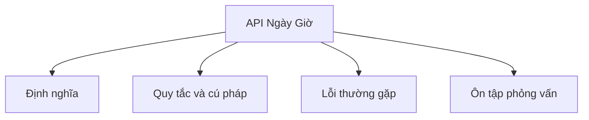

# 25 - API Ngày Giờ (Date and Time API)

Chủ đề này tuân theo đề cương chính trong [outline.md](../outline.md). Mục tiêu là hiểu từng khái niệm đủ sâu để có thể giải thích, nhận diện trong code và trả lời các câu hỏi phỏng vấn.

## Thứ Tự Học

- [Khái Niệm về Ngày Tháng](theory/01-date-concepts.md)
- [Khái Niệm về Period](theory/02-period-concepts.md)
- [Thuật Ngữ Chính](terms/01-key-terms.md)

## Danh Sách Kiểm Tra Theo Đề Cương

- Date
- Calendar
- SimpleDateFormat
- LocalDate
- LocalTime
- LocalDateTime
- ZonedDateTime
- OffsetDateTime
- Instant
- Duration
- Period
- DateTimeFormatter
- ZoneId
- Phân tích ngày/giờ (Parse date/time)
- Định dạng ngày/giờ (Format date/time)
- So sánh ngày/giờ
- Cộng/trừ ngày/giờ
- Múi giờ (Timezone)

## Tự Kiểm Tra

- Tại sao API ngày tháng cũ (`java.util.Date`, `java.util.Calendar`, `java.text.SimpleDateFormat`) có những khiếm khuyết (ví dụ: khả năng biến đổi, lệch chỉ số, vấn đề an toàn luồng - thread-safety)?
- Tại sao các đối tượng ngày-giờ hiện đại trong Java 8 (như `LocalDate`, `LocalTime`, `ZonedDateTime`) được thiết kế bất biến (immutable) và an toàn cho luồng (thread-safe), và mẫu thiết kế nào được dùng để lấy các thực thể đã sửa đổi?
- Sự khác biệt trong biểu diễn múi giờ và các quy tắc giữa `OffsetDateTime`, `ZonedDateTime` và `Instant` là gì?
- Tại sao `java.time.format.DateTimeFormatter` tránh được các lỗi đồng thời (concurrency bugs) của `SimpleDateFormat`?
- `Period` và `Duration` khác nhau như thế nào về biểu diễn và hành vi, đặc biệt khi cộng vào một đối tượng temporal nhận biết múi giờ như `ZonedDateTime` trong quá trình chuyển đổi Giờ Mùa Hè (DST - Daylight Saving Time)?
- `ZonedDateTime` xử lý các thời điểm địa phương không hợp lệ hoặc chồng chéo do chuyển đổi DST như thế nào?

## Thẻ Anki

- [Basic](anki/basic.tsv)
- [Basic Extra](anki/basic-extra.tsv)
- [Cloze](anki/cloze.tsv)
- [Code Question](anki/code-question.tsv)

## Tổng Quan Mermaid

## Liên Kết Tham Khảo

- https://docs.oracle.com/javase/tutorial/datetime/
- https://docs.oracle.com/en/java/javase/21/docs/api/java.base/java/time/package-summary.html
