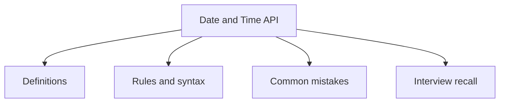

# 25 - Date and Time API

This topic follows the master outline in [outline.md](../outline.md). The goal is to understand each concept deeply enough to explain it, recognize it in code, and answer interview-style questions.

## Study Order

- [Date Concepts](theory/01-date-concepts.md)
- [Period Concepts](theory/02-period-concepts.md)
- [Key Terms](terms/01-key-terms.md)

## Outline Checklist

- Date
- Calendar
- SimpleDateFormat
- LocalDate
- LocalTime
- LocalDateTime
- ZonedDateTime
- OffsetDateTime
- Instant
- Duration
- Period
- DateTimeFormatter
- ZoneId
- Parse date/time
- Format date/time
- Compare date/time
- Add/subtract date/time
- Timezone

## Anki Cards

- [Basic](anki/basic.tsv)
- [Basic Extra](anki/basic-extra.tsv)
- [Cloze](anki/cloze.tsv)
- [Code Question](anki/code-question.tsv)

## Mermaid Overview

## Reference Links

- https://docs.oracle.com/javase/tutorial/datetime/
- https://docs.oracle.com/en/java/javase/21/docs/api/java.base/java/time/package-summary.html
