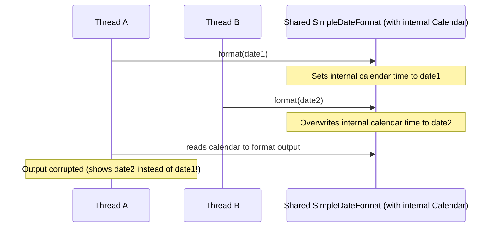
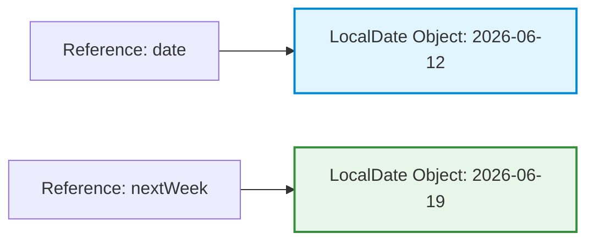
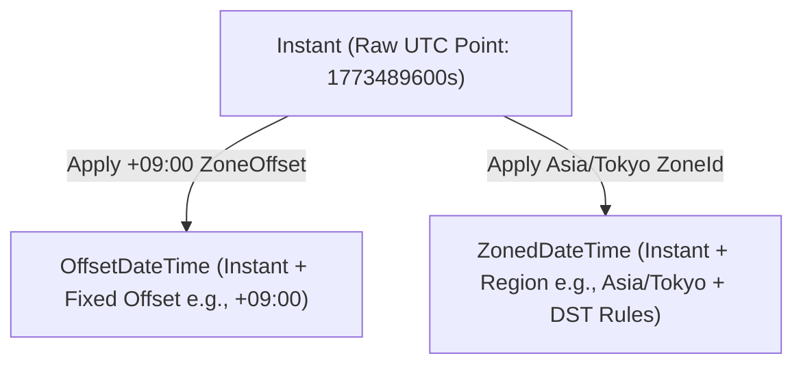

# Date and Time API - Part 1

## Learning Goal

This file covers a focused slice of **Date and Time API**. Study each concept as a practical Java rule, not as isolated vocabulary.

## Outline Coverage

| Concept | What to know |
| --- | --- |
| `Date` | Legacy mutable class representing an instant in time with millisecond precision; suffers from thread-safety issues, 0-indexed months, and confusing timezone handling. |
| `Calendar` | Legacy mutable abstract class for manipulating dates; lacks type safety (uses integer constants), not thread-safe, and retains 0-indexed months. |
| `SimpleDateFormat` | Legacy date formatting and parsing class; not thread-safe and must not be shared across threads without external synchronization. |
| `LocalDate` | Immutable, thread-safe class representing a date without time or timezone (e.g., `2026-06-12`) using 1-indexed months. |
| `LocalTime` | Immutable, thread-safe class representing time without date or timezone (e.g., `13:45:00`) with nanosecond precision. |
| `LocalDateTime` | Immutable, thread-safe class combining date and time without a timezone (e.g., `2026-06-12T13:45:00`). |
| `ZonedDateTime` | Immutable, thread-safe class representing date and time with a full geographical timezone context (resolving DST and offsets). |
| `OffsetDateTime` | Immutable, thread-safe class representing date and time with a fixed offset from UTC, without daylight saving time rules. |
| `Instant` | Immutable, thread-safe class representing a single point on the UTC timeline (seconds and nanoseconds from Epoch). |
| `Duration` | Immutable representation of a time-based amount of time (seconds and nanoseconds) for comparing instants or times. |

## Detailed Notes

### Date
`java.util.Date` is a legacy class representing a specific instant in time, with millisecond precision relative to the Epoch (January 1, 1970, 00:00:00 GMT). 

#### Legacy Issues & Failure Modes:
* **Mutability**: `java.util.Date` is mutable. Methods like `setTime(long time)` modify the object itself, risking data corruption in multi-threaded contexts and violating encapsulation.
* **Confusing Timezone Representation**: It stores time in UTC but its `toString()` method formats it using the JVM's default timezone, leading developers to incorrectly believe it contains zone information.
* **0-indexed Months & 1900-based Years**: Month values are 0-indexed (January is `0`, December is `11`), and year constructor arguments require subtracting 1900 (e.g., `new Date(126, 5, 12)` represents June 12, 2026).

```java
// Mutability bug demo
java.util.Date sharedDate = new java.util.Date();
System.out.println("Initial Date: " + sharedDate);

// A caller can mutate this date, affecting any other components sharing the reference
sharedDate.setTime(0L); // Mutated to Jan 1, 1970
System.out.println("Mutated Date: " + sharedDate);
```

### Calendar
`java.util.Calendar` was introduced in JDK 1.1 to replace `Date` for formatting and date manipulation, but it inherited many of the same problems.

#### Limitations & Gotchas:
* **Mutability**: It is mutable, allowing state changes via `set(int field, int value)` which makes thread safety extremely difficult.
* **Type Safety Issues**: It relies on arbitrary integer constants (e.g., `Calendar.MONTH`, `Calendar.YEAR`) for field access, which compile-time type checkers cannot validate.
* **Month indexing**: Like `Date`, it retains 0-indexed months (`Calendar.JUNE` is `5`).

```java
// Modifying dates with Calendar (Mutable and verbose)
java.util.Calendar cal = java.util.Calendar.getInstance();
cal.set(2026, java.util.Calendar.JUNE, 12); // June is 5
cal.add(java.util.Calendar.DAY_OF_MONTH, 5); // Adds 5 days
System.out.println("Calendar after modification: " + cal.getTime());
```

### SimpleDateFormat
`java.text.SimpleDateFormat` is the legacy date parsing and formatting class.

#### Critical Failure Mode:
* **Not Thread-Safe**: Internally maintains state (a calendar instance). Concurrent formatting or parsing from multiple threads can produce corrupt date outputs or throw `NumberFormatException`.

```java
// Dangerous concurrent formatting
java.text.SimpleDateFormat sdf = new java.text.SimpleDateFormat("yyyy-MM-dd");
// If sdf is shared across threads:
// Thread 1: sdf.format(date1)
// Thread 2: sdf.format(date2) -> Can result in corrupted/mixed date output!
```

### Why the Legacy Date, Calendar, and SimpleDateFormat APIs Are Flawed

The legacy `java.util.Date` and `java.util.Calendar` classes represent dates and calendar fields using mutable state, which poses a severe risk of data corruption in concurrent applications. Because any thread with a reference to a `Date` or `Calendar` instance can call mutator methods like `setTime()` or `set()`, developers must write verbose defensive copies to protect encapsulation. Additionally, their API design is highly error-prone: month indices are 0-based (January is `0`), years are offset by `1900` in legacy constructors, and timezone behavior is opaque and format-dependent. Furthermore, classes like `java.text.SimpleDateFormat` are not thread-safe because they maintain mutable calendar state internally; sharing an instance across threads without external synchronization results in corrupted date strings or parsing errors.

#### Mental Model: SimpleDateFormat Concurrency Conflict


#### Code Example: Mutability and Indexing Bugs
```java
// 0-based month (5 = June) and 1900-based year offset (126 = 2026)
java.util.Date legacyDate = new java.util.Date(126, 5, 12); 
System.out.println(legacyDate); // Fri Jun 12 00:00:00 UTC 2026 (formats with JVM timezone)

// Mutability bug
legacyDate.setTime(0L); // Mutated to Epoch (Jan 1, 1970)
System.out.println(legacyDate); // Thu Jan 01 00:00:00 UTC 1970
```

#### Cause-Effect Chain
`Sharing mutable SimpleDateFormat` → `Multiple threads concurrently parse/format` → `Internal Calendar state overwritten midway` → `Corrupt output or unexpected exceptions`

### LocalDate
`java.time.LocalDate` represents a date without time or time zone in the ISO-8601 calendar system (e.g., `2026-06-12`). It is immutable, thread-safe, and implements the `Temporal` interface.

```java
// Creating and manipulating LocalDate
LocalDate date = LocalDate.of(2026, 6, 12); // Clear, 1-indexed months!
LocalDate nextWeek = date.plusDays(7); // Returns a new instance

System.out.println("Original: " + date);   // 2026-06-12
System.out.println("Next Week: " + nextWeek); // 2026-06-19
```

### LocalTime
`java.time.LocalTime` represents time without a date or time zone (e.g., `13:45:00`). It is immutable and thread-safe.

```java
LocalTime time = LocalTime.of(13, 45, 0); // 1:45 PM
LocalTime halfHourLater = time.plusMinutes(30);

System.out.println("Start Time: " + time);          // 13:45
System.out.println("End Time: " + halfHourLater); // 14:15
```

### LocalDateTime
`java.time.LocalDateTime` combines date and time into a single class without a timezone (e.g., `2026-06-12T13:45:00`). It is ideal for local events (e.g., "The store opens daily at 9:00 AM local time") but does not map to a specific moment on the global timeline without a zone context.

```java
LocalDate date = LocalDate.of(2026, 6, 12);
LocalTime time = LocalTime.of(13, 45, 0);
LocalDateTime ldt = LocalDateTime.of(date, time);

System.out.println("LocalDateTime: " + ldt); // 2026-06-12T13:45
```

### Why Modern Java 8 Date-Time Objects Are Immutable and Thread-Safe

Classes in the `java.time` package (such as `LocalDate`, `LocalTime`, and `LocalDateTime`) are designed as immutable value types: they are declared `final`, and their internal state is stored in `private final` fields. Because an immutable object's state cannot change after it is constructed, it is inherently thread-safe and can be shared freely across multiple threads without locks or defensive copies. Rather than modifying the original instance, methods like `plusDays()` or `with()` use a copying pattern to create and return a brand-new instance representing the new state. This design guarantees that code elsewhere in your program holding a reference to the original date-time object will never observe unexpected mutations.

#### Mental Model: Immutable State Transition


#### Code Example: Immutable Modification
```java
LocalDate date = LocalDate.of(2026, 6, 12);
LocalDate nextWeek = date.plusDays(7); // Returns new LocalDate instance

System.out.println(date);     // 2026-06-12 (original remains untouched)
System.out.println(nextWeek); // 2026-06-19 (new instance created)
```

#### Cause-Effect Chain
`Call plusDays()` → `Retrieve value from final fields` → `Compute new values` → `Construct and return a brand new instance` → `Original instance remains unchanged`

### ZonedDateTime
`java.time.ZonedDateTime` represents a date and time with a full timezone context (e.g., `2026-06-12T13:45:00+09:00[Asia/Tokyo]`). It incorporates daylight saving time rules and timezone offset transitions from a `ZoneId`.

```java
LocalDateTime ldt = LocalDateTime.of(2026, 6, 12, 13, 45);
ZonedDateTime tokyoTime = ZonedDateTime.of(ldt, ZoneId.of("Asia/Tokyo"));

System.out.println("Tokyo ZonedDateTime: " + tokyoTime);
```

### OffsetDateTime
`java.time.OffsetDateTime` represents a date and time with a fixed UTC/Greenwich offset (e.g., `2026-06-12T13:45:00+09:00`), but without daylight saving time rules or historical zone adjustments. It is often used for serializing dates in databases or XML/JSON APIs.

```java
LocalDateTime ldt = LocalDateTime.of(2026, 6, 12, 13, 45);
ZoneOffset offset = ZoneOffset.ofHours(9);
OffsetDateTime odt = OffsetDateTime.of(ldt, offset);

System.out.println("OffsetDateTime: " + odt); // 2026-06-12T13:45:00+09:00
```

### Instant
`java.time.Instant` represents an instantaneous point on the UTC timeline (e.g., `2026-06-12T04:45:00Z`). It measures epoch seconds and nanoseconds from `1970-01-01T00:00:00Z` and does not contain local timezone offsets.

```java
Instant instant = Instant.now();
System.out.println("Current Instant (UTC): " + instant);

// ZonedDateTime can be converted to an Instant
ZonedDateTime zdt = ZonedDateTime.now(ZoneId.of("America/New_York"));
Instant fromZdt = zdt.toInstant();
System.out.println("Instant from ZonedDateTime: " + fromZdt);
```

### Why We Distinguish Instant, OffsetDateTime, and ZonedDateTime

Java separates temporal models to reflect how different systems track time. An `Instant` represents a raw, timezone-independent point on the timeline measured in seconds and nanoseconds from the Unix epoch, making it the ideal representation for machine logs, database timestamps, and server communication. An `OffsetDateTime` adds a fixed offset (like `+09:00`) to the date-time fields, allowing representation of local times relative to UTC but without daylight saving time (DST) transition rules. A `ZonedDateTime` includes a full geographical time zone identifier (like `Europe/London`), which automatically handles historical changes and daylight saving adjustments for that specific region by looking up active rules.

#### Mental Model: Time Representation Relationship


#### Code Example: Converting Between Types
```java
Instant instant = Instant.ofEpochSecond(1773489600L); // 2026-03-12T12:00:00Z

// Conversion to OffsetDateTime
OffsetDateTime odt = instant.atOffset(ZoneOffset.ofHours(9));
System.out.println(odt); // 2026-03-12T21:00:00+09:00

// Conversion to ZonedDateTime (automatically shifts based on local DST/offset rules)
ZonedDateTime zdt = instant.atZone(ZoneId.of("America/New_York"));
System.out.println(zdt); // 2026-03-12T07:00:00-05:00[America/New_York]
```

#### Cause-Effect Chain
`Get Instant` → `Apply geographical ZoneId (e.g. Europe/London)` → `Look up active DST rules for that timestamp` → `Determine correct ZoneOffset` → `Construct ZonedDateTime containing Instant, ZoneId, and computed ZoneOffset`

### Duration
`java.time.Duration` represents a time-based amount of time (e.g., "34.5 seconds" or "2 hours"). It is calculated using seconds and nanoseconds and works with time-based temporals (`Instant`, `LocalTime`, `LocalDateTime`).

```java
Instant start = Instant.now();
// Simulating work
Instant end = start.plusSeconds(120);

Duration duration = Duration.between(start, end);
System.out.println("Duration in seconds: " + duration.getSeconds()); // 120
System.out.println("Duration in minutes: " + duration.toMinutes()); // 2
```

## Common Mistakes

### 1. Discarding Modified Immutable Date-Time Objects
Java 8 date-time objects are **immutable**. Calling `.plusDays()`, `.minusHours()`, or `.with()` returns a *new* object. The changes are lost if you discard the return value.
```java
// BAD: Modifying the object directly and expecting it to mutate
LocalDate date = LocalDate.of(2026, 6, 12);
date.plusDays(5); // This does nothing to 'date'!
System.out.println(date); // Prints 2026-06-12

// GOOD: Reassign the return value
date = date.plusDays(5);
System.out.println(date); // Prints 2026-06-17
```

### 2. Confusing Period and Duration
* `Period` represents a date-based amount of time (years, months, days).
* `Duration` represents a time-based amount of time (seconds, nanoseconds).
Passing an `Instant` to `Period.between()` or a `LocalDate` to `Duration.between()` throws a runtime `UnsupportedTemporalTypeException`.
```java
// BAD: Duration with LocalDate (throws UnsupportedTemporalTypeException: Unsupported unit: Seconds)
LocalDate d1 = LocalDate.of(2026, 6, 12);
LocalDate d2 = LocalDate.of(2026, 6, 15);
// Duration.between(d1, d2); // Runtime Error!

// GOOD: Period with LocalDate
Period period = Period.between(d1, d2);
System.out.println("Days between: " + period.getDays()); // 3
```

### 3. Sharing SimpleDateFormat
Using a static or shared instance of `SimpleDateFormat` across threads causes corrupt parse/format values or crash errors. Use `java.time.format.DateTimeFormatter` instead, which is completely thread-safe.


## Common Review Prompts

- Which concepts here are compile-time rules?
- Which concepts here affect runtime behavior?
- Which concepts here are likely interview traps?

## Reference Links

- https://docs.oracle.com/javase/tutorial/datetime/ (Oracle Java Date-Time Trail)
- https://docs.oracle.com/en/java/javase/21/docs/api/java.base/java/time/package-summary.html (Java 21 java.time Package Summary)
- https://docs.oracle.com/en/java/javase/21/docs/api/java.base/java/time/format/DateTimeFormatter.html (DateTimeFormatter JavaDoc)
- https://docs.oracle.com/en/java/javase/21/docs/api/java.base/java/time/ZonedDateTime.html (ZonedDateTime JavaDoc)
- https://docs.oracle.com/en/java/javase/21/docs/api/java.base/java/time/OffsetDateTime.html (OffsetDateTime JavaDoc)
- https://docs.oracle.com/en/java/javase/21/docs/api/java.base/java/time/Instant.html (Instant JavaDoc)

