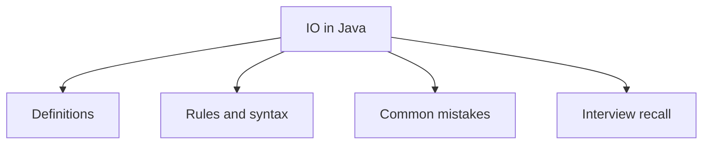

# 26 - IO in Java

This topic follows the master outline in [outline.md](../outline.md). The goal is to understand each concept deeply enough to explain it, recognize it in code, and answer interview-style questions.

## Study Order

- [File Concepts](theory/01-file-concepts.md)
- [Bufferedinputstream Concepts](theory/02-bufferedinputstream-concepts.md)
- [Serialization Concepts](theory/03-serialization-concepts.md)
- [Key Terms](terms/01-key-terms.md)

## Outline Checklist

- File
- Create file
- Delete file
- Check existence
- Read file metadata
- Create directory
- InputStream
- OutputStream
- FileInputStream
- FileOutputStream
- BufferedInputStream
- BufferedOutputStream
- Reader
- Writer
- FileReader
- FileWriter
- BufferedReader
- BufferedWriter
- ObjectInputStream
- ObjectOutputStream
- Serialization
- Deserialization
- Serializable
- serialVersionUID
- transient
- Scanner
- System.in
- System.out
- System.err

## Anki Cards

- [Basic](anki/basic.tsv)
- [Basic Extra](anki/basic-extra.tsv)
- [Cloze](anki/cloze.tsv)
- [Code Question](anki/code-question.tsv)

## Mermaid Overview

## Reference Links

- https://docs.oracle.com/javase/tutorial/essential/io/
- https://docs.oracle.com/en/java/javase/21/docs/api/java.base/java/io/package-summary.html
