# IO in Java - Part 1

## Learning Goal

This file covers a focused slice of **IO in Java**. Study each concept as a practical Java rule, not as isolated vocabulary.

## Outline Coverage

| Concept | What to know |
| --- | --- |
| `File` | Represents a file or directory path in memory; does not open or read the actual contents of a file directly. |
| `Create file` | Handled via `file.createNewFile()`, which returns `true` if successful, or throws an `IOException` if the path is invalid or lacks permissions. |
| `Delete file` | Handled via `file.delete()`, which returns a boolean. It fails (returns `false`) if the file does not exist or if the target is a non-empty directory. |
| `Check existence` | Verified using `file.exists()`, along with helper methods `file.isFile()` and `file.isDirectory()` to determine type. |
| `Read file metadata` | Accessing properties like file size (`file.length()`), name (`file.getName()`), paths (`file.getAbsolutePath()`), and permissions (`file.canRead()`, `file.canWrite()`). |
| `Create directory` | Created via `file.mkdir()` (fails if parent directories don't exist) or `file.mkdirs()` (recursively creates all missing parent directories). |
| `InputStream` | The abstract base class representing an input stream of bytes; used for reading raw binary data. |
| `OutputStream` | The abstract base class representing an output stream of bytes; used for writing raw binary data. |
| `FileInputStream` | A concrete subclass of `InputStream` that reads bytes sequentially from a file. |
| `FileOutputStream` | A concrete subclass of `OutputStream` that writes bytes sequentially to a file. |

## Detailed Notes

### File
The `java.io.File` class represents a pathname to a file or directory on the filesystem. Creating a `File` object does **not** create a file on disk or open any file system streams. It is simply an abstract representation of a path.

```java
// This ONLY creates a representation in memory
File file = new File("example.txt");
System.out.println("Exists: " + file.exists()); // Prints false if the file is not on disk
```

### Create, Delete, and Check Existence
To actually manipulate files on disk, `File` provides methods that interact with the underlying operating system:
* `createNewFile()`: Creates a new, empty file if it does not already exist. It returns `true` if the file was created, and `false` if it already exists.
* `delete()`: Deletes the file or directory. Note that directories can only be deleted if they are completely empty.
* `exists()`: Returns a boolean indicating whether the file or directory exists.
* `isFile()` / `isDirectory()`: Validates the node type on disk.

```java
import java.io.File;
import java.io.IOException;

public class FileBasics {
    public static void main(String[] args) {
        File file = new File("test.txt");
        try {
            if (file.createNewFile()) {
                System.out.println("File created successfully.");
            } else {
                System.out.println("File already exists.");
            }
            
            System.out.println("Is File: " + file.isFile());
            System.out.println("Is Directory: " + file.isDirectory());
            
            if (file.delete()) {
                System.out.println("File deleted successfully.");
            }
        } catch (IOException e) {
            e.printStackTrace();
        }
    }
}
```

### Create Directory and Read Metadata
* `mkdir()`: Creates the directory named by this abstract pathname. Fails if any parent directories in the path do not exist.
* `mkdirs()`: Creates the directory, including any necessary but nonexistent parent directories.
* Metadata methods:
  * `length()`: Returns the file size in bytes. Returns `0L` if the file does not exist.
  * `getName()`: Returns the name of the file or directory (last portion of the path).
  * `getAbsolutePath()`: Returns the absolute path string.

```java
File nestedDir = new File("parent/child/grandchild");
boolean dirsCreated = nestedDir.mkdirs(); // Creates parent, child, and grandchild directories
System.out.println("Directories created: " + dirsCreated);
System.out.println("Directory name: " + nestedDir.getName());
System.out.println("Absolute Path: " + nestedDir.getAbsolutePath());
```

### InputStream & OutputStream (Byte Streams)
`InputStream` and `OutputStream` are abstract classes representing sequential streams of bytes. They are designed for raw binary data (such as images, zip files, or audio).
* `read()`: Reads the next byte of data. Returns `-1` when the end of the stream is reached.
* `write(int b)`: Writes the specified byte to the stream.
* **Important**: Byte streams must be closed after use to release system resources (like file handles).

### FileInputStream & FileOutputStream
These are concrete implementations used to read and write bytes from/to a file on disk.

```java
import java.io.FileInputStream;
import java.io.FileOutputStream;
import java.io.IOException;

public class ByteFileCopy {
    public static void main(String[] args) {
        // Using try-with-resources to guarantee streams are closed
        try (FileInputStream in = new FileInputStream("source.bin");
             FileOutputStream out = new FileOutputStream("dest.bin")) {
             
            int byteData;
            // Read byte-by-byte
            while ((byteData = in.read()) != -1) {
                out.write(byteData);
            }
            System.out.println("Copy completed successfully.");
        } catch (IOException e) {
            System.err.println("File copy failed: " + e.getMessage());
        }
    }
}
```

## Why Character Streams Translate Bytes and Corrupt Binary Data

Character streams (`Reader` and `Writer`) are designed to process textual data by translating raw 8-bit bytes into 16-bit Unicode characters. This translation is governed by a character encoding (such as UTF-8 or UTF-16) that maps specific byte patterns to Unicode code points. When binary files (like images, zip files, or compiled classes) are read using character streams, the underlying bytes represent arbitrary raw data, not encoded characters. The character stream's decoder attempts to parse these bytes as valid characters; if it encounters a byte sequence that does not conform to the expected encoding, it automatically replaces it with a replacement character (typically `\uFFFD` or `?`) or drops it entirely. When the data is written back, the encoder writes out the replacement character's byte sequence, permanently altering and corrupting the original file structure.

### Binary vs. Character Stream Processing

```mermaid
flowchart TD
    subgraph ByteStream [Byte Stream: Safe for Binary]
        B1[Raw Binary Byte: e.g. 0xFF] -->|FileInputStream| B2[No translation] -->|FileOutputStream| B3[Identical Byte: 0xFF]
    end
    subgraph CharStream [Character Stream: Corrupts Binary]
        C1[Raw Binary Byte: e.g. 0xFF] -->|FileReader| C2[Charset Decoder: invalid UTF-8 byte]
        C2 -->|Replaced with| C3[Unicode Replacement Char: \uFFFD]
        C3 -->|FileWriter| C4[Charset Encoder: writes UTF-8 sequence]
        C4 -->|Corrupted Output Bytes| C5[0xEF 0xBF 0xBD]
    end
```



### Code Example: Corrupting Binary Data with Readers

The following example demonstrates how reading arbitrary binary data (specifically, the byte `0xFF`) with a character stream using UTF-8 encoding transforms the data into a multi-byte sequence (`0xEF 0xBF 0xBD`), causing corruption.

```java
import java.io.*;
import java.nio.charset.StandardCharsets;

public class BinaryCorruptionDemo {
    public static void main(String[] args) {
        byte[] binaryData = { (byte) 0xFF }; // Arbitrary raw binary byte
        
        // 1. Attempting to process as character data
        try {
            // Write using character writer
            ByteArrayOutputStream out = new ByteArrayOutputStream();
            OutputStreamWriter writer = new OutputStreamWriter(out, StandardCharsets.UTF_8);
            
            // Reinterprets the byte 0xFF as a character. In UTF-8, 0xFF alone is invalid.
            writer.write(new String(binaryData, StandardCharsets.UTF_8));
            writer.flush();
            
            byte[] corruptedData = out.toByteArray();
            System.out.println("Original size: " + binaryData.length); // 1
            System.out.println("Corrupted size: " + corruptedData.length); // 3
            
            for (byte b : corruptedData) {
                System.out.format("0x%02X ", b);
            }
            // Output: 0xEF 0xBF 0xBD (This is the UTF-8 representation of \uFFFD)
        } catch (IOException e) {
            e.printStackTrace();
        }
    }
}
```

### Cause-Effect Chain

```
Arbitrary binary byte (0xFF) read as text 
  ↳ Decoder interprets 0xFF as invalid UTF-8 sequence
    ↳ Decoder replaces the invalid sequence with Unicode replacement character \uFFFD
      ↳ Writer encodes \uFFFD back to UTF-8 byte representation (0xEF 0xBF 0xBD)
        ↳ Binary file size increases and physical structure changes (Corrupted File)
```

---

## Common Mistakes

### 1. Forgetting to Close Streams (Resource Leak)
Failing to close streams keeps file locks or handles open in the OS, which can lead to "Too many open files" errors.
* **Bad**: Closing streams manually in the try block (if an exception occurs, close is skipped).
* **Good**: Use **try-with-resources** (introduced in Java 7). Any class implementing `AutoCloseable` is automatically closed at the end of the block.

### 2. Assuming `new File("path")` Creates a File on Disk
Creating a `File` object does not touch the disk. You must call `createNewFile()`, `mkdir()`, or instantiate a `FileOutputStream` to write data.

### 3. Deleting a Non-Empty Directory
Calling `directory.delete()` returns `false` if the directory contains files or other subdirectories. You must recursively delete all children before deleting the parent directory.

```java
// BAD: Expecting folder to be deleted if it has content
File folder = new File("myFolder");
folder.delete(); // Returns false if not empty!
```

## Reference Links

- https://docs.oracle.com/javase/tutorial/essential/io/charstreams.html (Character Streams - Oracle Java Tutorials)
- https://docs.oracle.com/en/java/javase/21/docs/api/java.base/java/io/Reader.html (Reader API Documentation)
- https://docs.oracle.com/en/java/javase/21/docs/api/java.base/java/io/InputStreamReader.html (InputStreamReader API Documentation)

