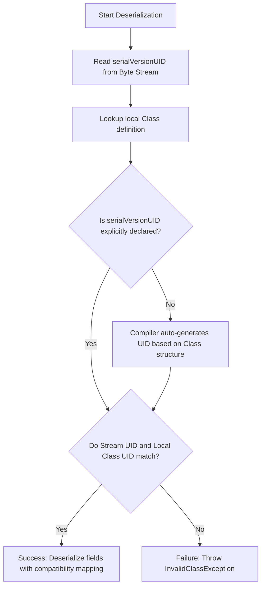
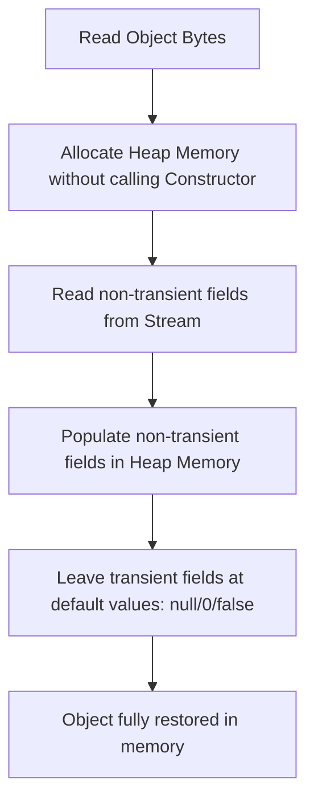
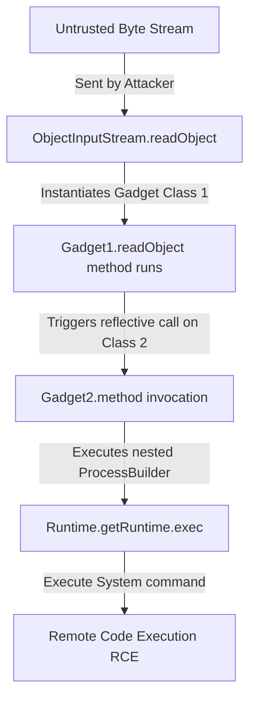

# IO in Java - Part 3

## Learning Goal

This file covers a focused slice of **IO in Java**. Study each concept as a practical Java rule, not as isolated vocabulary.

## Outline Coverage

| Concept | What to know |
| --- | --- |
| `Serialization` | The process of converting an object's state into a byte stream so it can be saved to a file or sent over a network. |
| `Deserialization` | The process of reconstructing an object from a serialized byte stream. |
| `Serializable` | A marker interface (no methods) that must be implemented by a class to make its instances eligible for serialization. |
| `serialVersionUID` | A unique 64-bit identifier used during deserialization to verify that the sender and receiver of a serialized object have loaded classes compatible with it. |
| `transient` | A field modifier indicating that the variable should not be serialized; its value is restored as the default value (e.g. `null` or `0`) during deserialization. |
| `Scanner` | A text scanner utility class used to parse primitive types and strings using regular expressions from an input stream or string. |
| `System.in` | The standard input stream (instance of `InputStream`), usually mapped to keyboard input. |
| `System.out` | The standard output stream (instance of `PrintStream`), usually mapped to console output. |
| `System.err` | The standard error stream (instance of `PrintStream`), used to print error messages to the console immediately. |

## Detailed Notes

### Serialization & Deserialization
Java object serialization allows developers to save the state of an object graph to a byte stream and reconstruct it later. 
* To make a class serializable, it must implement `java.io.Serializable`.
* Static fields represent class-level state, not object-level state, and are **not** serialized.
* If an object references other objects, the entire object graph is serialized. All referenced classes must also implement `Serializable`, or a `NotSerializableException` will be thrown at runtime.

```java
import java.io.Serializable;

public class User implements Serializable {
    private static final long serialVersionUID = 1L; // Recommended explicit definition
    
    private String username;
    private transient String password; // Will not be serialized!
    
    public User(String username, String password) {
        this.username = username;
        this.password = password;
    }
    
    @Override
    public String toString() {
        return "User{username='" + username + "', password='" + password + "'}";
    }
}
```

## Why serialVersionUID is Critical for Class Version Compatibility

If a `Serializable` class does not explicitly declare a `serialVersionUID`, the Java compiler automatically generates a 64-bit hash at compile time using a SHA-1 algorithm over the class descriptors (such as class name, interfaces, fields, and method signatures). If a developer subsequently makes any minor modification to the class—such as adding a helper method, changing a field access modifier, or even changing compiler versions—the compiler will generate a completely different default `serialVersionUID` for the updated class. When the JVM attempts to deserialize a previously stored byte stream, it compares the stream's class identifier with the local class's `serialVersionUID`. If they do not match, the JVM immediately aborts and throws an `InvalidClassException`, even if the changes were fully backward-compatible. By declaring `private static final long serialVersionUID` explicitly, the developer locks the class version, indicating to the JVM's serialization engine that the classes are compatible. This allows class evolution, such as adding new fields (which deserialize to their default values) or removing fields (which are silently ignored), without breaking existing serialized data stores.

### Class Evolution Matching Logic



### Code Example: Version Mismatch Behavior

The following example simulates class evolution where a missing explicit `serialVersionUID` triggers a version mismatch.

```java
// Version 1 of Class (stored to file)
// public class Profile implements Serializable {
//     String name;
// } // Auto-generated UID: e.g., 4278198327498L

// Version 2 of Class (attempting to read Version 1 data)
import java.io.*;

public class Profile implements Serializable {
    // Missing explicit serialVersionUID!
    String name;
    String email; // Added field changes class structure, altering auto-generated UID to 983179237498L
    
    public static void main(String[] args) {
        try (ObjectInputStream ois = new ObjectInputStream(new FileInputStream("profile.ser"))) {
            Profile p = (Profile) ois.readObject(); // Throws InvalidClassException due to UID mismatch
        } catch (Exception e) {
            System.out.println("Exception: " + e.toString());
            // Output: Exception: java.io.InvalidClassException: Profile; local class incompatible: 
            // stream classdesc serialVersionUID = 4278198327498, local class serialVersionUID = 983179237498
        }
    }
}
```

### Cause-Effect Chain of Version Mismatch

```
Class structure modified (field added) 
  ↳ Compiler re-calculates SHA-1 signature of Class
    ↳ Local class serialVersionUID changes from stream's serialVersionUID
      ↳ ObjectInputStream compares Stream UID and Local Class UID
        ↳ Mismatch detected -> Deserialization aborts -> InvalidClassException thrown
```

## Why transient Fields are Excluded from Serialization and How Deserialization Restores Them

The `transient` keyword is a field modifier that tells the serialization engine to ignore the field when converting an object to a byte stream. This is critical for excluding sensitive security credentials (like passwords or private keys) or runtime-bound resources (like open file handles, database connections, or thread locks) that have no meaning outside the current JVM run. During deserialization, the JVM does **not** call the class's standard constructor to instantiate the object. Instead, it allocates raw memory for the object on the Heap and directly populates its non-transient fields using the values found in the serialized byte stream. Because the byte stream contains no data or entries for `transient` fields, the JVM skips them, leaving them initialized to their default type values (such as `null` for object references, `0` for numeric primitives, and `false` for booleans). Crucially, inline field initializers and instance blocks are bypassed during this memory layout phase, meaning that even if a transient field is declared with an inline value (e.g., `private transient int age = 21;`), its value after deserialization will still revert to `0` or `null`.

### Memory Initialization Flow during Deserialization



### Code Example: Constructor and Initializer Bypass

```java
import java.io.*;

public class TransientDemo implements Serializable {
    private static final long serialVersionUID = 1L;
    
    private String name;
    private transient int age = 21; // Inline initializer
    private transient String status;
    
    public TransientDemo(String name) {
        System.out.println("Constructor called!");
        this.name = name;
        this.status = "Active";
    }

    public static void main(String[] args) throws Exception {
        ByteArrayOutputStream baos = new ByteArrayOutputStream();
        try (ObjectOutputStream oos = new ObjectOutputStream(baos)) {
            TransientDemo demo = new TransientDemo("Alice"); // Output: Constructor called!
            oos.writeObject(demo);
        }
        
        try (ObjectInputStream ois = new ObjectInputStream(new ByteArrayInputStream(baos.toByteArray()))) {
            TransientDemo restored = (TransientDemo) ois.readObject();
            // Constructor NOT called during readObject()!
            System.out.println("Restored Name: " + restored.name);     // Alice
            System.out.println("Restored Age: " + restored.age);       // 0 (Inline initializer bypassed!)
            System.out.println("Restored Status: " + restored.status); // null (Constructor assignment bypassed!)
        }
    }
}
```

### Cause-Effect Chain of Transient Field Reversion

```
Object deserialized from stream 
  ↳ JVM instantiates class directly on heap (bypasses constructor, initializers, and instance blocks)
    ↳ JVM reads and writes non-transient fields from byte stream
      ↳ Transient fields are absent in byte stream
        ↳ Fields remain at JVM default values (null for objects, 0 for integers)
```

## Why Java Serialization is a Security Liability and How Modern Alternatives Mitigate It

Java's native serialization mechanism is a major security vulnerability because `ObjectInputStream.readObject()` is a "look-ahead" deserializer that constructs arbitrary object graphs before the application has verified the types being instantiated. When an application accepts and deserializes untrusted byte streams from external sources, an attacker can construct a payload containing a "gadget chain"—a sequence of nested objects that exploit existing library classes (gadgets) on the classpath. During deserialization, the JVM automatically invokes life-cycle methods like `readObject()`, `readResolve()`, or `finalize()` on these objects. By nesting these classes, attackers can trigger reflective operations that eventually execute shell commands on the hosting system, leading to Remote Code Execution (RCE). To mitigate this vulnerability, Java 9 introduced serialization filters (`ObjectInputFilter`) to restrict which classes can be deserialized. However, modern application design favors data-only serialization formats like JSON, Protocol Buffers, or FlatBuffers, which do not serialize executable metadata or dynamic classes, isolating data parsing from code execution.

### Gadget Chain Deserialization RCE Exploit



### Code Example: Safe Alternative (JSON Data-Only Serialization)

Using Jackson or similar data-only parsers eliminates gadget execution because they only read state fields, never instantiating arbitrary class configurations from the stream.

```java
// Safe data representation
public class UserDTO {
    public String username;
    public String role;
    
    // Custom JSON serialization does not contain dynamic class loaders or executable metadata
    // Input format: {"username":"alice", "role":"admin"}
}
```

### Cause-Effect Chain of Deserialization Vulnerabilities

```
Untrusted byte stream received 
  ↳ ObjectInputStream.readObject() instantiates classes reflectively before validating type
    ↳ Life-cycle method (e.g. readObject) invoked automatically on classpath class
      ↳ Nested properties trigger a chain of calls (Gadget Chain)
        ↳ Reflective method execution -> ProcessBuilder spawned -> System RCE compromised
```

```

### Serializing and Deserializing Code Example
We write the object using `ObjectOutputStream` and read it back using `ObjectInputStream`.

```java
import java.io.*;

public class SerializationDemo {
    public static void main(String[] args) {
        User user = new User("alice", "secret123");
        File file = new File("user.ser");
        
        // 1. Serialize
        try (ObjectOutputStream oos = new ObjectOutputStream(new FileOutputStream(file))) {
            oos.writeObject(user);
            System.out.println("Object serialized: " + user);
        } catch (IOException e) {
            e.printStackTrace();
        }
        
        // 2. Deserialize
        try (ObjectInputStream ois = new ObjectInputStream(new FileInputStream(file))) {
            User deserializedUser = (User) ois.readObject();
            System.out.println("Object deserialized: " + deserializedUser);
            // Prints: User{username='alice', password='null'} (password was transient!)
        } catch (IOException | ClassNotFoundException e) {
            e.printStackTrace();
        }
    }
}
```

### Scanner & System I/O
* `System.in`, `System.out`, and `System.err` are opened by the JVM when the application starts.
* `Scanner` can wrap `System.in` to read user console input.
* **Important**: Closing a `Scanner` wrapped around `System.in` will close the underlying `System.in` stream itself. Once closed, you cannot read from `System.in` again for the remainder of the JVM execution.

```java
import java.util.Scanner;

public class ConsoleInput {
    public static void main(String[] args) {
        Scanner scanner = new Scanner(System.in);
        System.out.print("Enter your name: ");
        if (scanner.hasNextLine()) {
            String name = scanner.nextLine();
            System.out.println("Hello, " + name);
        }
        // Avoid closing scanner if you need System.in elsewhere in the app!
    }
}
```

---

## Case Study: Customizing Serialization

### Problem
We want to encrypt a sensitive field (like `password`) when serializing, and decrypt it upon deserialization, so that it is not stored in plaintext inside the `.ser` file.

### Implementation
We can define private `writeObject` and `readObject` methods inside the `Serializable` class. Java's serialization mechanism looks for these methods via reflection and calls them instead of the default mechanism.

```java
import java.io.IOException;
import java.io.ObjectInputStream;
import java.io.ObjectOutputStream;
import java.io.Serializable;
import java.util.Base64;

public class SecureUser implements Serializable {
    private static final long serialVersionUID = 2L;
    
    private String username;
    private String password; // Will be serialized, but encrypted!

    public SecureUser(String username, String password) {
        this.username = username;
        this.password = password;
    }

    private void writeObject(ObjectOutputStream oos) throws IOException {
        // Run default serialization for non-custom fields
        oos.defaultWriteObject();
        // Encrypt the password using simple Base64 for demo (use real cipher in production)
        String encryptedPassword = Base64.getEncoder().encodeToString(password.getBytes());
        oos.writeObject(encryptedPassword);
    }

    private void readObject(ObjectInputStream ois) throws IOException, ClassNotFoundException {
        // Run default deserialization
        ois.defaultReadObject();
        // Read the encrypted password and decrypt it
        String encryptedPassword = (String) ois.readObject();
        this.password = new String(Base64.getDecoder().decode(encryptedPassword));
    }
}
```

---

## Common Mistakes

### 1. Missing Explicit `serialVersionUID`
If you do not specify `serialVersionUID` explicitly, the Java compiler automatically computes one at compile time based on class details (fields, methods). If you modify the class (e.g. add a minor method), the computed value will change. When deserializing older data, Java throws an `InvalidClassException`.
* **Fix**: Always define `private static final long serialVersionUID = 1L;` explicitly.

### 2. Parent Class Non-Serializable Constructor Pitfall
If a subclass implements `Serializable` but its superclass does **not**, the superclass state is not serialized. During deserialization, Java must initialize the superclass state by calling its **no-argument constructor**. If the superclass does not define a no-argument constructor, deserialization will fail at runtime with an `InvalidClassException`.

### 3. Closing Scanner wrapped around `System.in`
Closing a scanner closed `System.in`.
```java
Scanner s1 = new Scanner(System.in);
s1.close(); // Closes System.in!

Scanner s2 = new Scanner(System.in);
// s2.nextLine(); // Throws NoSuchElementException because System.in is closed!
```

## Reference Links

- https://docs.oracle.com/en/java/javase/21/docs/api/java.base/java/io/Serializable.html (Serializable API Documentation)
- https://docs.oracle.com/en/java/javase/21/docs/api/java.base/java/io/ObjectInputStream.html (ObjectInputStream API Documentation)
- https://docs.oracle.com/javase/specs/jls/se21/html/jls-14.html#jls-14.21 (JLS Unreachable Statements)

