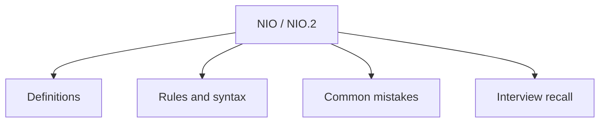

# 27 - NIO / NIO.2

This topic follows the master outline in [outline.md](../outline.md). The goal is to understand each concept deeply enough to explain it, recognize it in code, and answer interview-style questions.

## Study Order

- [Path Concepts](theory/01-path-concepts.md)
- [Filechannel Concepts](theory/02-filechannel-concepts.md)
- [Key Terms](terms/01-key-terms.md)

## Outline Checklist

- Path
- Paths
- Files
- StandardOpenOption
- Read/write file using Files
- Walk file tree
- Copy/move/delete file
- Channel
- Buffer
- ByteBuffer
- FileChannel
- Basic Selector
- Basic Asynchronous IO

## Anki Cards

- [Basic](anki/basic.tsv)
- [Basic Extra](anki/basic-extra.tsv)
- [Cloze](anki/cloze.tsv)
- [Code Question](anki/code-question.tsv)

## Mermaid Overview

## Reference Links

- https://docs.oracle.com/en/java/javase/21/docs/api/java.base/java/nio/package-summary.html
- https://docs.oracle.com/en/java/javase/21/docs/api/java.base/java/nio/file/package-summary.html
