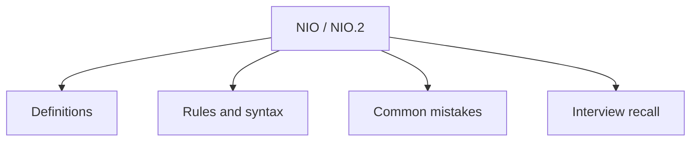

# 27 - NIO / NIO.2

This topic follows the master outline in [outline.md](../outline.md). The goal is to understand each concept deeply enough to explain it, recognize it in code, and answer interview-style questions.

## Study Order

- [Path Concepts](theory/01-path-concepts.md)
- [Filechannel Concepts](theory/02-filechannel-concepts.md)
- [Key Terms](terms/01-key-terms.md)

## Outline Checklist

- Path
- Paths
- Files
- StandardOpenOption
- Read/write file using Files
- Walk file tree
- Copy/move/delete file
- Channel
- Buffer
- ByteBuffer
- FileChannel
- Basic Selector
- Basic Asynchronous IO

## Anki Cards

- [Basic](anki/basic.tsv)
- [Basic Extra](anki/basic-extra.tsv)
- [Cloze](anki/cloze.tsv)
- [Code Question](anki/code-question.tsv)

## Self-Check

Before moving to the next topic, verify that you can answer these questions:
1. What are the key differences between Java Classic I/O (BIO) and Java New I/O (NIO) regarding blocking vs non-blocking, stream vs buffer orientation, and thread scaling?
2. How does a NIO `Buffer` manage state using the `position`, `limit`, and `capacity` pointers, and why must `flip()` be called when shifting from write-mode to read-mode?
3. Why are memory-mapped files (`FileChannel.map` returning `MappedByteBuffer`) extremely fast for large file reads/writes, and how do they leverage virtual memory and OS page cache bypass?
4. How does a `Selector` enable multiplexed non-blocking I/O, allowing a single thread to monitor multiple network channels?
5. Why do `Path` and `Files` (NIO.2) provide better exception reporting, symbolic link handling, and metadata access compared to legacy `java.io.File`?

## Mermaid Overview

## Reference Links

- https://docs.oracle.com/en/java/javase/21/docs/api/java.base/java/nio/package-summary.html
- https://docs.oracle.com/en/java/javase/21/docs/api/java.base/java/nio/file/package-summary.html
