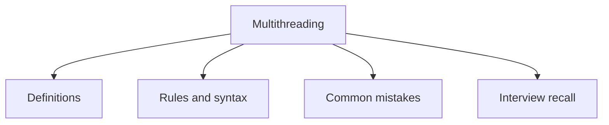

# 28 - Multithreading

This topic follows the master outline in [outline.md](../outline.md). The goal is to understand each concept deeply enough to explain it, recognize it in code, and answer interview-style questions.

## Study Order

- [Process Vs Thread Concepts](theory/01-process-vs-thread-concepts.md)
- [Runnable Concepts](theory/02-runnable-concepts.md)
- [Join Concepts](theory/03-join-concepts.md)
- [Thread Safety Concepts](theory/04-thread-safety-concepts.md)
- [Key Terms](terms/01-key-terms.md)

## Outline Checklist

- Process vs Thread
- Create thread using:
- extends Thread
- implements Runnable
- implements Callable
- ExecutorService
- Lifecycle of Thread:
- New
- Runnable
- Running
- Blocked
- Waiting
- Timed Waiting
- Terminated
- start() vs run()
- sleep
- join
- yield
- interrupt
- Daemon thread
- User thread
- Thread priority
- Race condition
- Critical section
- Thread safety
- Immutable object
- Atomic operation

## Anki Cards

- [Basic](anki/basic.tsv)
- [Basic Extra](anki/basic-extra.tsv)
- [Cloze](anki/cloze.tsv)
- [Code Question](anki/code-question.tsv)

## Mermaid Overview

## Reference Links

- https://docs.oracle.com/javase/tutorial/essential/concurrency/
