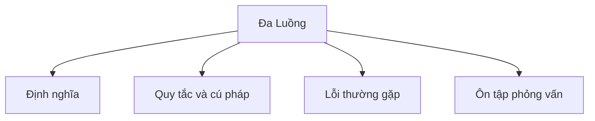

# 28 - Đa Luồng (Multithreading)

Chủ đề này tuân theo đề cương chính trong [outline.md](../outline.md). Mục tiêu là hiểu từng khái niệm đủ sâu để có thể giải thích, nhận diện trong code và trả lời các câu hỏi phỏng vấn.

## Thứ Tự Học

- [Khái Niệm Process và Thread](theory/01-process-vs-thread-concepts.md)
- [Khái Niệm Runnable](theory/02-runnable-concepts.md)
- [Khái Niệm Join](theory/03-join-concepts.md)
- [Khái Niệm An Toàn Luồng](theory/04-thread-safety-concepts.md)
- [Thuật Ngữ Chính](terms/01-key-terms.md)

## Danh Sách Kiểm Tra Theo Đề Cương

- Process và Thread
- Tạo luồng bằng:
  - extends Thread
  - implements Runnable
  - implements Callable
  - ExecutorService
- Vòng đời của Thread:
  - New (Mới)
  - Runnable (Sẵn sàng chạy)
  - Running (Đang chạy)
  - Blocked (Bị chặn)
  - Waiting (Chờ đợi)
  - Timed Waiting (Chờ có thời hạn)
  - Terminated (Kết thúc)
- start() và run()
- sleep
- join
- yield
- interrupt
- Luồng Daemon (Daemon thread)
- Luồng người dùng (User thread)
- Mức ưu tiên luồng (Thread priority)
- Điều kiện tranh chấp (Race condition)
- Đoạn quan trọng (Critical section)
- An toàn luồng (Thread safety)
- Đối tượng bất biến (Immutable object)
- Thao tác nguyên tử (Atomic operation)

## Tự Kiểm Tra

Trước khi chuyển sang chủ đề tiếp theo, hãy xác nhận bạn có thể trả lời các câu hỏi sau:
1. Tại sao một process khác với một thread về phân bổ tài nguyên, và layout bộ nhớ JVM (Heap/Metaspace dùng chung so với Stack/PC riêng của từng thread) phản ánh sự phân biệt này như thế nào?
   → Xem [Tại Sao Process Khác Thread](theory/01-process-vs-thread-concepts.md#why-processes-differ-from-threads)
2. Tại sao nên cài đặt `Runnable` hay `Callable` thay vì kế thừa `Thread` (và ràng buộc kế thừa đơn của Java cùng nguyên tắc tách biệt nhiệm vụ dẫn đến thiết kế này như thế nào)?
   → Xem [Tại Sao Runnable/Callable Được Ưu Tiên Hơn Kế Thừa Thread](theory/02-runnable-concepts.md#why-runnablecallable-is-preferred-over-extending-thread)
3. Tại sao gọi `start()` trên một thread tạo ra một call stack mới trong khi `run()` thực thi trên stack của người gọi, và bộ lập lịch thread cấp OS được gọi như thế nào?
   → Xem [Tại Sao start() Bắt Buộc Để Tạo Thread](theory/02-runnable-concepts.md#why-start-is-required-to-spawn-a-thread)
4. Tại sao `thread.join()` khiến luồng gọi bị chặn, và cơ chế chờ và thông báo JVM/OS nào được kích hoạt?
   → Xem [Tại Sao join() Chặn Luồng Gọi](theory/03-join-concepts.md#why-join-blocks-the-calling-thread)
5. Tại sao điều kiện tranh chấp và vấn đề hiển thị dữ liệu xảy ra trong môi trường đa luồng, và một thao tác có nghĩa là "an toàn luồng" là gì?
   → Xem [Tại Sao Điều Kiện Tranh Chấp và Vấn Đề Hiển Thị Dữ Liệu Xảy Ra](theory/04-thread-safety-concepts.md#why-race-conditions-and-data-visibility-issues-occur)

## Thẻ Anki

- [Basic](anki/basic.tsv)
- [Basic Extra](anki/basic-extra.tsv)
- [Cloze](anki/cloze.tsv)
- [Code Question](anki/code-question.tsv)

## Tổng Quan Mermaid

## Liên Kết Tham Khảo

- https://docs.oracle.com/javase/tutorial/essential/concurrency/
