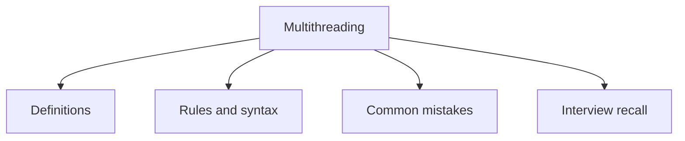

# 28 - Multithreading

This topic follows the master outline in [outline.md](../outline.md). The goal is to understand each concept deeply enough to explain it, recognize it in code, and answer interview-style questions.

## Study Order

- [Process Vs Thread Concepts](theory/01-process-vs-thread-concepts.md)
- [Runnable Concepts](theory/02-runnable-concepts.md)
- [Join Concepts](theory/03-join-concepts.md)
- [Thread Safety Concepts](theory/04-thread-safety-concepts.md)
- [Key Terms](terms/01-key-terms.md)

## Outline Checklist

- Process vs Thread
- Create thread using:
- extends Thread
- implements Runnable
- implements Callable
- ExecutorService
- Lifecycle of Thread:
- New
- Runnable
- Running
- Blocked
- Waiting
- Timed Waiting
- Terminated
- start() vs run()
- sleep
- join
- yield
- interrupt
- Daemon thread
- User thread
- Thread priority
- Race condition
- Critical section
- Thread safety
- Immutable object
- Atomic operation

## Self-Check

Before moving to the next topic, verify that you can answer these questions:
1. Why does a process differ from a thread in resource allocation, and how does the JVM memory layout (shared Heap/Metaspace vs thread-private Stack/PC) reflect this distinction?
   &rarr; See [Why Processes Differ from Threads](theory/01-process-vs-thread-concepts.md#why-processes-differ-from-threads)
2. Why should you implement `Runnable` or `Callable` instead of extending `Thread` (and how does Java's single inheritance constraint and task decoupling drive this design)?
   &rarr; See [Why Runnable/Callable Is Preferred Over Extending Thread](theory/02-runnable-concepts.md#why-runnablecallable-is-preferred-over-extending-thread)
3. Why does calling `start()` on a thread spawn a new call stack while `run()` executes on the caller's stack, and how does the OS-level thread scheduler get invoked?
   &rarr; See [Why start() Is Required to Spawn a Thread](theory/02-runnable-concepts.md#why-start-is-required-to-spawn-a-thread)
4. Why does `thread.join()` cause the calling thread to block, and what JVM/OS waiting and notification mechanism does it invoke?
   &rarr; See [Why join() Blocks the Calling Thread](theory/03-join-concepts.md#why-join-blocks-the-calling-thread)
5. Why do race conditions and data visibility issues occur in multithreaded environments, and what does it mean for an operation to be thread-safe?
   &rarr; See [Why Race Conditions and Data Visibility Issues Occur](theory/04-thread-safety-concepts.md#why-race-conditions-and-data-visibility-issues-occur)

## Anki Cards

- [Basic](anki/basic.tsv)
- [Basic Extra](anki/basic-extra.tsv)
- [Cloze](anki/cloze.tsv)
- [Code Question](anki/code-question.tsv)

## Mermaid Overview

## Reference Links

- https://docs.oracle.com/javase/tutorial/essential/concurrency/
