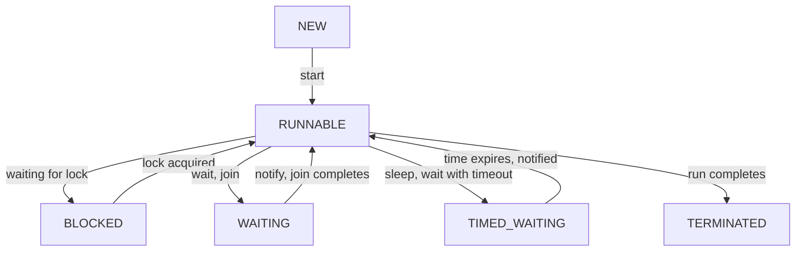

# Multithreading - Part 2

## Learning Goal

This file covers thread execution states, scheduling, and basic operations like starting, running, and sleeping. Study each concept as a practical Java rule, not as isolated vocabulary.

## Outline Coverage

| Concept | What to know |
| --- | --- |
| `Runnable` (Thread State) | The state where a thread is either executing or ready/eligible to execute, waiting for the OS thread scheduler to allocate CPU time. |
| `Running` | The conceptual sub-state of `RUNNABLE` where the thread's instructions are actively executing on a CPU core. Java maps both ready and running states to `Thread.State.RUNNABLE`. |
| `Blocked` | The state of a thread waiting to acquire an object monitor lock (for a `synchronized` block/method). |
| `Waiting` | The state of a thread waiting indefinitely for another thread to perform a specific action (via `Object.wait()` or `Thread.join()`). |
| `Timed Waiting` | The state of a thread waiting for a bounded duration (via `Thread.sleep()`, `Object.wait(timeout)`, or `Thread.join(timeout)`). |
| `Terminated` | The state of a thread that has completed its execution (either normally or by throwing an unhandled exception). |
| `start() vs run()` | `start()` allocates OS resources and schedules the thread to execute asynchronously; `run()` executes the task code synchronously in the current thread. |
| `sleep` | A static method (`Thread.sleep()`) that pauses execution of the current thread for a specified duration, releasing the CPU but **retaining** any acquired locks. |

## Detailed Notes

### Thread States in Detail

Java defines thread states in the `Thread.State` enum. We can query a thread's state via `thread.getState()`.



#### 1. RUNNABLE
The thread is running or eligible to run.
```java
Thread t = new Thread(() -> {
    while (true) {
        // Active execution
    }
});
t.start();
System.out.println("State: " + t.getState()); // Prints RUNNABLE
```

#### 2. BLOCKED
Occurs when a thread attempts to enter a `synchronized` block but another thread already holds the monitor lock.
```java
public class BlockedDemo {
    private static final Object lock = new Object();

    public static void main(String[] args) throws InterruptedException {
        Runnable r = () -> {
            synchronized (lock) {
                try { Thread.sleep(5000); } catch (InterruptedException e) {}
            }
        };

        Thread t1 = new Thread(r);
        Thread t2 = new Thread(r);

        t1.start();
        Thread.sleep(100); // Ensure t1 gets the lock first
        t2.start();
        Thread.sleep(100);

        System.out.println("t2 state: " + t2.getState()); // Prints BLOCKED
    }
}
```

#### 3. WAITING and TIMED_WAITING
* `WAITING` is triggered by calling `Object.wait()` without a timeout or `Thread.join()`.
* `TIMED_WAITING` is triggered by calling `Thread.sleep(millis)`, `Object.wait(millis)`, or `Thread.join(millis)`.
```java
Thread sleeper = new Thread(() -> {
    try { Thread.sleep(1000); } catch (InterruptedException e) {}
});
sleeper.start();
Thread.sleep(100); // Give it time to sleep
System.out.println("Sleeper state: " + sleeper.getState()); // Prints TIMED_WAITING
```

---

## Case Study: Analyzing Thread States under Lock Contention

### Problem
An e-commerce system is experiencing extreme response times on checkout. Thread dumps show multiple threads processing checkouts.

### Analysis
By printing thread states, the developer finds:
* Thread-A holds a lock on a shared `Inventory` monitor and is in `TIMED_WAITING` (sleeping during a database call inside the synchronized block).
* Threads B, C, and D are in the `BLOCKED` state, waiting to enter the checkout method.

### Code Demonstration
```java
class Inventory {
    public synchronized void update() {
        try {
            // Simulated slow database write
            Thread.sleep(3000); 
        } catch (InterruptedException e) {}
    }
}
```
**Takeaway**: Synchronized blocks should not wrap blocking I/O (like network or database calls) because any thread that gets blocked will hold the lock, cascading blockages to other threads.

---

## Common Mistakes

### 1. Assuming `Thread.sleep()` Releases Locks
A sleeping thread does NOT yield its monitor locks. If a thread sleeps inside a synchronized block, no other thread can enter that synchronized block.
```java
synchronized(lock) {
    Thread.sleep(5000); // BUG: Holds lock for 5 seconds while doing nothing
}
```
**Fix**: If you need to wait for a condition and release the lock, use `lock.wait()` instead of `sleep()`.

### 2. Forgetting to Handle `InterruptedException`
`Thread.sleep()` throws `InterruptedException` which is a checked exception. If a sleeping thread is interrupted, the sleep terminates immediately. Never swallow this exception without resetting the interrupt status or re-throwing it.
```java
// BAD
try {
    Thread.sleep(1000);
} catch (InterruptedException e) {
    // Swallowed!
}

// GOOD
try {
    Thread.sleep(1000);
} catch (InterruptedException e) {
    Thread.currentThread().interrupt(); // Restore interrupted status
}
```

## Why Runnable/Callable Is Preferred Over Extending Thread

Java enforcing a single class inheritance model creates a severe architectural restriction when extending the `Thread` class. If a class inherits from `Thread`, it cannot inherit from any other base class, which limits the extensibility and reuse of business logic within enterprise frameworks. Furthermore, subclassing `Thread` violates the Single Responsibility Principle by combining the execution context (the physical thread managed by the OS) with the computational task itself. By implementing `Runnable` or `Callable`, you cleanly separate the core task definition from the execution framework. This decoupling allows tasks to be submitted to modern execution frameworks like `ExecutorService` thread pools, reused across different execution engines, and easily mocked or tested in isolation. The `Callable` interface specifically enhances this pattern by allowing tasks to return computation results asynchronously and propagate checked exceptions up the stack, which is impossible with the standard `run()` method in the `Thread` class.

### Mental Model
```text
[Tight Coupling (Inheritance)]
+-----------------------------+
| CustomTask extends Thread   | ---> Single inheritance slot consumed!
|  - Thread Control Logic     |
|  - Task Logic (run())       |
+-----------------------------+

[Loose Coupling (Composition)]
+----------------------+     +-----------------------+
|  Task (Runnable)     |     | Thread / Thread Pool  |
|  - Pure Task Logic   |===> | - Execution Mechanics |
+----------------------+     +-----------------------+
```

### Code Example
```java
import java.util.concurrent.*;

public class TaskDecoupling {
    public static void main(String[] args) throws Exception {
        Callable<String> task = () -> "Task executed by: " + Thread.currentThread().getName();
        
        ExecutorService executor = Executors.newSingleThreadExecutor();
        Future<String> future = executor.submit(task);
        
        System.out.println(future.get());
        executor.shutdown();
    }
}
/*
Output:
Task executed by: pool-1-thread-1
*/
```

### Cause-Effect Chain
1. Code implements Runnable/Callable &rarr; Task logic is decoupled from execution mechanism.
2. Single class inheritance slot remains open &rarr; Class can extend database, network, or framework utilities.
3. Decoupled tasks are submitted to ExecutorService &rarr; JVM avoids the overhead of manually creating threads.
4. Callable propagates results and checked exceptions &rarr; Caller thread handles asynchronous outcomes safely.

## Why start() Is Required to Spawn a Thread

Invoking the `run()` method directly on a `Thread` instance executes the task instructions synchronously within the call stack of the calling thread, failing to spawn a concurrent thread. To achieve actual multithreaded execution, you must call `start()`, which triggers a sequence of native JVM and operating system operations. Calling `start()` performs a state check to ensure the thread is in the `NEW` state, then invokes the internal JVM native method `start0()`. This native hook requests the operating system's thread scheduler to allocate a new platform-level thread structure and set up its private execution stack. Once the operating system schedules this new thread, the JVM invokes the `run()` method asynchronously inside the newly created thread context. Attempting to call `start()` multiple times is illegal because the internal state machine of the thread transitions out of the `NEW` state; doing so immediately throws an `IllegalThreadStateException`.

### Mental Model
```text
[Calling run() directly]
Caller Thread Stack: [main()] -> [run()]   (Synchronous, same stack)

[Calling start() method]
Caller Thread Stack: [main()] -> [start()] -> [native start0()]
                                                    |
                                                    v (OS Thread Spawning)
New Thread Stack:                               [run()] (Asynchronous)
```

### Code Example
```java
public class StartVsRun {
    public static void main(String[] args) {
        Thread thread = new Thread(() -> {
            System.out.println("Executing inside: " + Thread.currentThread().getName());
        });

        System.out.println("Calling run() directly:");
        thread.run(); // Executed synchronously on main stack

        System.out.println("Calling start():");
        thread.start(); // Spawns new thread asynchronously
    }
}
/*
Output:
Calling run() directly:
Executing inside: main
Calling start():
Executing inside: Thread-0
*/
```

### Cause-Effect Chain
1. Caller invokes start() on a Thread &rarr; JVM performs state checks to ensure the thread is NEW.
2. JVM calls native method start0() &rarr; OS thread scheduler allocates platform thread structure.
3. OS configures a new private call stack &rarr; Thread state transitions from NEW to RUNNABLE.
4. OS schedules thread for CPU time &rarr; JVM run() method executes asynchronously on the new stack.

