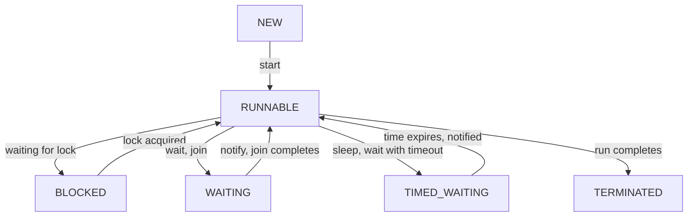

# Multithreading - Part 2

## Learning Goal

This file covers thread execution states, scheduling, and basic operations like starting, running, and sleeping. Study each concept as a practical Java rule, not as isolated vocabulary.

## Outline Coverage

| Concept | What to know |
| --- | --- |
| `Runnable` (Thread State) | The state where a thread is either executing or ready/eligible to execute, waiting for the OS thread scheduler to allocate CPU time. |
| `Running` | The conceptual sub-state of `RUNNABLE` where the thread's instructions are actively executing on a CPU core. Java maps both ready and running states to `Thread.State.RUNNABLE`. |
| `Blocked` | The state of a thread waiting to acquire an object monitor lock (for a `synchronized` block/method). |
| `Waiting` | The state of a thread waiting indefinitely for another thread to perform a specific action (via `Object.wait()` or `Thread.join()`). |
| `Timed Waiting` | The state of a thread waiting for a bounded duration (via `Thread.sleep()`, `Object.wait(timeout)`, or `Thread.join(timeout)`). |
| `Terminated` | The state of a thread that has completed its execution (either normally or by throwing an unhandled exception). |
| `start() vs run()` | `start()` allocates OS resources and schedules the thread to execute asynchronously; `run()` executes the task code synchronously in the current thread. |
| `sleep` | A static method (`Thread.sleep()`) that pauses execution of the current thread for a specified duration, releasing the CPU but **retaining** any acquired locks. |

## Detailed Notes

### Thread States in Detail

Java defines thread states in the `Thread.State` enum. We can query a thread's state via `thread.getState()`.



#### 1. RUNNABLE
The thread is running or eligible to run.
```java
Thread t = new Thread(() -> {
    while (true) {
        // Active execution
    }
});
t.start();
System.out.println("State: " + t.getState()); // Prints RUNNABLE
```

#### 2. BLOCKED
Occurs when a thread attempts to enter a `synchronized` block but another thread already holds the monitor lock.
```java
public class BlockedDemo {
    private static final Object lock = new Object();

    public static void main(String[] args) throws InterruptedException {
        Runnable r = () -> {
            synchronized (lock) {
                try { Thread.sleep(5000); } catch (InterruptedException e) {}
            }
        };

        Thread t1 = new Thread(r);
        Thread t2 = new Thread(r);

        t1.start();
        Thread.sleep(100); // Ensure t1 gets the lock first
        t2.start();
        Thread.sleep(100);

        System.out.println("t2 state: " + t2.getState()); // Prints BLOCKED
    }
}
```

#### 3. WAITING and TIMED_WAITING
* `WAITING` is triggered by calling `Object.wait()` without a timeout or `Thread.join()`.
* `TIMED_WAITING` is triggered by calling `Thread.sleep(millis)`, `Object.wait(millis)`, or `Thread.join(millis)`.
```java
Thread sleeper = new Thread(() -> {
    try { Thread.sleep(1000); } catch (InterruptedException e) {}
});
sleeper.start();
Thread.sleep(100); // Give it time to sleep
System.out.println("Sleeper state: " + sleeper.getState()); // Prints TIMED_WAITING
```

---

## Case Study: Analyzing Thread States under Lock Contention

### Problem
An e-commerce system is experiencing extreme response times on checkout. Thread dumps show multiple threads processing checkouts.

### Analysis
By printing thread states, the developer finds:
* Thread-A holds a lock on a shared `Inventory` monitor and is in `TIMED_WAITING` (sleeping during a database call inside the synchronized block).
* Threads B, C, and D are in the `BLOCKED` state, waiting to enter the checkout method.

### Code Demonstration
```java
class Inventory {
    public synchronized void update() {
        try {
            // Simulated slow database write
            Thread.sleep(3000); 
        } catch (InterruptedException e) {}
    }
}
```
**Takeaway**: Synchronized blocks should not wrap blocking I/O (like network or database calls) because any thread that gets blocked will hold the lock, cascading blockages to other threads.

---

## Common Mistakes

### 1. Assuming `Thread.sleep()` Releases Locks
A sleeping thread does NOT yield its monitor locks. If a thread sleeps inside a synchronized block, no other thread can enter that synchronized block.
```java
synchronized(lock) {
    Thread.sleep(5000); // BUG: Holds lock for 5 seconds while doing nothing
}
```
**Fix**: If you need to wait for a condition and release the lock, use `lock.wait()` instead of `sleep()`.

### 2. Forgetting to Handle `InterruptedException`
`Thread.sleep()` throws `InterruptedException` which is a checked exception. If a sleeping thread is interrupted, the sleep terminates immediately. Never swallow this exception without resetting the interrupt status or re-throwing it.
```java
// BAD
try {
    Thread.sleep(1000);
} catch (InterruptedException e) {
    // Swallowed!
}

// GOOD
try {
    Thread.sleep(1000);
} catch (InterruptedException e) {
    Thread.currentThread().interrupt(); // Restore interrupted status
}
```
