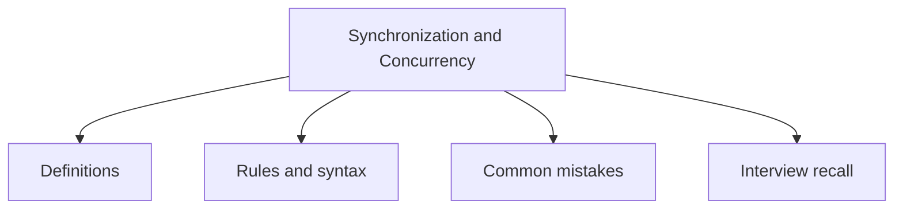

# 29 - Synchronization and Concurrency

This topic follows the master outline in [outline.md](../outline.md). The goal is to understand each concept deeply enough to explain it, recognize it in code, and answer interview-style questions.

## Study Order

- [Synchronized Method Concepts](theory/01-synchronized-method-concepts.md)
- [Deadlock Concepts](theory/02-deadlock-concepts.md)
- [Atomicreference Concepts](theory/03-atomicreference-concepts.md)
- [Cyclicbarrier Concepts](theory/04-cyclicbarrier-concepts.md)
- [Executor Concepts](theory/05-executor-concepts.md)
- [Forkjoinpool Concepts](theory/06-forkjoinpool-concepts.md)
- [Key Terms](terms/01-key-terms.md)

## Outline Checklist

- synchronized method
- synchronized block
- Object lock
- Class lock
- Monitor
- wait
- notify
- notifyAll
- Deadlock
- Livelock
- Starvation
- Volatile
- Atomic classes:
- AtomicInteger
- AtomicLong
- AtomicBoolean
- AtomicReference
- Lock API:
- Lock
- ReentrantLock
- ReadWriteLock
- StampedLock
- Semaphore
- CountDownLatch
- CyclicBarrier
- Phaser
- BlockingQueue
- Concurrent collections:
- ConcurrentHashMap
- CopyOnWriteArrayList
- ConcurrentLinkedQueue
- Executor Framework:
- Executor
- ExecutorService
- ScheduledExecutorService
- ThreadPoolExecutor
- Executors
- Future
- Callable
- CompletableFuture
- ForkJoinPool
- Parallel Stream

## Self-Check

Before moving to the next topic, verify that you can answer these questions:
1. Why does the `synchronized` keyword prevent race conditions, and how do object monitors and lock acquisition/release behave under the hood?
   &rarr; See [Why synchronized Blocks Prevent Race Conditions](theory/01-synchronized-method-concepts.md#why-synchronized-blocks-prevent-race-conditions)
2. Why does a deadlock occur in Java, and what specific resource-acquisition sequence creates the four necessary deadlock conditions?
   &rarr; See [Why Deadlocks Occur and How to Avoid Them](theory/02-deadlock-concepts.md#why-deadlocks-occur-and-how-to-avoid-them)
3. Why do atomic variables (like `AtomicReference` or `AtomicInteger`) avoid lock-based synchronization, and how does the hardware-level CAS (Compare-And-Swap) mechanism guarantee atomicity?
   &rarr; See [Why Atomic Variables Avoid Lock-Based Synchronization](theory/03-atomicreference-concepts.md#why-atomic-variables-avoid-lock-based-synchronization)
4. Why does `CyclicBarrier` differ from `CountDownLatch`, and how does the internal lock/condition await mechanism reset the barrier for reuse?
   &rarr; See [Why CyclicBarrier and CountDownLatch Differ](theory/04-cyclicbarrier-concepts.md#why-cyclicbarrier-and-count-down-latch-differ)
5. Why should you use `ExecutorService` (and thread pools) instead of manually spawning new threads for each task, and how do thread queue limit policies protect the JVM?
   &rarr; See [Why ExecutorService and Thread Pools Are Required](theory/05-executor-concepts.md#why-executorservice-and-thread-pools-are-required)
6. Why does `ForkJoinPool` use a work-stealing algorithm, and how do its double-ended queues (deques) improve CPU utilization for divide-and-conquer tasks?
   &rarr; See [Why ForkJoinPool Uses Work-Stealing](theory/06-forkjoinpool-concepts.md#why-forkjoinpool-uses-work-stealing)

## Anki Cards

- [Basic](anki/basic.tsv)
- [Basic Extra](anki/basic-extra.tsv)
- [Cloze](anki/cloze.tsv)
- [Code Question](anki/code-question.tsv)

## Mermaid Overview

## Reference Links

- https://docs.oracle.com/javase/tutorial/essential/concurrency/sync.html
- https://docs.oracle.com/en/java/javase/21/docs/api/java.base/java/util/concurrent/package-summary.html
