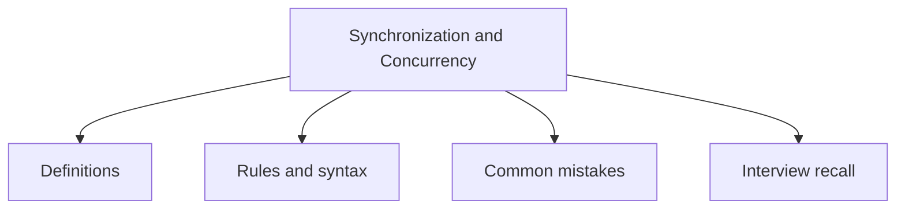

# 29 - Synchronization and Concurrency

This topic follows the master outline in [outline.md](../outline.md). The goal is to understand each concept deeply enough to explain it, recognize it in code, and answer interview-style questions.

## Study Order

- [Synchronized Method Concepts](theory/01-synchronized-method-concepts.md)
- [Deadlock Concepts](theory/02-deadlock-concepts.md)
- [Atomicreference Concepts](theory/03-atomicreference-concepts.md)
- [Cyclicbarrier Concepts](theory/04-cyclicbarrier-concepts.md)
- [Executor Concepts](theory/05-executor-concepts.md)
- [Forkjoinpool Concepts](theory/06-forkjoinpool-concepts.md)
- [Key Terms](terms/01-key-terms.md)

## Outline Checklist

- synchronized method
- synchronized block
- Object lock
- Class lock
- Monitor
- wait
- notify
- notifyAll
- Deadlock
- Livelock
- Starvation
- Volatile
- Atomic classes:
- AtomicInteger
- AtomicLong
- AtomicBoolean
- AtomicReference
- Lock API:
- Lock
- ReentrantLock
- ReadWriteLock
- StampedLock
- Semaphore
- CountDownLatch
- CyclicBarrier
- Phaser
- BlockingQueue
- Concurrent collections:
- ConcurrentHashMap
- CopyOnWriteArrayList
- ConcurrentLinkedQueue
- Executor Framework:
- Executor
- ExecutorService
- ScheduledExecutorService
- ThreadPoolExecutor
- Executors
- Future
- Callable
- CompletableFuture
- ForkJoinPool
- Parallel Stream

## Anki Cards

- [Basic](anki/basic.tsv)
- [Basic Extra](anki/basic-extra.tsv)
- [Cloze](anki/cloze.tsv)
- [Code Question](anki/code-question.tsv)

## Mermaid Overview

## Reference Links

- https://docs.oracle.com/javase/tutorial/essential/concurrency/sync.html
- https://docs.oracle.com/en/java/javase/21/docs/api/java.base/java/util/concurrent/package-summary.html
