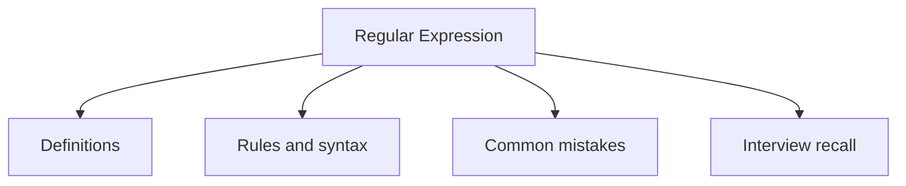

# 30 - Regular Expression

This topic follows the master outline in [outline.md](../outline.md). The goal is to understand each concept deeply enough to explain it, recognize it in code, and answer interview-style questions.

## Study Order

- [What Is Regex Concepts](theory/01-what-is-regex-concepts.md)
- [Basic Lookahead Lookbehind Concepts](theory/02-basic-lookahead-lookbehind-concepts.md)
- [Key Terms](terms/01-key-terms.md)

## Outline Checklist

- What is Regex?
- Pattern
- Matcher
- matches
- find
- group
- Character classes
- Quantifiers
- Capturing group
- Non-capturing group
- Basic lookahead / lookbehind
- Validate email, phone, password
- Replace using regex
- Split using regex

## Anki Cards

- [Basic](anki/basic.tsv)
- [Basic Extra](anki/basic-extra.tsv)
- [Cloze](anki/cloze.tsv)
- [Code Question](anki/code-question.tsv)

## Mermaid Overview

## Reference Links

- https://docs.oracle.com/javase/tutorial/essential/regex/
- https://docs.oracle.com/en/java/javase/21/docs/api/java.base/java/util/regex/Pattern.html
