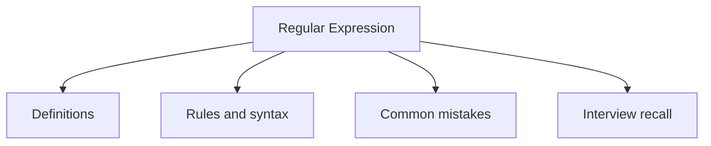

# 30 - Regular Expression

This topic follows the master outline in [outline.md](../outline.md). The goal is to understand each concept deeply enough to explain it, recognize it in code, and answer interview-style questions.

## Study Order

- [What Is Regex Concepts](theory/01-what-is-regex-concepts.md)
- [Basic Lookahead Lookbehind Concepts](theory/02-basic-lookahead-lookbehind-concepts.md)
- [Key Terms](terms/01-key-terms.md)

## Outline Checklist

- What is Regex?
- Pattern
- Matcher
- matches
- find
- group
- Character classes
- Quantifiers
- Capturing group
- Non-capturing group
- Basic lookahead / lookbehind
- Validate email, phone, password
- Replace using regex
- Split using regex

## Self-Check

- Why is compiling a `Pattern` computationally expensive, and why should `Pattern.compile()` be cached rather than calling `String.matches()` repeatedly in a hot loop?
  → See [Why Pattern Compilation Is Expensive](theory/01-what-is-regex-concepts.md#why-pattern-compilation-is-expensive)
- What are the key differences between capturing groups `(group)` and non-capturing groups `(?:group)` in terms of heap allocation and performance?
  → See [Why Non-Capturing Groups Save Heap Allocations](theory/01-what-is-regex-concepts.md#why-non-capturing-groups-save-heap-allocations)
- How do lookahead and lookbehind assertions function conceptually without consuming any input characters, and what is their "zero-width" nature?
  → See [Why Lookarounds are Zero-Width Assertions](theory/02-basic-lookahead-lookbehind-concepts.md#why-lookarounds-are-zero-width-assertions)
- What is the technical width limitation of lookbehind assertions in Java's regex engine compared to lookahead, and why does it exist?
  → See [Why Java Lookbehinds Have Width Limitations](theory/02-basic-lookahead-lookbehind-concepts.md#why-java-lookbehinds-have-width-limitations)
- Why does backtracking occur during regex execution, and how can greedy vs reluctant vs possessive quantifiers prevent catastrophic backtracking (ReDoS)?
  → See [Why Backtracking Occurs and How Quantifiers Prevent ReDoS](theory/01-what-is-regex-concepts.md#why-backtracking-occurs-and-how-quantifiers-prevent-redos)
- Why does `String.split(regex)` discard trailing empty strings by default, and how can passing a negative limit parameter prevent this behavior?
  → See [Why String.split Discards Trailing Empty Strings](theory/02-basic-lookahead-lookbehind-concepts.md#why-stringsplit-discards-trailing-empty-strings)

## Anki Cards

- [Basic](anki/basic.tsv)
- [Basic Extra](anki/basic-extra.tsv)
- [Cloze](anki/cloze.tsv)
- [Code Question](anki/code-question.tsv)

## Mermaid Overview

## Reference Links

- https://docs.oracle.com/javase/tutorial/essential/regex/
- https://docs.oracle.com/en/java/javase/21/docs/api/java.base/java/util/regex/Pattern.html
