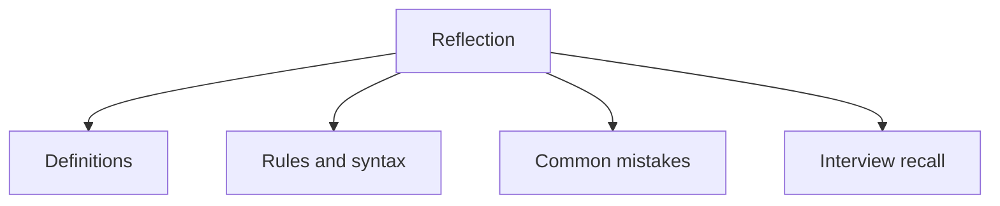

# 31 - Reflection

This topic follows the master outline in [outline.md](../outline.md). The goal is to understand each concept deeply enough to explain it, recognize it in code, and answer interview-style questions.

## Study Order

- [What Is Reflection Concepts](theory/01-what-is-reflection-concepts.md)
- [Advantages And Disadvantages Of Reflection Concepts](theory/02-advantages-and-disadvantages-of-reflection-concepts.md)
- [Key Terms](terms/01-key-terms.md)

## Outline Checklist

- What is Reflection?
- Class<?>
- Get class information
- Get field
- Get method
- Get constructor
- Invoke method using reflection
- Create object using reflection
- Access private field/method
- Annotation + reflection
- Advantages and disadvantages of reflection
- Reflection in frameworks such as Spring

## Anki Cards

- [Basic](anki/basic.tsv)
- [Basic Extra](anki/basic-extra.tsv)
- [Cloze](anki/cloze.tsv)
- [Code Question](anki/code-question.tsv)

## Mermaid Overview

## Reference Links

- https://docs.oracle.com/javase/tutorial/reflect/
- https://docs.oracle.com/en/java/javase/21/docs/api/java.base/java/lang/reflect/package-summary.html
