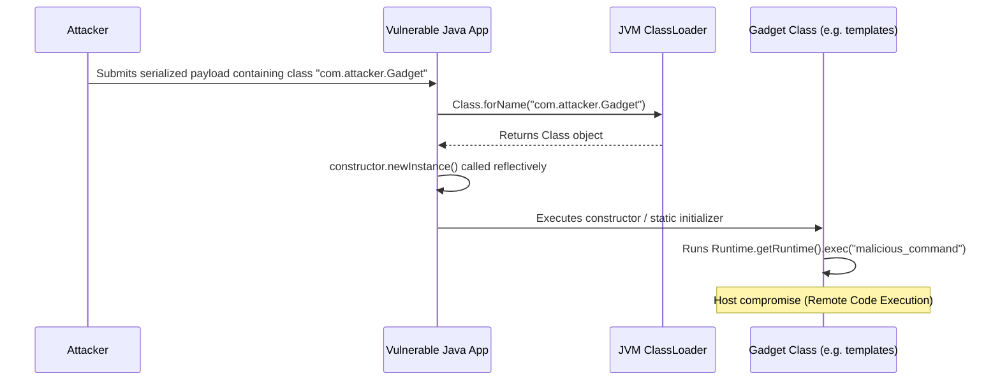

# Reflection - Part 2

## Learning Goal

This file covers a focused slice of **Reflection**. Study each concept as a practical Java rule, not as isolated vocabulary.

## Outline Coverage

| Concept | What to know |
| --- | --- |
| `Advantages and disadvantages of reflection` | The critical tradeoffs of reflection regarding performance, design encapsulation, and extensibility. |
| `Reflection in frameworks such as Spring` | How modern enterprise frameworks use reflection to achieve Dependency Injection (DI) and dynamic behavior. |

---

## Detailed Notes

### Advantages and disadvantages of reflection

Reflection is a double-edged sword. While it offers unmatched runtime flexibility, it comes with severe costs.

#### Advantages
1. **Extensibility**: Applications can dynamically load third-party plugins or modules by name without static recompilation.
2. **Framework Decoupling**: Allows writing generic code that operates on arbitrary classes (e.g., JSON serializers, JDBC query builders).
3. **Rich Tooling**: Powering IDE features, code inspectors, dynamic proxies, mock libraries (Mockito), and test suites (JUnit).

#### Disadvantages
1. **Performance Overhead**:
   - **No Compiler Optimizations**: The JIT compiler cannot inline reflective method calls or optimize field lookups.
   - **Dynamic Type Checking**: Arguments must be checked, checked exceptions verified, and visibility permissions checked on every call.
   - **Object Wrapping**: Primitive arguments and return values must be boxed/unboxed, creating garbage collector overhead.
2. **Loss of Compile-time Safety**: Errors that would normally cause compilation failures (like misspelled field or class names) are deferred to runtime as exceptions.
3. **Bypassing Encapsulation**: Accessing private fields or methods breaks class invariants, making code highly fragile and tightly coupled to class internal implementations.
4. **Security/Module Restrictions**: Strong encapsulation rules in Java modules (since Java 9) or a configured JVM `SecurityManager` will block reflective access, causing runtime crashes.

#### Code Example: Performance Benchmark Idea
```java
// Reflective method lookup and invocation is typically 10x to 100x slower
// than direct method execution because of validation, boxing, and safety checks.
public class PerformanceComparison {
    public void executeDirect() {
        // Direct method call: resolved at compile-time and optimized by JIT
    }
    
    public void executeReflective(java.lang.reflect.Method m, Object target) throws Exception {
        m.invoke(target); // Expensive validation checks and JIT bypass on every call
    }
}
```

## Why Reflection Introduces Performance Penalties and How to Optimize It

In standard Java execution, the JVM's Just-In-Time (JIT) compiler compiles hot bytecode paths into native machine code. It relies on static analysis to perform critical optimizations like method inlining (replacing a method call directly with its body) and dead code elimination. Reflective invocations bypass this process because class, method, and field references are resolved as dynamic variables at runtime. This forces the JVM to disable JIT compilation optimizations for reflective calls, requiring the execution engine to perform name lookup, access verification, and parameter type compatibility checks on every invocation. Additionally, passing primitive arguments reflectively requires allocating an object array (`Object[]`) and boxing primitives (e.g., wrapping `int` to `Integer`), which adds significant heap allocation and garbage collection overhead. To optimize these reflective operations, Java 7 introduced the `java.lang.invoke.MethodHandles` and `VarHandle` APIs, which leverage direct JVM bootstrap lookup mechanics and allow JIT compiler inlining when handles are stored in `static final` fields.

### Mental Model: Direct Invocation vs. Reflection JIT Bypass
```mermaid
flowchart TD
    subgraph Direct Invocation [Direct Method Call]
        A[target.method()] --> B[Static Type Checked]
        B --> C[JIT Optimization: Method Inlining]
        C --> D[Direct Native Code Execution]
    end
    subgraph Reflective Invocation [Reflective Method Call]
        E[method.invoke(target, args)] --> F[Runtime Lookup by String Name]
        F --> G[Modifier Verification & Access Checks]
        G --> H[Primitive Auto-boxing & Object[] Allocation]
        H --> I[JVM Stub Execution (Dynamic Dispatch)]
        I --> J[Unboxing & Actual Execution]
    end
```

### Code Example: Performance Comparison and MethodHandles
```java
import java.lang.invoke.MethodHandle;
import java.lang.invoke.MethodHandles;
import java.lang.invoke.MethodType;
import java.lang.reflect.Method;

public class ReflectionPerformanceDemo {
    public void targetMethod() {}

    public static void main(String[] args) throws Throwable {
        ReflectionPerformanceDemo instance = new ReflectionPerformanceDemo();
        
        // 1. Standard Reflection: Slow due to lookup, access checks, and JIT bypass
        Method reflectMethod = ReflectionPerformanceDemo.class.getMethod("targetMethod");
        reflectMethod.invoke(instance); 
        
        // 2. MethodHandles: Faster because it is type-safe and optimizable by the JVM
        MethodHandles.Lookup lookup = MethodHandles.lookup();
        MethodType type = MethodType.methodType(void.class);
        MethodHandle handle = lookup.findVirtual(ReflectionPerformanceDemo.class, "targetMethod", type);
        
        // Dynamic invocation with compile-time type verification
        handle.invokeExact(instance); 
    }
}
```

### Cause-Effect Chain
Reflective lookup by name &rarr; JIT compiler cannot determine target method signature at compile-time &rarr; Method inlining and optimizations disabled &rarr; JVM performs runtime access checks, parameter type checking, and argument boxing &rarr; Heap allocation rate increases and execution latency rises by 10x to 100x compared to direct calls.

---

## Why Reflective Instantiation and Classloading Pose Security and Stability Risks

Dynamic classloading (`Class.forName()`) and reflective constructor instantiation (`Constructor.newInstance()`) bypass static compile-time type boundaries to resolve classes by name at runtime. While this enables high flexibility, it introduces severe security and stability risks, most notably unsafe deserialization and arbitrary code execution (RCE). If an application accepts untrusted data that specifies class names to load dynamically, an attacker can supply the names of "gadget classes" (classes present on the classpath that execute actions in their constructors, static blocks, or deserialization methods). When the application instantiates these classes reflectively, it executes the attacker's code, potentially compromising the host system. Furthermore, loading classes dynamically can lead to Metaspace memory leaks because classes are stored in the JVM's Metaspace, which cannot be garbage collected as long as the loading ClassLoader remains referenced.

### Mental Model: Unsafe Dynamic Instantiation Vulnerability Flow


### Code Example: Reflective Instantiation Security Risk
```java
import java.lang.reflect.Constructor;

public class UnsafeDynamicInstantiation {
    // DANGER: Instantiates arbitrary classes by name from untrusted dynamic input
    public static Object instantiateDynamic(String className) {
        try {
            Class<?> clazz = Class.forName(className);
            Constructor<?> constructor = clazz.getDeclaredConstructor();
            constructor.setAccessible(true);
            return constructor.newInstance();
        } catch (Exception e) {
            System.out.println("Failed to instantiate: " + e.getMessage());
            return null;
        }
    }

    public static void main(String[] args) {
        // Simulating an attacker attempting to instantiate ProcessBuilder reflectively
        // which can lead to system command execution without compile-time restrictions
        instantiateDynamic("java.lang.ProcessBuilder"); 
    }
}
```

### Cause-Effect Chain
Untrusted input specifies class name &rarr; `Class.forName` loads the class from the classpath dynamically &rarr; Reflective instantiation executes the class's constructor or static initializer &rarr; Malicious payload executes OS commands reflectively &rarr; Host operating system is compromised with Remote Code Execution (RCE).

---

## Accessing private field/method

### Reflection in frameworks such as Spring

Enterprise Java frameworks rely heavily on reflection to manage object lifecycles, configure bean definitions, and implement dynamic cross-cutting concerns (Aspect-Oriented Programming).

- **Dependency Injection (DI)**: Spring scans classpath classes, reads annotations like `@Autowired` or `@Component`, and uses reflection to instantiate beans and inject dependencies directly into fields (even private ones) without constructor code.
- **Dynamic Proxies**: Spring AOP and `@Transactional` utilize `java.lang.reflect.Proxy` (or CGLIB code generation) to wrap your bean in a proxy object. When a method is called, the proxy intercepts the call reflectively, starts a transaction, delegates to your bean, and commits/rolls back the transaction.

#### Case Study: Simple Dependency Injection (DI) Container
```java
import java.lang.annotation.*;
import java.lang.reflect.Field;

// Define custom dependency marker annotation
@Retention(RetentionPolicy.RUNTIME)
@Target(ElementType.FIELD)
@interface Inject {}

class Engine {
    public void start() { System.out.println("Vroom!"); }
}

class Car {
    @Inject
    private Engine engine; // Spring injects this dynamically at runtime

    public void drive() { engine.start(); }
}

// Simple Container implementation demonstrating Spring-like reflection injection
public class MiniSpringContainer {
    public static void bootstrap(Car car) throws Exception {
        Class<?> clazz = car.getClass();
        for (Field field : clazz.getDeclaredFields()) {
            if (field.isAnnotationPresent(Inject.class)) {
                // Instantiates dependency object reflectively
                Object dependency = field.getType().getDeclaredConstructor().newInstance();
                
                // Enable writing to the private engine field
                field.setAccessible(true);
                
                // Inject the dependency instance into the car instance
                field.set(car, dependency);
            }
        }
    }

    public static void main(String[] args) throws Exception {
        Car car = new Car();
        bootstrap(car);
        car.drive(); // Outputs "Vroom!"
    }
}
```

## Why Reflection Enables Dependency Injection and ORM Frameworks

Modern Java enterprise frameworks, such as Spring and Hibernate, must operate on user-defined classes that do not exist at the time the framework is compiled. Reflection serves as the critical mechanism that resolves this chicken-and-egg problem by allowing frameworks to introspect class structures and inspect metadata at runtime. Instead of requiring developers to write boilerplate factory code, instantiate classes manually, or manually map database columns to fields, the framework scans the classpath and inspects classes for annotations (such as `@Autowired`, `@Entity`, or `@Column`). Using reflection, the framework can locate the appropriate constructor, call `newInstance()` to create instances, and use `setAccessible(true)` to directly inject dependency instances or database row values into private fields. This decoupling allows applications to remain clean of infrastructure code, shifting component wiring and object-relational mapping to a declarative configuration model handled entirely by the framework container.

### Mental Model: Annotation Scanning and Reflection-Based Wiring
```mermaid
flowchart TD
    A[Framework Bootstraps] --> B[Scan Classpath for Classes]
    B --> C{Class annotated with @Component or @Entity?}
    C -- Yes --> D[Reflectively inspect constructors]
    D --> E[Instantiate Bean via constructor.newInstance()]
    E --> F[Iterate over Fields checking for @Autowired or @Column]
    F --> G{Annotation found?}
    G -- Yes --> H[Bypass private visibility with setAccessible]
    H --> I[Inject dependency reference or DB value reflectively]
    I --> J[Register fully-wired Bean in Application Context]
    G -- No --> J
```

### Code Example: Reflective Annotation Mapping
```java
import java.lang.annotation.Retention;
import java.lang.annotation.RetentionPolicy;
import java.lang.reflect.Field;

@Retention(RetentionPolicy.RUNTIME)
@interface Column {
    String name();
}

class UserProfile {
    @Column(name = "user_email")
    private String email;
    
    public String getEmail() { return email; }
}

public class MiniOrmMapper {
    public static void populateField(Object target, String columnName, String value) throws Exception {
        Class<?> clazz = target.getClass();
        for (Field field : clazz.getDeclaredFields()) {
            if (field.isAnnotationPresent(Column.class)) {
                Column annotation = field.getAnnotation(Column.class);
                if (annotation.name().equals(columnName)) {
                    field.setAccessible(true); // Bypass encapsulation
                    field.set(target, value); // Inject value reflectively
                }
            }
        }
    }

    public static void main(String[] args) throws Exception {
        UserProfile profile = new UserProfile();
        populateField(profile, "user_email", "admin@example.com");
        System.out.println("Mapped Email: " + profile.getEmail()); // Outputs "Mapped Email: admin@example.com"
    }
}
```

### Cause-Effect Chain
Framework scans classpath &rarr; Dynamic reflection reads user-defined class structures and annotations &rarr; Field access controls bypassed with `setAccessible(true)` &rarr; Data and dependencies injected directly into fields &rarr; Boilerplate factory and mapping code eliminated, achieving decoupling and declarative architecture.

---

## Common Review Prompts

- **Why is reflection slower than direct code?**
  Reflection bypasses compile-time optimizations (like method inlining by the JIT compiler). It requires the JVM to perform name lookup, type matching, access check validation, and argument boxing/unboxing at runtime.
- **How does reflection break the Singleton pattern?**
  A client can obtain the private constructor of a Singleton class via reflection (`getDeclaredConstructor()`), change its accessibility with `setAccessible(true)`, and call `newInstance()` to create a second instance of the class.
- **What is the difference between JDK Dynamic Proxies and CGLIB?**
  - **JDK Dynamic Proxies** use standard reflection (`java.lang.reflect.Proxy`) to create proxy instances for classes that implement interfaces.
  - **CGLIB** generates subclasses at runtime to intercept method calls for classes that do not implement any interfaces.

## Reference Links

- https://docs.oracle.com/javase/specs/jls/se21/html/jls-15.html#jls-15.12 (Method Invocation Expressions)
- https://docs.oracle.com/en/java/javase/21/docs/api/java.base/java/lang/invoke/MethodHandles.html (MethodHandles Lookup)
- https://docs.oracle.com/javase/specs/jls/se21/html/jls-12.html#jls-12.2 (Class Loading)
- https://docs.oracle.com/en/java/javase/21/docs/api/java.base/java/lang/reflect/AnnotatedElement.html (AnnotatedElement Annotation Reflection)
- https://docs.oracle.com/javase/tutorial/reflect/ (Oracle Reflection Tutorial)

