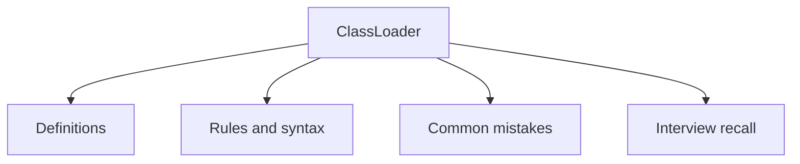

# 32 - ClassLoader

This topic follows the master outline in [outline.md](../outline.md). The goal is to understand each concept deeply enough to explain it, recognize it in code, and answer interview-style questions.

## Study Order

- [Class Loading Process Concepts](theory/01-class-loading-process-concepts.md)
- [Key Terms](terms/01-key-terms.md)

## Outline Checklist

- Class loading process
- Bootstrap ClassLoader
- Platform/Extension ClassLoader
- Application ClassLoader
- Parent delegation model
- Dynamic class loading
- Class.forName
- Classpath
- Basic JAR loading

## Anki Cards

- [Basic](anki/basic.tsv)
- [Basic Extra](anki/basic-extra.tsv)
- [Cloze](anki/cloze.tsv)
- [Code Question](anki/code-question.tsv)

## Mermaid Overview

## Reference Links

- https://docs.oracle.com/en/java/javase/21/docs/api/java.base/java/lang/ClassLoader.html
