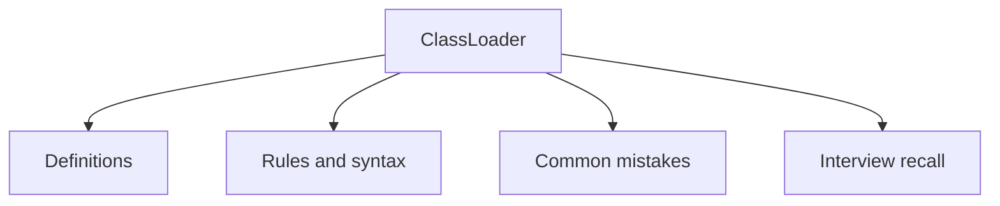

# 32 - ClassLoader

This topic follows the master outline in [outline.md](../outline.md). The goal is to understand each concept deeply enough to explain it, recognize it in code, and answer interview-style questions.

## Study Order

- [Class Loading Process Concepts](theory/01-class-loading-process-concepts.md)
- [Key Terms](terms/01-key-terms.md)

## Outline Checklist

- Class loading process
- Bootstrap ClassLoader
- Platform/Extension ClassLoader
- Application ClassLoader
- Parent delegation model
- Dynamic class loading
- Class.forName
- Classpath
- Basic JAR loading

## Key Terms

- Class loader
- Bootstrap ClassLoader
- Platform ClassLoader
- Application ClassLoader
- Parent delegation model
- TCCL (Thread Context ClassLoader)
- Loading
- Linking
- Initialization
- Metaspace
- Memory leak

## Self-Check

- Why do the three phases of classloading govern static execution?
  → See [How the three phases of classloading govern static execution](theory/01-class-loading-process-concepts.md#why-the-three-phases-of-classloading-govern-static-execution)
- Why does the parent delegation model protect core APIs?
  → See [Why the parent delegation model protects core APIs](theory/01-class-loading-process-concepts.md#why-the-parent-delegation-model-protects-core-apis)
- Why do ClassLoader namespaces dictate type identity uniqueness?
  → See [Why ClassLoader namespaces dictate type identity uniqueness](theory/01-class-loading-process-concepts.md#why-classloader-namespaces-dictate-type-identity-uniqueness)
- Why do SPI and plugin frameworks must break parent delegation?
  → See [Why SPI and plugin frameworks must break parent delegation](theory/01-class-loading-process-concepts.md#why-spi-and-plugin-frameworks-must-break-parent-delegation)
- Why do custom classloaders cause Metaspace memory leaks?
  → See [Why Custom Classloaders Cause Metaspace Memory Leaks](theory/01-class-loading-process-concepts.md#why-custom-classloaders-cause-metaspace-memory-leaks)

## Anki Cards

- [Basic](anki/basic.tsv)
- [Basic Extra](anki/basic-extra.tsv)
- [Cloze](anki/cloze.tsv)
- [Code Question](anki/code-question.tsv)

## Mermaid Overview

## Reference Links

- https://docs.oracle.com/en/java/javase/21/docs/api/java.base/java/lang/ClassLoader.html
