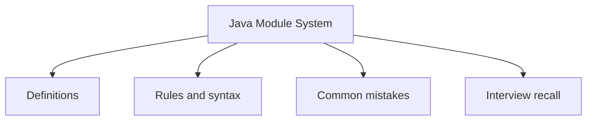

# 33 - Java Module System

This topic follows the master outline in [outline.md](../outline.md). The goal is to understand each concept deeply enough to explain it, recognize it in code, and answer interview-style questions.

## Study Order

- [What Is A Module Concepts](theory/01-what-is-a-module-concepts.md)
- [Key Terms](terms/01-key-terms.md)

## Outline Checklist

- What is a module?
- module-info.java
- requires
- exports
- opens
- Named module
- Unnamed module
- Automatic module
- Module-level encapsulation
- Module path vs Classpath

## Anki Cards

- [Basic](anki/basic.tsv)
- [Basic Extra](anki/basic-extra.tsv)
- [Cloze](anki/cloze.tsv)
- [Code Question](anki/code-question.tsv)

## Mermaid Overview

## Reference Links

- https://dev.java/learn/modules/
- https://docs.oracle.com/javase/specs/jls/se21/html/jls-7.html#jls-7.7
