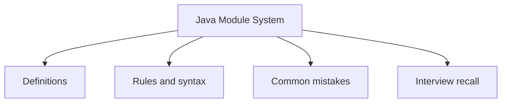

# 33 - Java Module System

This topic follows the master outline in [outline.md](../outline.md). The goal is to understand each concept deeply enough to explain it, recognize it in code, and answer interview-style questions.

## Study Order

- [What Is A Module Concepts](theory/01-what-is-a-module-concepts.md)
- [Key Terms](terms/01-key-terms.md)

## Outline Checklist

- What is a module?
- module-info.java
- requires
- exports
- opens
- Named module
- Unnamed module
- Automatic module
- Module-level encapsulation
- Module path vs Classpath

## Self-Check

Before moving to Anki cards, verify you can answer these questions:
1. Why did Java 9 introduce the Module System (Project Jigsaw), and what security/reliability issues of the classpath did it solve?
2. What is the difference between `exports` and `opens` in `module-info.java`, and how does `opens` affect reflection?
3. How does the Module Path differ from the Classpath (modular classloading vs flat classloading)?
4. What are automatic modules and unnamed modules, and how do they bridge the transition for legacy libraries?
5. Why are cyclic dependencies and split packages strictly forbidden under the Java Module System?

## Anki Cards

- [Basic](anki/basic.tsv)
- [Basic Extra](anki/basic-extra.tsv)
- [Cloze](anki/cloze.tsv)
- [Code Question](anki/code-question.tsv)

## Mermaid Overview

## Reference Links

- https://dev.java/learn/modules/
- https://docs.oracle.com/javase/specs/jls/se21/html/jls-7.html#jls-7.7
