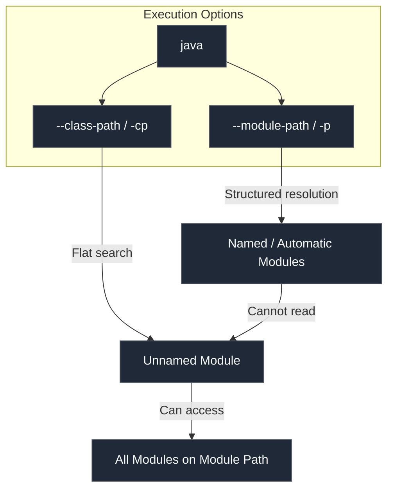

# Java Module System - Part 1

## Learning Goal

This file covers the **Java Module System** (introduced in Java 9 as Project Jigsaw). Study how modules enforce strong encapsulation, resolve "classpath hell", and change how the JVM loads and secures classes.

## Outline Coverage

| Concept | Description |
| --- | --- |
| `What is a module?` | A self-describing collection of code (packages) and data (resources) with a module descriptor. |
| `module-info.java` | The module descriptor file defining the module's name, dependencies, and exported packages. |
| `requires` | Directive declaring a dependency on another module. |
| `exports` | Directive making public types in a package accessible to other modules at compile and runtime. |
| `opens` | Directive allowing runtime deep reflection on a package while blocking compile-time access. |
| `Named module` | A module with a name defined in a `module-info.class` file, loaded from the module path. |
| `Unnamed module` | A catch-all module for classes loaded from the classpath to preserve backwards compatibility. |
| `Automatic module` | A bridge module created when a traditional JAR (no `module-info.class`) is placed on the module path. |
| `Module-level encapsulation` | Strong access controls enforced at JVM level, blocking public API leakage and illegal reflection. |
| `Module path vs Classpath` | Classpath is a flat, order-sensitive list of JARs; Module path is a structure-aware collection of named modules. |

---

## Detailed Notes

### What is a Module?

A **module** is a package of Java classes, interfaces, and resources grouped together with a **module descriptor** (`module-info.class`). It introduces a higher level of aggregation above packages, shifting Java from a flat list of classes to a structured dependency graph.

#### Why Modules Solve Classpath Hell and Security Gaps

In traditional Java (Java 8 and earlier), all classes loaded via the **Classpath** were pooled into a single, flat namespace. This led to two fatal flaws:
1. **Classpath Hell**: If two JARs contained the same class name in the same package (a "split package"), the JVM would load whichever JAR appeared first on the command line. This made deployments non-deterministic. Furthermore, if a dependency was missing, the compiler wouldn't know; the application would start up fine and crash only hours later when code tried to execute the missing class, throwing a `NoClassDefFoundError`.
2. **Weak Encapsulation**: The `public` modifier meant "public to the entire JVM". Any developer could import internal JDK APIs (like `sun.misc.Unsafe`) or internal library packages. This prevented library authors from modifying internal implementation details, as changes would break consumer applications.

The Java Module System (Project Jigsaw) addresses these by introducing **Strong Encapsulation** and **Reliable Configuration**:
- **Strong Encapsulation**: Packages inside a module are invisible to other modules unless explicitly exported. Even if a class and its methods are declared `public`, they cannot be accessed by another module unless the module containing the class `exports` its package.
- **Reliable Configuration**: Dependencies are declared explicitly. At startup, the JVM checks the module graph. If any required module is missing, or if there is a cyclic dependency, the JVM aborts immediately with a clear error before running any application code.

#### Analogy: Rummaging Heap vs. Sealed Shipping Containers
- **Classpath (Legacy)**: A flat heap of loose parts. Anyone can reach in, grab any piece, or accidentally overwrite a part with a duplicate because there are no boundaries.
- **Module Path (Modern)**: Sealed shipping containers. Each container has a manifest on the outside (`module-info.class`) declaring what it needs from other containers and what specific contents inside are allowed to be taken out.

```mermaid
flowchart TD
    subgraph Classpath (Flat Heap)
        A[Class A] --- B[Class B]
        C[Class C] --- A
        D[Duplicate Class B]
    end
    subgraph Module Path (Encapsulated Modules)
        subgraph Module A
            DirA[module-info.class] -->|requires| ModuleB
            ExportA[exports package.a]
        end
        subgraph ModuleB
            DirB[module-info.class]
            ExportB[exports package.b]
            InternalB[internal.package.c]
        end
    end
    classDef default fill:#1f2937,stroke:#4b5563,color:#f9fafb;
```

#### Cause-Effect Chain of Startup Verification
```text
Missing JAR on Classpath 
  → JVM ignores it during startup 
  → Classloader attempts to load class at runtime 
  → ClassNotFoundException / NoClassDefFoundError (Application crashes in production)

Missing Module on Module Path 
  → JVM resolves module graph at startup 
  → Detects missing dependency in module-info 
  → Application aborts immediately with detailed error (Safe fail-fast)
```

---

### module-info.java and Module Directives

The module descriptor must be named `module-info.java` and placed at the root of the source directory (e.g., `src/main/java/module-info.java`). It compiles into `module-info.class`.

```java
// File: src/main/java/module-info.java
module com.example.app {
    // Requires standard library or custom modules
    requires java.sql;
    requires transitive com.example.util; // Any module requiring 'com.example.app' gets 'com.example.util' automatically

    // Exports public classes in this package to all modules
    exports com.example.app.api;

    // Restricts exports to a specific module (Qualified Export)
    exports com.example.app.internal to com.example.trusted;

    // Opens a package for deep reflection (even private fields) at runtime only
    opens com.example.app.model to spring.beans, jackson.databind;
}
```

#### The `requires` Directives
- `requires <module-name>`: Specifies that this module depends on another module. It establishes **readability** (Module A can read Module B).
- `requires transitive <module-name>`: Specifies a dependency that is also automatically passed on to any modules that depend on this one.
- `requires static <module-name>`: A compile-time-only dependency. It is optional at runtime.

---

### exports vs opens

A common source of confusion is when to use `exports` versus `opens`. They represent different styles of access control:

| Feature | `exports` | `opens` |
| --- | --- | --- |
| **Compile-time Access** | ✅ Allowed (Other modules can write code using these classes) | ❌ Blocked (Compiler throws "package does not exist" error) |
| **Runtime Direct Access** | ✅ Allowed | ❌ Blocked |
| **Runtime Reflection (Shallow)**| ✅ Allowed (Only public elements can be inspected) | ✅ Allowed |
| **Runtime Deep Reflection** | ❌ Blocked (Accessing `private` members throws Exception) | ✅ Allowed (Can access `private` fields/methods via `.setAccessible(true)`) |

#### Deep Reflection Block

If you attempt to perform deep reflection on a package that is exported but not opened:
```java
package com.example.app.api;
public class User {
    private String secretToken = "12345";
}
```
If a framework tries to access `secretToken` reflectively:
```java
// Code inside a framework module
Field field = User.class.getDeclaredField("secretToken");
field.setAccessible(true); // Throws InaccessibleObjectException under strong encapsulation!
String secret = (String) field.get(userInstance); 
```
**Output Exception**:
```text
java.lang.reflect.InaccessibleObjectException: Unable to make field private java.lang.String com.example.app.api.User.secretToken accessible: 
module com.example.app does not "opens com.example.app.api" to framework.module
```

#### Cause-Effect Chain of `opens` vs `exports`
```text
Class A needs to call Class B at compile-time 
  → Package containing Class B must be EXPORTED 
  → Compiler compiles successfully.

Framework needs to inspect private fields of Class B at runtime 
  → Package containing Class B must be OPENED 
  → JVM allows setAccessible(true) 
  → Reflection succeeds without Exception.
```

---

### Classpath vs Module Path

The Java compiler (`javac`) and runtime (`java`) behave differently depending on whether code is placed on the Classpath or the Module Path.



#### Modular vs Flat Classloading
1. **Classpath (Flat)**:
   - Command line: `java -cp lib/dep.jar:app.jar com.example.Main`
   - Classloaders search JARs sequentially in a flat list.
   - Everything loaded from the classpath is placed into the **Unnamed Module**.
2. **Module Path (Modular)**:
   - Command line: `java --module-path lib:app.jar -m com.example.app/com.example.Main`
   - The JVM uses the module path to construct a structured graph.
   - Only packages explicitly exported by their containing modules are searchable by other classloaders.
   - Cyclic dependencies are detected during resolution and rejected before classloading begins.

---

### Named, Unnamed, and Automatic Modules

To allow incremental migration from Java 8, Java defines three types of modules:

| Module Type | How it is Defined | Where it is Loaded From | exports / opens | Readability Rules | Name Source |
| --- | --- | --- | --- | --- | --- |
| **Named Module** | Has `module-info.class` | Module Path (`--module-path`) | Explicitly as defined | Can read modules it explicitly `requires` | Defined in `module-info.java` |
| **Unnamed Module** | No `module-info.class` (Implicit) | Classpath (`-cp`) | Exports everything | Can read all modules on the Module Path | None (referred to as unnamed) |
| **Automatic Module** | Legacy JAR (No `module-info.class`) | Module Path (`--module-path`) | Exports and opens everything | Can read all modules (named, unnamed, automatic) | Derived from JAR name or Manifest |

#### The Migration Bridge Mechanism
Because named modules cannot require the unnamed module (since it has no name and cannot be explicitly referenced), loading legacy code directly into a named module would break. To bridge this:
1. You place a legacy library JAR on the **Module Path**.
2. The JVM treats it as an **Automatic Module**. It gains a module name automatically (e.g., `commons.lang3` from `commons-lang3-3.12.0.jar` or via the `Automatic-Module-Name` manifest header).
3. Named modules can now declare `requires commons.lang3;`.
4. The automatic module can read all other modules (including the classpath's unnamed module), bridging the old and new worlds.

```text
Named Module 
  → requires com.helper (Automatic Module) 
  → accesses legacy class 
  → Success!
```

---

### Reference Links

- [Official Oracle Java Modules Tutorial](https://dev.java/learn/modules/)
- [Java Language Specification: Chapter 7.7 (Module Declarations)](https://docs.oracle.com/javase/specs/jls/se21/html/jls-7.html#jls-7.7)
- [Project Jigsaw Quick Start Guide](https://openjdk.org/projects/jigsaw/quick-start)
