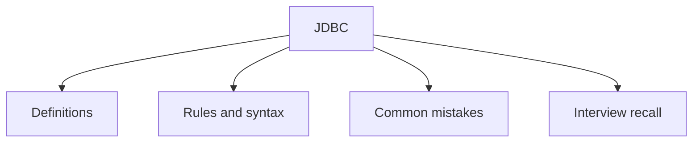

# 34 - JDBC

This topic follows the master outline in [outline.md](../outline.md). The goal is to understand each concept deeply enough to explain it, recognize it in code, and answer interview-style questions.

## Study Order

- [What Is Jdbc Concepts](theory/01-what-is-jdbc-concepts.md)
- [Rollback Concepts](theory/02-rollback-concepts.md)
- [Key Terms](terms/01-key-terms.md)

## Outline Checklist

- What is JDBC?
- Driver
- DriverManager
- Connection
- Statement
- PreparedStatement
- CallableStatement
- ResultSet
- Transaction:
- commit
- rollback
- setAutoCommit
- Batch processing
- SQL Injection
- Basic Connection Pool
- DataSource
- CRUD using JDBC

## Anki Cards

- [Basic](anki/basic.tsv)
- [Basic Extra](anki/basic-extra.tsv)
- [Cloze](anki/cloze.tsv)
- [Code Question](anki/code-question.tsv)

## Mermaid Overview

## Reference Links

- https://docs.oracle.com/javase/tutorial/jdbc/
- https://docs.oracle.com/en/java/javase/21/docs/api/java.sql/java/sql/package-summary.html
