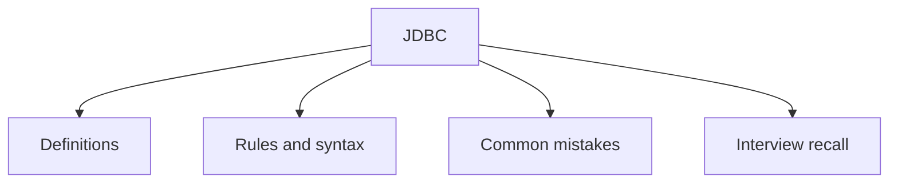

# 34 - JDBC

This topic follows the master outline in [outline.md](../outline.md). The goal is to understand each concept deeply enough to explain it, recognize it in code, and answer interview-style questions.

## Study Order

- [What Is Jdbc Concepts](theory/01-what-is-jdbc-concepts.md)
- [Rollback Concepts](theory/02-rollback-concepts.md)
- [Key Terms](terms/01-key-terms.md)

## Outline Checklist

- What is JDBC?
- Driver
- DriverManager
- Connection
- Statement
- PreparedStatement
- CallableStatement
- ResultSet
- Transaction:
- commit
- rollback
- setAutoCommit
- Batch processing
- SQL Injection
- Basic Connection Pool
- DataSource
- CRUD using JDBC

## Self-Check

1. Why does `PreparedStatement` prevent SQL injection, and how does it leverage the database's query plan cache to improve performance compared to `Statement`?
2. Why does disabling auto-commit override the database's default behavior, and why is this manual control critical for maintaining transactional ACID boundaries?
3. Why do database `Savepoint`s allow partial rollbacks, and what is the underlying mechanism and impact on transaction isolation levels when executing a partial rollback?
4. Why do database connection pools (like HikariCP) yield massive performance gains, and how do they reuse physical connections to avoid TCP handshakes and database authentication overhead?
5. Why must JDBC resources (`Connection`, `Statement`, `ResultSet`) be closed in the strict reverse order of their creation, and how does try-with-resources prevent resource leaks under JVM garbage collection?

## Anki Cards

- [Basic](anki/basic.tsv)
- [Basic Extra](anki/basic-extra.tsv)
- [Cloze](anki/cloze.tsv)
- [Code Question](anki/code-question.tsv)

## Mermaid Overview

## Reference Links

- https://docs.oracle.com/javase/tutorial/jdbc/
- https://docs.oracle.com/en/java/javase/21/docs/api/java.sql/java/sql/package-summary.html
