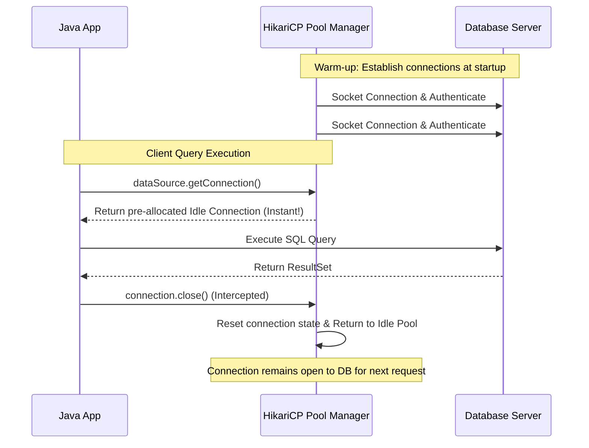

# JDBC - Part 2

## Learning Goal

This file covers a focused slice of **JDBC**. Study each concept as a practical Java rule, not as isolated vocabulary.

## Outline Coverage

| Concept | What to know |
| --- | --- |
| `rollback` |rollback cancels current transaction changes since the last commit. |
| `setAutoCommit` | setAutoCommit configures whether SQL statements are committed automatically or grouped into transactions. |
| `Batch processing` |Batch processing is a specific concept in JDBC; learn its Java rule, valid use cases, and failure mode rather than only its name. |
| `SQL Injection` | SQL injection happens when untrusted input changes the meaning of a SQL command. |
| `Basic Connection Pool` |Basic Connection Pool is a specific concept in JDBC; learn its Java rule, valid use cases, and failure mode rather than only its name. |
| `DataSource` |DataSource is a configurable factory for database connections, often backed by a pool. |
| `CRUD using JDBC` | JDBC is the Java API for connecting to relational databases. |

## Detailed Notes

### rollback

rollback cancels current transaction changes since the last commit.

Use it to predict the exact Java rule, the allowed form, and the failure mode. Review it with a tiny example instead of memorizing only the label.

Practical check:

- Define `rollback` in one sentence.
- Recognize `rollback` in code, commands, documentation, or interview prompts.
- Explain one bug, limitation, or tradeoff related to `rollback`.

Tiny example or mental model:

- When reading code, ask: what does `rollback` change, allow, reject, or clarify?

### setAutoCommit

setAutoCommit determines whether statements are executed in auto-commit mode (which commits each SQL statement immediately) or manual-commit mode (which groups statements into transactions).

It matters because for multi-step transactional operations (e.g., bank transfer), auto-commit must be disabled (`setAutoCommit(false)`) to ensure atomic execution.

Practical check:

- Define `setAutoCommit` in one sentence.
- Recognize `setAutoCommit` in code, commands, documentation, or interview prompts.
- Explain one bug, limitation, or tradeoff related to `setAutoCommit`.

Tiny example or mental model:

- When reading code, ask: what does `setAutoCommit` change, allow, reject, or clarify?

## Why Disabling Auto-Commit Establishes Transactional ACID Boundaries

By default, new JDBC connections operate in auto-commit mode, where every individual SQL statement is treated as a distinct transaction and committed immediately to the database upon execution. While convenient, this model violates the Atomicity and Consistency properties of ACID transactions for operations requiring multiple related updates (such as transferring money between two accounts). If one update succeeds and the next fails (e.g., due to a network interruption or business rule violation), the database is left in a corrupted, partially updated state. Disabling auto-commit (`conn.setAutoCommit(false)`) instructs the database engine to group all subsequent SQL commands into a single logical transaction block. This manual control ensures that either all modifications are finalized together via `conn.commit()`, or all changes are completely discarded via `conn.rollback()` in the event of an error, preserving database consistency.

### Mental Model: Auto-Commit Active vs. Transactional Boundaries
```mermaid
flowchart TD
    subgraph Auto-Commit Active [Auto-Commit = true (Default)]
        A[withdraw.executeUpdate()] --> B[Committed Instantly to DB]
        B --> C[Network Outage / Failure]
        C --> D[deposit.executeUpdate() fails]
        D --> E[DB State: Money withdrawn but never deposited - Inconsistent!]
    end
    subgraph Auto-Commit Disabled [Auto-Commit = false (Transactional)]
        F[withdraw.executeUpdate()] --> G[Pending state in DB transaction log]
        G --> H[Network Outage / Failure]
        H --> I[Catch Block catches error]
        I --> J[conn.rollback() called]
        J --> K[DB State: All changes discarded - Consistent!]
    end
```

### Code Example: Transaction Management with Auto-Commit Disabled
```java
public void transferMoney(Connection conn, int fromId, int toId, double amount) throws SQLException {
    try {
        // Disable auto-commit to establish transaction boundary
        conn.setAutoCommit(false); 
        
        try (PreparedStatement withdraw = conn.prepareStatement("UPDATE accounts SET balance = balance - ? WHERE id = ?");
             PreparedStatement deposit = conn.prepareStatement("UPDATE accounts SET balance = balance + ? WHERE id = ?")) {
            
            withdraw.setDouble(1, amount);
            withdraw.setInt(2, fromId);
            withdraw.executeUpdate();
            
            // Simulating a runtime error to trigger rollback
            if (true) { throw new SQLException("Simulated network outage"); }
            
            deposit.setDouble(1, amount);
            deposit.setInt(2, toId);
            deposit.executeUpdate();
            
            conn.commit(); // Never reached in this example
        }
    } catch (SQLException e) {
        conn.rollback(); // Discards the withdraw update, maintaining consistency
        System.out.println("Transaction rolled back: " + e.getMessage()); // Prints "Transaction rolled back: Simulated network outage"
    } finally {
        conn.setAutoCommit(true); // Restore default
    }
}
```

### Cause-Effect Chain
`conn.setAutoCommit(false)` invoked &rarr; Database stops committing statements individually &rarr; All updates written to undo/redo logs as a single logical block &rarr; Runtime exception thrown &rarr; `conn.rollback()` called in catch block &rarr; Database discards pending transaction logs &rarr; Database state restored to original, maintaining ACID consistency.

---

## Why Savepoints Enable Partial Rollbacks and Their Isolation Mechanics

A `Savepoint` allows a transaction to be split into logical steps, enabling the application to roll back a subset of updates without discarding the entire transaction. This is highly useful in complex workflows where optional sub-tasks might fail but the main transaction should still commit (for example, printing a shipping label might fail, but the order payment must still be recorded). When a `Savepoint` is set, the database marks a specific state in the transaction's undo/redo log. If a partial rollback is executed (`conn.rollback(savepoint)`), the database reverts only the modifications made *after* that savepoint, while keeping locks and modifications made *before* the savepoint intact. The transaction remains active, and the database maintains the current transaction isolation level (e.g. Read Committed or Repeatable Read), ensuring that uncommitted changes before the savepoint remain invisible to other concurrent database sessions.

### Mental Model: Partial Rollback via Savepoint Checkpoints
```
Transaction Starts (setAutoCommit(false))
      |
[Update Account Balance]
      |
Create Savepoint: conn.setSavepoint("PostBalanceUpdate")
      |
[Attempt to send SMS notification (failing subtask)]
      | (Fails)
Rollback to Savepoint: conn.rollback(savepoint)
      | (Reverts SMS update only, account balance update remains pending)
Commit Transaction: conn.commit()
      |
DB finalizes account balance change only.
```

### Code Example: Partial Rollback using Savepoints
```java
import java.sql.*;

public class SavepointDemo {
    public void processOrder(Connection conn) throws SQLException {
        Savepoint savepoint = null;
        try {
            conn.setAutoCommit(false);
            
            // 1. Critical Action: Charge Customer
            try (PreparedStatement charge = conn.prepareStatement("UPDATE accounts SET balance = balance - 50.0 WHERE id = 1")) {
                charge.executeUpdate();
            }
            
            // Set savepoint after critical action
            savepoint = conn.setSavepoint("PaymentMade");
            
            // 2. Non-critical action: Log audit entry (simulating failure)
            try (PreparedStatement log = conn.prepareStatement("INSERT INTO invalid_table (msg) VALUES ('paid')")) {
                log.executeUpdate(); // Will fail due to missing table
            }
            
            conn.commit();
        } catch (SQLException e) {
            if (savepoint != null) {
                // Roll back only the non-critical log insert, keeping the payment update
                conn.rollback(savepoint); 
                conn.commit(); // Finalize payment
                System.out.println("Partial rollback executed: payment charged, audit logged failed.");
            } else {
                conn.rollback(); // Full rollback if payment itself failed
            }
        }
    }
}
```

### Cause-Effect Chain
`Savepoint` created via `conn.setSavepoint()` &rarr; Database marks checkpoint in transaction undo log &rarr; Secondary statement fails &rarr; `conn.rollback(savepoint)` invoked &rarr; Database reverts only undo log entries recorded after the checkpoint &rarr; Database locks and changes before checkpoint remain active &rarr; Transaction commits successfully with primary changes only.

---

### Batch processing

Batch processing is a specific concept in JDBC; learn its Java rule, valid use cases, and failure mode rather than only its name.

Use it to predict the exact Java rule, the allowed form, and the failure mode. Review it with a tiny example instead of memorizing only the label.

Practical check:

- Define `Batch processing` in one sentence.
- Recognize `Batch processing` in code, commands, documentation, or interview prompts.
- Explain one bug, limitation, or tradeoff related to `Batch processing`.

Tiny example or mental model:

- When reading code, ask: what does `Batch processing` change, allow, reject, or clarify?

### SQL Injection

SQL injection happens when untrusted input changes the meaning of a SQL command.

Use it to predict the exact Java rule, the allowed form, and the failure mode. Review it with a tiny example instead of memorizing only the label.

Practical check:

- Define `SQL Injection` in one sentence.
- Recognize `SQL Injection` in code, commands, documentation, or interview prompts.
- Explain one bug, limitation, or tradeoff related to `SQL Injection`.

Tiny example or mental model:

- When reading code, ask: what does `SQL Injection` change, allow, reject, or clarify?

### Basic Connection Pool

Basic Connection Pool is a specific concept in JDBC; learn its Java rule, valid use cases, and failure mode rather than only its name.

Use it to predict the exact Java rule, the allowed form, and the failure mode. Review it with a tiny example instead of memorizing only the label.

Practical check:

- Define `Basic Connection Pool` in one sentence.
- Recognize `Basic Connection Pool` in code, commands, documentation, or interview prompts.
- Explain one bug, limitation, or tradeoff related to `Basic Connection Pool`.

Tiny example or mental model:

- When reading code, ask: what does `Basic Connection Pool` change, allow, reject, or clarify?

### DataSource

DataSource is a configurable factory for database connections, often backed by a pool.

Use it to predict the exact Java rule, the allowed form, and the failure mode. Review it with a tiny example instead of memorizing only the label.

Practical check:

- Define `DataSource` in one sentence.
- Recognize `DataSource` in code, commands, documentation, or interview prompts.
- Explain one bug, limitation, or tradeoff related to `DataSource`.

Tiny example or mental model:

- When reading code, ask: what does `DataSource` change, allow, reject, or clarify?

## Why Database Connection Pools Yield Massive Performance Gains

Establishing a new physical database connection is an extremely expensive operation because it requires performing a TCP three-way handshake, exchanging database authentication and authorization credentials, and allocating server-side process memory and resources. In high-traffic web applications, initiating a new connection for every single incoming HTTP request creates a massive performance bottleneck and quickly exhausts database resources. Connection pooling frameworks (such as HikariCP or Apache Commons DBCP) solve this by establishing a pool of active physical database connections at application startup. When the application requests a connection via `dataSource.getConnection()`, the pool manager immediately hands over an already established, idle connection from the pool. Upon calling `connection.close()`, the connection is not physically closed; instead, the pool manager intercepts the close call, resets the connection state (clearing temp tables and transactions), and returns it to the pool for reuse, completely bypassing the socket handshake and authentication overhead.

### Mental Model: Pre-allocated Connections vs. Manual Handshakes


### Code Example: Connection Reuse with HikariCP
```java
import com.zaxxer.hikari.HikariConfig;
import com.zaxxer.hikari.HikariDataSource;
import java.sql.Connection;
import java.sql.ResultSet;
import java.sql.Statement;

public class ConnectionPoolDemo {
    private static HikariDataSource dataSource;

    static {
        HikariConfig config = new HikariConfig();
        config.setJdbcUrl("jdbc:h2:mem:test;DB_CLOSE_DELAY=-1");
        config.setUsername("sa");
        config.setPassword("");
        config.setMaximumPoolSize(10); // Hold up to 10 reusable connections
        dataSource = new HikariDataSource(config);
    }

    public static void runQuery() throws Exception {
        // getConnection returns a pooled connection in milliseconds
        try (Connection conn = dataSource.getConnection(); 
             Statement stmt = conn.createStatement();
             ResultSet rs = stmt.executeQuery("SELECT 1")) {
            if (rs.next()) {
                System.out.println("Result: " + rs.getInt(1)); // Outputs "Result: 1"
            }
        } // conn.close() returns connection to pool, does not close socket
    }
}
```

### Cause-Effect Chain
Pool established at startup &rarr; Active physical sockets created and authenticated &rarr; `getConnection()` queries pool manager &rarr; Idle socket retrieved and returned in sub-milliseconds &rarr; `close()` resets session state and releases socket back to pool manager &rarr; No socket teardown or re-authentication required &rarr; Latency reduced and database server CPU usage lowered.

---

### CRUD using JDBC

JDBC is the Java API for connecting to relational databases.

Use it to predict the exact Java rule, the allowed form, and the failure mode. Review it with a tiny example instead of memorizing only the label.

Practical check:

- Define `CRUD using JDBC` in one sentence.
- Recognize `CRUD using JDBC` in code, commands, documentation, or interview prompts.
- Explain one bug, limitation, or tradeoff related to `CRUD using JDBC`.

Tiny example or mental model:

- `PreparedStatement` binds values safely with placeholders.

## Common Review Prompts

- Which concepts here are compile-time rules?
- Which concepts here affect runtime behavior?
- Which concepts here are likely interview traps?

## Code Examples

### Transaction Management (commit and rollback)
```java
Connection conn = null;
try {
    conn = dataSource.getConnection();
    conn.setAutoCommit(false); // Enable manual transaction control
    
    try (PreparedStatement withdraw = conn.prepareStatement("UPDATE accounts SET balance = balance - ? WHERE id = ?");
         PreparedStatement deposit = conn.prepareStatement("UPDATE accounts SET balance = balance + ? WHERE id = ?")) {
         
        withdraw.setDouble(1, 100.0);
        withdraw.setInt(2, 1);
        withdraw.executeUpdate();
        
        deposit.setDouble(1, 100.0);
        deposit.setInt(2, 2);
        deposit.executeUpdate();
        
        conn.commit(); // Commit if both succeed
    }
} catch (Exception e) {
    if (conn != null) {
        try {
            conn.rollback(); // Rollback on error
        } catch (SQLException ex) {
            ex.printStackTrace();
        }
    }
} finally {
    if (conn != null) {
        try {
            conn.close();
        } catch (SQLException ex) {
            ex.printStackTrace();
        }
    }
}
```

### Batch Processing
```java
String sql = "INSERT INTO logs (message, created_at) VALUES (?, ?)";
try (Connection conn = dataSource.getConnection();
     PreparedStatement stmt = conn.prepareStatement(sql)) {
     
    conn.setAutoCommit(false);
    
    for (int i = 0; i < 1000; i++) {
        stmt.setString(1, "Log message " + i);
        stmt.setTimestamp(2, new java.sql.Timestamp(System.currentTimeMillis()));
        stmt.addBatch();
        
        if (i % 100 == 0) {
            stmt.executeBatch(); // Execute every 100 items
        }
    }
    stmt.executeBatch(); // Execute remaining items
    conn.commit();
}
```

## Common Mistakes

- **Assuming Auto-Commit is Off by Default**: By default, new database connections are in auto-commit mode. You must explicitly call `conn.setAutoCommit(false)` to begin a transaction.
- **Forgetting to Commit**: If auto-commit is disabled and you execute insert/update statements, you must call `conn.commit()`. If you don't call it, the database will discard the changes when the connection is closed or garbage-collected.
- **Not Handling Rollback Exceptions**: If an error occurs during transaction execution, calling `conn.rollback()` can also throw a `SQLException`. This should be handled properly in a nested try-catch block inside the main catch block.

## Reference Links

- https://docs.oracle.com/javase/tutorial/jdbc/basics/transactions.html (Using Transactions in JDBC)
- https://docs.oracle.com/en/java/javase/21/docs/api/java.sql/java/sql/Connection.html#setAutoCommit(boolean) (Connection setAutoCommit JavaDoc)
- https://docs.oracle.com/en/java/javase/21/docs/api/java.sql/java/sql/Savepoint.html (Savepoint JavaDoc)
- https://github.com/brettwooldridge/HikariCP (HikariCP Connection Pool GitHub Reference)

