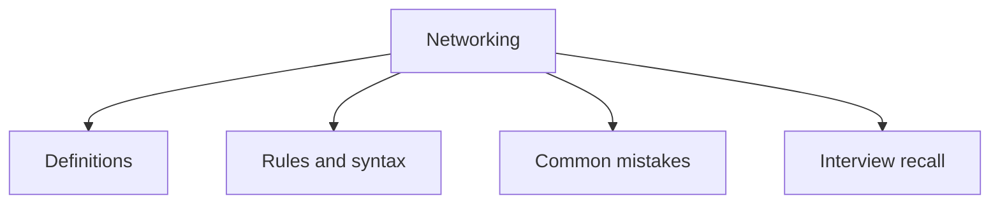

# 35 - Networking

This topic follows the master outline in [outline.md](../outline.md). The goal is to understand each concept deeply enough to explain it, recognize it in code, and answer interview-style questions.

## Study Order

- [Socket Programming Concepts](theory/01-socket-programming-concepts.md)
- [Httpurlconnection Concepts](theory/02-httpurlconnection-concepts.md)
- [Key Terms](terms/01-key-terms.md)

## Outline Checklist

- Socket programming
- TCP socket
- UDP socket
- Socket
- ServerSocket
- DatagramSocket
- InetAddress
- URL
- URI
- Basic HTTP request
- HttpURLConnection
- Java 11 HttpClient
- Client-server model

## Self-Check

Before moving to the next topic, verify that you can answer these questions:
1. Why does TCP require a connection establishment phase (handshake) using `Socket` and `ServerSocket`, while UDP (`DatagramSocket`) executes connectionless packet transfers?
   &rarr; See [Why TCP Handshakes Differ From Connectionless UDP](theory/01-socket-programming-concepts.md#why-tcp-handshakes-differ-from-connectionless-udp)
2. Why is it a critical error to run blocking socket I/O operations (like `accept()` or `read()`) directly on the application's main thread, and how does multithreading solve this?
   &rarr; See [Why Blocking Socket Operations Must Not Run on the Main Thread](theory/01-socket-programming-concepts.md#why-blocking-socket-operations-must-not-run-on-the-main-thread)
3. Why did Java 20 deprecate `URL` constructors (like `new URL(string)`), and why is it preferred to instantiate `URI` first and then convert it using `uri.toURL()`?
   &rarr; See [Why Java 20 Deprecated URL Constructors in Favor of URI](theory/01-socket-programming-concepts.md#why-java-20-deprecated-url-constructors-in-favor-of-uri)
4. Why does `HttpURLConnection` suffer from performance limitations (e.g. blocking API, complex resource management), and how does the modern Java 11 `HttpClient` improve performance and support asynchronous execution?
   &rarr; See [Why Java 11 HttpClient Supersedes HttpURLConnection](theory/02-httpurlconnection-concepts.md#why-java-11-httpclient-supersedes-httpurlconnection)
5. Why must socket streams and sockets be closed properly, and what are the OS-level consequences (e.g., port binding exceptions, file descriptor leaks) of failing to do so?
   &rarr; See [Why Sockets and Streams Must Be Closed Properly](theory/01-socket-programming-concepts.md#why-sockets-and-streams-must-be-closed-properly)

## Anki Cards

- [Basic](anki/basic.tsv)
- [Basic Extra](anki/basic-extra.tsv)
- [Cloze](anki/cloze.tsv)
- [Code Question](anki/code-question.tsv)

## Mermaid Overview

## Reference Links

- https://docs.oracle.com/javase/tutorial/networking/
- https://docs.oracle.com/en/java/javase/21/docs/api/java.base/java/net/package-summary.html
