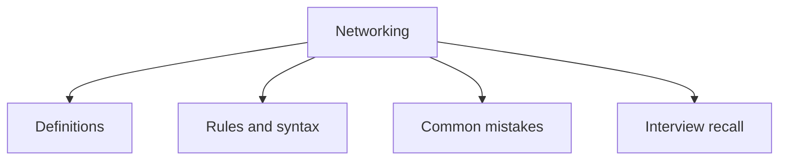

# 35 - Networking

This topic follows the master outline in [outline.md](../outline.md). The goal is to understand each concept deeply enough to explain it, recognize it in code, and answer interview-style questions.

## Study Order

- [Socket Programming Concepts](theory/01-socket-programming-concepts.md)
- [Httpurlconnection Concepts](theory/02-httpurlconnection-concepts.md)
- [Key Terms](terms/01-key-terms.md)

## Outline Checklist

- Socket programming
- TCP socket
- UDP socket
- Socket
- ServerSocket
- DatagramSocket
- InetAddress
- URL
- URI
- Basic HTTP request
- HttpURLConnection
- Java 11 HttpClient
- Client-server model

## Anki Cards

- [Basic](anki/basic.tsv)
- [Basic Extra](anki/basic-extra.tsv)
- [Cloze](anki/cloze.tsv)
- [Code Question](anki/code-question.tsv)

## Mermaid Overview

## Reference Links

- https://docs.oracle.com/javase/tutorial/networking/
- https://docs.oracle.com/en/java/javase/21/docs/api/java.base/java/net/package-summary.html
